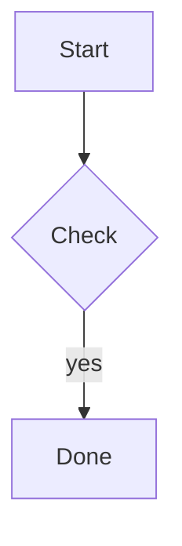

# excalidraw/excalidraw 源码分析报告

仓库地址：<https://github.com/excalidraw/excalidraw>

分析时间：2026-06-01

## 🔍 项目简介

`excalidraw/excalidraw` 是一个用 TypeScript/React 实现的手绘风白板项目，同时包含可嵌入的编辑器库 `packages/excalidraw` 和官方演示/云能力外壳 `excalidraw-app`。它解决的是“快速画出结构图、流程图、线框图，同时还能分享、协作、导出、复用素材”的问题，目标用户既包括直接在网页上画图的终端用户，也包括想把白板能力嵌入自家产品的前端团队。技术栈核心是 React 19、TypeScript、Vite、Jotai、Firebase、Socket.IO 和浏览器 Web Crypto。竞品可以类比 tldraw、draw.io，但 Excalidraw 的差异在于手绘风、本地优先、开放 JSON 格式和把协作加密逻辑也做进了前端实现。

## ⚡ 核心功能

### 1. 可嵌入的 React 白板组件

功能名称：把 Excalidraw 当成 React 组件接入业务应用，并暴露 imperative API、导出/导入工具函数。

实现方式：

核心入口在 `packages/excalidraw/index.tsx:38-51,55-116,160-204,304-339`。`ExcalidrawAPIProvider` 提供上下文，`ExcalidrawBase` 归一化 UI 配置和图片限制，最后通过 `React.memo` 输出 `<Excalidraw>` 组件；同一文件还直接导出了 `restoreElements`、`reconcileElements`、`exportToSvg`、`serializeAsJSON`、`loadFromBlob` 等 API。

```tsx
export const ExcalidrawAPIProvider = ({ children }) => {
  const [api, setApi] = useState<ExcalidrawImperativeAPI | null>(null);
  return (
    <ExcalidrawAPIContext.Provider value={api}>
      <ExcalidrawAPISetContext.Provider value={setApi}>
        {children}
      </ExcalidrawAPISetContext.Provider>
    </ExcalidrawAPIContext.Provider>
  );
};

export const Excalidraw = React.memo(ExcalidrawBase, areEqual);

export { serializeAsJSON, serializeLibraryAsJSON } from "./data/json";
export { loadFromBlob, loadSceneOrLibraryFromBlob } from "./data/blob";
```

怎么用：

```tsx
import { Excalidraw, ExcalidrawAPIProvider } from "@excalidraw/excalidraw";

export default function Demo() {
  return (
    <ExcalidrawAPIProvider>
      <div style={{ height: "100vh" }}>
        <Excalidraw
          initialData={{ appState: { viewBackgroundColor: "#ffffff" } }}
          UIOptions={{ canvasActions: { export: true } }}
        />
      </div>
    </ExcalidrawAPIProvider>
  );
}
```

输入输出：

输入是 React props、初始 scene、UI 配置、事件回调；输出是用户操作后的 scene 状态、`ExcalidrawImperativeAPI`、导出/恢复函数。

适用场景和限制：

适合把白板能力嵌入知识库、流程设计器、文档系统、协作文档。限制是它明确面向浏览器运行时，依赖 DOM/Canvas/Web Crypto，不是一个纯 SSR 组件。


### 2. 本地优先自动保存与离线恢复

功能名称：自动把画布元素、UI 状态和图片文件保存到浏览器，并在下次打开时恢复。

实现方式：

本地存储逻辑主要在 `excalidraw-app/data/LocalData.ts:73-109,117-145,169-227`，场景初始化恢复在 `excalidraw-app/App.tsx:232-247`。前者把非删除元素写入 `localStorage`，图片写入 IndexedDB；后者启动时先从浏览器存储恢复，再统一走 `restoreElements()` / `restoreAppState()`。

```ts
localStorage.setItem(
  STORAGE_KEYS.LOCAL_STORAGE_ELEMENTS,
  JSON.stringify(getNonDeletedElements(elements)),
);
localStorage.setItem(
  STORAGE_KEYS.LOCAL_STORAGE_APP_STATE,
  JSON.stringify(_appState),
);

static save = (elements, appState, files, onFilesSaved) => {
  if (!this.isSavePaused()) {
    this._save(elements, appState, files, onFilesSaved);
  }
};
```

怎么用：

```bash
cd /home/trade/ctf_workspace/gh_trending/excalidraw-excalidraw
corepack yarn install --frozen-lockfile
corepack yarn start
# 在浏览器里画图、刷新页面，scene 会从浏览器存储自动恢复
```

输入输出：

输入是 `elements`、`appState`、`files`；输出是 `localStorage` 里的元素/UI JSON 和 IndexedDB 里的图片二进制缓存。

适用场景和限制：

适合草稿、离线编辑、单机使用。限制是浏览器配额有限，代码里显式处理了 `QuotaExceededError`；协作模式下会调用 `LocalData.pauseSave("collaboration")` 暂停本地保存，避免与远端同步状态冲突。


### 3. 多来源场景恢复与导入

功能名称：从本地缓存、后端分享链接、协作链接、外部 URL、`.excalidraw/.png/.svg` 文件中恢复 scene。

实现方式：

`excalidraw-app/App.tsx:225-359` 的 `initializeScene()` 会识别 `?id=...`、`#json=id,key`、`#room=id,key`、`#url=...` 等入口；`packages/excalidraw/data/blob.ts:32-79,138-215` 负责从 PNG/SVG 元数据或 JSON 文件里解析 scene，并调用 `restoreElements()` / `restoreAppState()` 做规范化恢复。

```ts
const jsonBackendMatch = window.location.hash.match(
  /^#json=([a-zA-Z0-9_-]+),([a-zA-Z0-9_-]+)$/,
);
const externalUrlMatch = window.location.hash.match(/^#url=(.*)$/);

scene = {
  elements: restoreElements(localDataState?.elements, null, {
    repairBindings: true,
    deleteInvisibleElements: true,
  }),
  appState: restoreAppState(localDataState?.appState, null),
};
```

```ts
if (isValidExcalidrawData(data)) {
  return {
    type: MIME_TYPES.excalidraw,
    data: {
      elements: restoreElements(data.elements, localElements, {
        repairBindings: true,
        deleteInvisibleElements: true,
      }),
      appState: restoreAppState(...),
      files: data.files || {},
    },
  };
}
```

怎么用：

```ts
import { loadFromBlob } from "@excalidraw/excalidraw";

const restored = await loadFromBlob(file, null, null);
console.log(restored.elements, restored.appState, restored.files);
```

或者直接访问：

```text
http://localhost:3000/#json=<sceneId>,<decryptKey>
http://localhost:3000/#url=https%3A%2F%2Fexample.com%2Fdemo.excalidraw
http://localhost:3000/#room=<roomId>,<roomKey>
```

输入输出：

输入可以是 URL、Blob/File、后端返回的压缩密文；输出是统一的 `ImportedDataState`，包含 `elements`、`appState`、`files`。

适用场景和限制：

适合做分享链接、文件导入、从图片中恢复原始图。限制是 `#url=` 走浏览器 `fetch()`，受 CORS/浏览器网络环境约束；非法文件会抛 `Error: invalid file` 或图片不含 scene 数据错误。


### 4. 端到端加密的实时协作

功能名称：多人协作房间、光标同步、增量 scene 广播、协作图片同步。

实现方式：

房间链接和密钥生成在 `excalidraw-app/data/index.ts:148-163`；加密原语在 `packages/excalidraw/data/encryption.ts:12-29,50-94`；Socket 广播在 `excalidraw-app/collab/Portal.tsx:85-103,142-182,202-247`；协作初始化与接收远端更新在 `excalidraw-app/collab/Collab.tsx:485-608`；落地到 Firebase 的文档/文件同步在 `excalidraw-app/data/firebase.ts:203-247,249-319`。

```ts
export const generateCollaborationLinkData = async () => {
  const roomId = await generateRoomId();
  const roomKey = await generateEncryptionKey();
  return { roomId, roomKey };
};

return `${window.location.origin}${window.location.pathname}#room=${data.roomId},${data.roomKey}`;
```

```ts
const { encryptedBuffer, iv } = await encryptData(this.roomKey!, encoded);
this.socket?.emit(
  volatile ? WS_EVENTS.SERVER_VOLATILE : WS_EVENTS.SERVER,
  roomId ?? this.roomId,
  encryptedBuffer,
  iv,
);
```

怎么用：

```bash
cd /home/trade/ctf_workspace/gh_trending/excalidraw-excalidraw
corepack yarn start
# 在 UI 里启动协作后，把 #room=<roomId>,<roomKey> 链接发给另一位用户
```

或者程序化调用：

```ts
await collabAPI.startCollaboration({ roomId, roomKey });
```

输入输出：

输入是当前 scene 元素、鼠标位置、空闲状态、图片文件；输出是经 AES-GCM 加密的 WebSocket 数据包和 Firebase 持久化后的协作 scene/file 数据。

适用场景和限制：

适合在线头脑风暴、远程评审、结对设计。限制是云端协作依赖外部 WebSocket/Firebase 服务，`FILE_UPLOAD_MAX_BYTES` 在 `excalidraw-app/app_constants.ts:11-12` 被限制为 4 MiB；授权模型本质上是“持有 room link 即有权限”，不是账号级 ACL。


### 5. 导出与开放格式序列化

功能名称：导出 Canvas/PNG/SVG/剪贴板，序列化 `.excalidraw` JSON，并支持把 scene 内嵌进 SVG/PNG 里做可逆导出。

实现方式：

`packages/excalidraw/scene/export.ts:176-279,289-383` 实现 `exportToCanvas()` 和 `exportToSvg()`；`packages/excalidraw/data/json.ts:52-99,137-159` 负责 JSON 序列化和保存；`packages/excalidraw/data/blob.ts:35-79` 负责从 PNG/SVG 元数据解回原始 scene。

```ts
const data: ExportedDataState = {
  type: EXPORT_DATA_TYPES.excalidraw,
  version: VERSIONS.excalidraw,
  source: getExportSource(),
  elements,
  appState: type === "local"
    ? cleanAppStateForExport(appState)
    : clearAppStateForDatabase(appState),
  files: type === "local" ? filterOutDeletedFiles(elements, files) : undefined,
};
```

```ts
if (exportEmbedScene) {
  encodeSvgBase64Payload({
    metadataElement,
    payload: serializeAsJSON(elements, appState, files || {}, "local"),
  });
}
```

怎么用：

```ts
import {
  exportToSvg,
  exportToCanvas,
  serializeAsJSON,
} from "@excalidraw/excalidraw";

const svg = await exportToSvg(elements, {
  exportBackground: true,
  exportEmbedScene: true,
  viewBackgroundColor: "#ffffff",
}, files);

const canvas = await exportToCanvas(elements, appState, files, {
  exportBackground: true,
  viewBackgroundColor: "#ffffff",
});

const json = serializeAsJSON(elements, appState, files, "local");
```

输入输出：

输入是 scene 元素、appState、二进制文件；输出是 `<canvas>`、`<svg>`、`.excalidraw` JSON 字符串或系统剪贴板内容。

适用场景和限制：

适合导图分享、静态素材导出、版本归档。限制是导出到 database 模式时不会把 `files` 放进 JSON，超大画布可能触发 `Canvas too big`，而 SVG/PNG 可逆恢复前提是导出时启用了嵌入 scene。


### 6. Library 素材库管理、持久化与发布

功能名称：维护本地素材库、导入 `.excalidrawlib`、从 URL 安装第三方库、把素材库发布到官方后端。

实现方式：

`packages/excalidraw/data/library.ts:54-58,145-157,506-527,607-675` 实现素材去重、合并、URL 白名单校验与持久化队列；`excalidraw-app/data/LocalData.ts:229-276` 用 IndexedDB 迁移/保存素材库；`packages/excalidraw/components/PublishLibrary.tsx:38-104,258-303` 负责生成预览图、打包 `.excalidrawlib` 并提交到发布后端。

```ts
const ALLOWED_LIBRARY_URLS = [
  "excalidraw.com",
  "raw.githubusercontent.com/excalidraw/excalidraw-libraries",
];

export const mergeLibraryItems = (localItems, otherItems) => {
  const newItems = [];
  for (const item of otherItems) {
    if (isUniqueItem(localItems, item)) {
      newItems.push(item);
    }
  }
  return [...newItems, ...localItems];
};
```

```ts
fetch(`${import.meta.env.VITE_APP_LIBRARY_BACKEND}/submit`, {
  method: "post",
  body: formData,
});
```

怎么用：

```ts
import {
  useHandleLibrary,
} from "@excalidraw/excalidraw";
import {
  LibraryIndexedDBAdapter,
  LibraryLocalStorageMigrationAdapter,
} from "./excalidraw-app/data/LocalData";

useHandleLibrary({
  excalidrawAPI,
  adapter: LibraryIndexedDBAdapter,
  migrationAdapter: LibraryLocalStorageMigrationAdapter,
});
```

输入输出：

输入是 `LibraryItems`、`.excalidrawlib` 文件、第三方库 URL、素材元信息；输出是浏览器本地素材库、合并后的素材列表、发布请求和预览图片。

适用场景和限制：

适合沉淀常用组件、团队图形模板、共享图标库。限制是默认只允许 `excalidraw.com` 和官方库仓库 URL；发布流程依赖 `VITE_APP_LIBRARY_BACKEND` 后端。


### 7. 粘贴表格 / Mermaid 自动转图

功能名称：用户直接粘贴 TSV/CSV 或 Mermaid 文本，自动转成图表或 Excalidraw 元素。

实现方式：

图表入口在 `packages/excalidraw/charts/index.ts:24-38`；Mermaid 识别在 `packages/excalidraw/mermaid.ts:1-33`；实际粘贴处理在 `packages/excalidraw/components/App.tsx:3724-3805`；Mermaid 预览/回退策略在 `packages/excalidraw/components/TTDDialog/common.ts:73-129`。

```ts
if (!isPlainPaste && data.text) {
  const result = tryParseSpreadsheet(data.text);
  if (result.ok) {
    this.setState({
      openDialog: { name: "charts", data: result.data, rawText: data.text },
    });
    return;
  }
}

if (!isPlainPaste && isMaybeMermaidDefinition(data.text)) {
  const api = await import("@excalidraw/mermaid-to-excalidraw");
  const { elements: skeletonElements, files = {} } =
    await api.parseMermaidToExcalidraw(data.text);
}
```

怎么用：

```ts
import {
  tryParseSpreadsheet,
  renderSpreadsheet,
} from "@excalidraw/excalidraw";

const parsed = tryParseSpreadsheet("Quarter\tQ1\tQ2\nSales\t12\t18");
if (parsed.ok) {
  const chart = renderSpreadsheet("line", parsed.data, 100, 300);
  console.log(chart?.elements);
}
```

也可以直接在编辑器里粘贴：



输入输出：

输入是纯文本表格、Mermaid 定义；输出是图表对话框里的结构化 `Spreadsheet` 数据，或转换后的 Excalidraw 元素/附件文件。

适用场景和限制：

适合把表格、流程图定义快速落成白板内容。限制是图表解析带有启发式，Mermaid 只对支持的语法有效；源码里还做了双引号替换回退，但并不保证所有 Mermaid 方言都能成功转换。

## 🔐 安全审计

依赖扫描：

我实际执行了以下命令：

```bash
cd /home/trade/ctf_workspace/gh_trending/excalidraw-excalidraw
corepack yarn audit --groups dependencies --json
corepack yarn audit --json
```

结果分两层看更有意义：

- 生产依赖扫描结果：`488` 个依赖，`4 critical / 40 high / 80 moderate / 6 low`
- 全工作区扫描结果（包含 examples、构建链、开发链）：`1321` 个依赖，`5 critical / 98 high / 146 moderate / 23 low`

高风险条目里，和主应用更相关的有：

- `protobufjs`，路径 `excalidraw-app>firebase>@firebase/firestore>@grpc/proto-loader>protobufjs`，命中 1 个 critical 和多条 high，问题类型包括 RCE、代码生成 gadget、递归 DoS。由于主应用确实依赖 Firebase/Firestore，这条链路不是纯示例噪音。
- `socket.io-parser`，路径 `excalidraw-app>socket.io-client>socket.io-parser`，high，问题是二进制附件数量无界，和协作通道直接相关。
- `ws`，路径 `excalidraw-app>socket.io-client>engine.io-client>ws`，moderate，属于协作链路里的内存泄露风险。
- `@excalidraw/excalidraw@0.18.0`，moderate，GitHub advisory 指向 Mermaid 转换流程的 XSS；仓库本身在 `packages/excalidraw/package.json:1-4` 仍标记为 `0.18.0`。
- `dompurify`，路径 `@excalidraw/excalidraw>@excalidraw/mermaid-to-excalidraw>mermaid>dompurify`，命中多条 moderate，和 Mermaid/嵌入内容清洗链路有关。

高危但主要属于示例/构建链的有：

- `next`，路径 `with-nextjs>next`，出现 1 条 critical 和多条 high；这部分主要来自 `examples/with-nextjs`，不是 `excalidraw-app` 主运行路径。
- `minimatch` / `picomatch` / `brace-expansion`，主要落在 `vite-plugin-html`、`ejs`、`jake` 等构建链上，偏开发/构建时风险。
- `immutable`，路径 `@excalidraw/excalidraw>sass>immutable`，high，属于样式编译链。

密钥泄露扫描：

我实际执行了模式扫描：

```bash
rg -n --hidden -S "(api[_-]?key|secret|token|password|client_secret|AKIA|AIza...)" /home/trade/ctf_workspace/gh_trending/excalidraw-excalidraw
```

人工复核后，最值得写进报告的结果是：

- `.env.development:17` 和 `.env.production:17` 存在 Firebase Web 配置，包含 `apiKey`、`projectId`、`storageBucket` 等。这类 Firebase Web API key 通常不是传统意义上的私密后端密钥，但它暴露了项目标识和存储入口，安全性必须依赖 Firebase 规则和上层加密。
- `.github/workflows/*.yml` 里大量出现 `${{ secrets.* }}`，例如 `NPM_TOKEN`、`SENTRY_AUTH_TOKEN`、`DOCKER_PASSWORD`，但这些都是 GitHub Actions 占位符，不是明文泄露。
- `packages/common/src/constants.ts:468` 只有 `OAI_API_KEY` 这个本地存储键名，不是实际 key 值。
- 结论：没有扫出明显的明文私有 token/password/JWT secret，但存在公开的前端 Firebase 配置。

认证、授权、CSRF 逻辑：

- 我没有在仓库里找到传统的服务端 `auth middleware`、session store 或 CSRF 中间件。这个仓库的主形态是 Vite 前端 + 外部服务，而不是一个带后端控制器的单体 Web 服务。
- `excalidraw-app/app_constants.ts:55-60` 只通过 `document.cookie.includes("excplus-auth")` 判断 Excalidraw+ 登录态，更像 UI 分支条件，不构成真正的服务端认证边界。
- `excalidraw-app/ExcalidrawPlusIframeExport.tsx:101-183` 做了比较认真地跨窗口校验：先校验 `event.origin`，再用 `VITE_APP_PLUS_EXPORT_PUBLIC_KEY` 验证 JWT 签名，通过后才把本地 scene 发给父窗口。这是仓库里最接近“认证授权”的代码路径。
- `firebase-project/firestore.rules:4-7` 与 `firebase-project/storage.rules:4-8` 都是 `allow get, write: if true;`。也就是说，服务端存储层默认不做用户身份限制，真正的保密性依赖 `packages/excalidraw/data/encryption.ts:50-94` 的 AES-GCM 和 `excalidraw-app/data/index.ts:148-163` 里生成的 room/share key。这个设计可以称为“密钥即授权”。
- `packages/excalidraw/data/library.ts:506-527` 对第三方 library URL 做了 allowlist 校验，算是一个轻量的授权边界，防止任意站点 library 被静默安装。
- `packages/excalidraw/components/PublishLibrary.tsx:301-304` 提交发布时只是直接 `fetch(.../submit)`，当前仓库里没看到配套 CSRF token 逻辑；如果后端依赖 cookie，会把防护压力留给服务端。

输入校验与数据暴露面：

- `packages/excalidraw/data/blob.ts:146-194` 对导入的 JSON/PNG/SVG/Library 做结构校验，只接受 `isValidExcalidrawData()` 或 `isValidLibrary()`，然后统一经过 `restoreElements()` / `restoreAppState()`，这是这个仓库最核心的输入净化点。
- `packages/excalidraw/data/library.ts:530-542` 只从 `hash/search` 提取 library token，再用 `validateLibraryUrl()` 做域名/路径白名单过滤，避免任意 URL 自动安装 library。
- `excalidraw-app/App.tsx:303-315` 支持 `#url=` 场景导入，会对外部 URL 做浏览器侧 `fetch()`。这不是服务器端 SSRF，但确实扩大了用户浏览器的出站请求面；恶意链接至少可以诱导受害者浏览器请求某个 URL。
- `packages/excalidraw/components/App.tsx:3813-3824` 只有在 `embeddableURLValidator()` 判定通过时才把纯 URL 作为可嵌入内容插入，说明嵌入不是“见链接就上”。
- `excalidraw-app/App.tsx:846-862` 对同源自嵌套做了额外 guard，防止异常 self-embedding 死循环。

综合判断：

- 没看到传统后端 auth/session 漏洞，因为仓库基本没有这类后端代码。
- 真实风险主要是依赖漏洞积压较多，以及 Firebase 规则过于开放，必须靠客户端密钥加密兜底。
- 如果把这个仓库用于强权限隔离、多租户严肃业务系统，光靠当前这套“链接+密钥”模型并不够。

## 🚀 快速上手

系统和依赖要求：

- Node.js `>=18`，源码里在根 `package.json:33-35` 和 `excalidraw-app/package.json:18-20` 都写了要求
- 建议用 `corepack` 管理 Yarn 1，因为这个仓库声明的是 `yarn@1.22.22`
- 浏览器环境，默认开发端口 `3000`，定义在 `excalidraw-app/vite.config.mts:16-19`

本地开发：

```bash
cd /home/trade/ctf_workspace/gh_trending/excalidraw-excalidraw
corepack enable
corepack yarn install --frozen-lockfile
corepack yarn start
```

打开：

```text
http://localhost:3000
```

构建生产包：

```bash
cd /home/trade/ctf_workspace/gh_trending/excalidraw-excalidraw
corepack yarn install --frozen-lockfile
corepack yarn build
corepack yarn start:production
```

Docker 启动：

```bash
cd /home/trade/ctf_workspace/gh_trending/excalidraw-excalidraw
docker compose up --build
```

常见坑：

- 这是 Yarn workspaces monorepo，不要在子目录随手 `npm install`，容易把锁文件和依赖树搞乱。
- `excalidraw-app/vite.config.mts:20-23` 把 `envDir` 指到了仓库根目录，所以环境变量文件要放在根目录，不是在 `excalidraw-app/` 里。
- 协作、分享链接、Library 发布、Excalidraw+ 相关功能都依赖 `VITE_APP_*` 外部服务；本地跑起来不代表这些云能力也一定可用。
- `Dockerfile` 明确提示“不要忽略 optional dependencies”，否则像 `@rollup/rollup-linux-x64-gnu` 这样的可选原生依赖可能导致构建失败。
- 依赖审计结果很多，建议启动前先升级 `protobufjs`、`socket.io-parser`、Mermaid/DOMPurify 相关链路，再决定是否启用分享/协作特性。

## ⚖️ 一句话判词

值得关注，尤其适合想把“本地优先 + 可嵌入 + 可协作 + 开放导出格式”的白板能力接进自己产品的团队；但如果你的场景要求强账号授权、严格租户隔离和更干净的供应链安全面，这个仓库需要明显补强。

## 📊 元信息

- Stars：约 `124k`（GitHub 仓库页，2026-06-01 查询）
- Forks：约 `13.9k`（GitHub 仓库页，2026-06-01 查询）
- Language：`TypeScript`
- License：`MIT`
