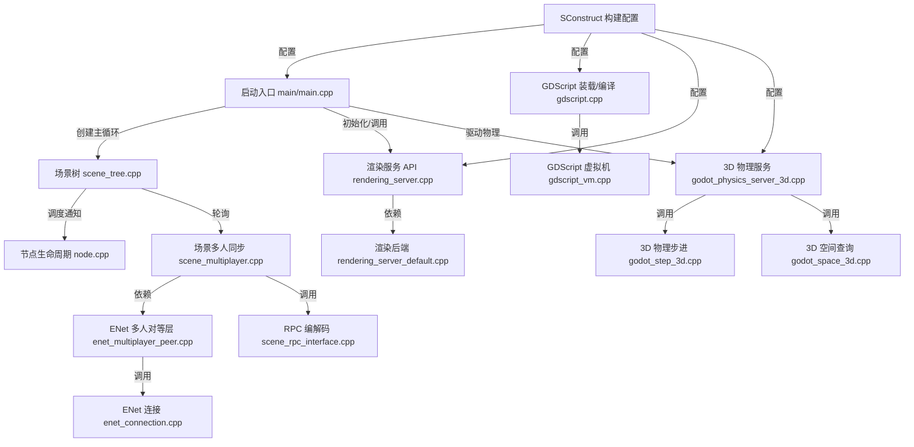

<!-- 
  📖 English summary available at: [English version](../../en/trending/2026-06-01-22-godotengine-godot.md)
-->


# godotengine/godot 源码分析

## 🔍 项目简介

Godot 是一个把编辑器、运行时、脚本系统、渲染、物理和导出链路全部放在同一仓库里的跨平台 2D/3D 游戏引擎。它解决的是“从项目打开、场景调度、脚本执行到图形/物理/联网”整条链路的开发问题，目标用户是独立游戏开发者、引擎定制者和插件作者。源码主干是 C++17，构建系统是 SCons，脚本层是 GDScript，网络层内置 ENet/mbedTLS，Web 平台额外带一套 JS 开发工具链。和 Unity/Unreal 相比，它的差异不是“功能少”，而是把核心引擎完全开源，并且允许你直接在 `main/`、`scene/`、`servers/`、`modules/` 这些目录里改引擎本体。

## ⚡ 核心功能

### 1. 启动器会按命令行/项目配置装配不同的 `MainLoop`

实现方式：`main/main.cpp:4356-4432` 先决定启动编辑器还是游戏，再选择 `SceneTree` 或脚本化 `MainLoop`；`main/main.cpp:4917-5000` 在每帧里统一推进 physics/process。

```cpp
MainLoop *main_loop = nullptr;
if (editor) {
    main_loop = memnew(SceneTree);
}
...
script_loop->set_script(script_res);
main_loop = script_loop;
...
OS::get_singleton()->set_main_loop(main_loop);
```

```cpp
MainFrameTime advance = main_timer_sync.advance(physics_step, physics_ticks_per_second);
OS::get_singleton()->get_main_loop()->iteration_prepare();
PhysicsServer3D::get_singleton()->sync();
if (OS::get_singleton()->get_main_loop()->physics_process(physics_step * time_scale)) {
```

怎么用：

```bash
cd /home/trade/ctf_workspace/gh_trending/godotengine-godot
scons platform=linuxbsd target=editor dev_build=yes
./bin/godot.linuxbsd.editor.$(uname -m) --path /path/to/project
./bin/godot.linuxbsd.editor.$(uname -m) --headless --path /path/to/project --script res://tool_main.gd
```

输入输出：输入是命令行参数、项目配置、可选 `MainLoop`/`SceneTree` 派生脚本；输出是 editor/game/headless 工具三种运行形态共享的一套主循环。

适用场景和限制：适合把同一个二进制跑成编辑器、游戏或 CLI 工具。限制是脚本化主循环必须继承 `SceneTree` 或 `MainLoop`，否则会在 `main/main.cpp:4375-4381` 直接报错退出。


### 2. `SceneTree` 负责节点生命周期、逐帧调度、换场和分组广播

实现方式：`scene/main/scene_tree.cpp:639-670` 和 `688-735` 分别驱动物理帧与普通帧；`scene/main/node.cpp:99-105` 把 `_process/_physics_process` 变成真正的脚本回调；`scene/main/scene_tree.cpp:1703-1744` 做场景切换；`scene/main/scene_tree.cpp:361-438` 做 group 广播。

```cpp
bool SceneTree::physics_process(double p_time) {
    current_frame++;
    ...
    _process(true);
    process_timers(p_time, true);
}
```

```cpp
case NOTIFICATION_PROCESS: {
    GDVIRTUAL_CALL(_process, get_process_delta_time());
} break;
case NOTIFICATION_PHYSICS_PROCESS: {
    GDVIRTUAL_CALL(_physics_process, get_physics_process_delta_time());
} break;
```

```cpp
Ref<PackedScene> new_scene = ResourceLoader::load(p_path);
Node *new_scene = p_scene->instantiate();
...
pending_new_scene_id = p_node->get_instance_id();
```

怎么用：

```gdscript
extends Node

func _ready():
    set_process(true)

func _process(delta):
    if Input.is_action_just_pressed("ui_accept"):
        get_tree().change_scene_to_file("res://levels/level_2.tscn")

func refresh_enemies():
    get_tree().call_group("enemies", "repath")
```

输入输出：输入是节点树、timer/tween、场景资源、group 名称和方法名；输出是节点通知、脚本回调、待切换场景以及批量方法调用。

适用场景和限制：这是 Godot 运行时的核心骨架，游戏逻辑几乎都挂在这里。限制是 `change_scene_to_file()` 只能在主线程调用（`scene/main/scene_tree.cpp:1704`），新场景节点也不能已经在树里（`1723-1725`）。


### 3. GDScript 会经过“读文件 -> 解析 -> 语义分析 -> 编译 -> VM 执行”完整流水线

实现方式：`modules/gdscript/gdscript.cpp:1124-1162` 先读取并校验 UTF-8 脚本；`modules/gdscript/gdscript.cpp:811-859` 调 parser/analyzer/compiler；`modules/gdscript/gdscript_vm.cpp:499-760` 在 VM 中做参数检查、栈分配、递归保护和字节码执行。

```cpp
Ref<FileAccess> f = FileAccess::open(p_path, FileAccess::READ, &err);
...
if (s.append_utf8((const char *)w, len) != OK) {
    ERR_FAIL_V_MSG(ERR_INVALID_DATA, "Script ... contains invalid unicode (UTF-8)...");
}
```

```cpp
err = parser.parse(source, path, false);
...
GDScriptAnalyzer analyzer(&parser);
err = analyzer.analyze();
...
GDScriptCompiler compiler;
err = compiler.compile(&parser, this, p_keep_state);
```

```cpp
if (unlikely(++call_depth > MAX_CALL_DEPTH)) {
    ...
    const char *err_text = "Stack overflow. Check for infinite recursion in your script.";
}
...
if (!argument_types[i].is_type(*p_args[i], true)) {
    r_err.error = Callable::CallError::CALL_ERROR_INVALID_ARGUMENT;
```

怎么用：

```gdscript
extends Node

func add(a: int, b: int) -> int:
    return a + b

func _ready():
    print(add(2, 3))
```

输入输出：输入是 `.gd` 文本、可选 binary tokens、调用参数；输出是编译后的脚本对象、VM 返回的 `Variant`，或者带文件行号的 parse/compile 错误。

适用场景和限制：适合游戏逻辑、工具脚本、编辑器插件。限制是脚本必须是合法 UTF-8，且 VM 有递归深度保护；参数类型不匹配时不会“帮你乱转”，会直接返回 `CALL_ERROR_INVALID_ARGUMENT`。


### 4. `RenderingServer` 暴露低层图形 API，`RenderingServerDefault` 负责真正的多线程绘制

实现方式：`servers/rendering/rendering_server.cpp:2851-2865`、`3315-3345`、`3465-3471` 把 viewport/canvas/shader 参数 API 绑到脚本层；`servers/rendering/rendering_server_default.cpp:76-134` 负责一帧里的 scene/canvas/particles/viewport/rasterizer 流程；`servers/rendering/rendering_server_default.cpp:276-283`、`415-451` 则把它放进专门的渲染线程和命令队列。

```cpp
ClassDB::bind_method(D_METHOD("viewport_create"), &RenderingServer::viewport_create);
ClassDB::bind_method(D_METHOD("canvas_item_create"), &RenderingServer::canvas_item_create);
ClassDB::bind_method(D_METHOD("global_shader_parameter_set", "name", "value"),
        &RenderingServer::global_shader_parameter_set);
```

```cpp
RSG::scene->update();
RSG::canvas->update();
RSG::particles_storage->update_particles();
RSG::viewport->draw_viewports(p_swap_buffers);
RSG::rasterizer->end_frame(p_swap_buffers);
```

```cpp
if (create_thread) {
    command_queue.push(this, &RenderingServerDefault::_draw, p_present, frame_step);
} else {
    _draw(p_present, frame_step);
}
```

怎么用：

```gdscript
var rs := RenderingServer
var vp := rs.viewport_create()
var item := rs.canvas_item_create()
rs.viewport_set_size(vp, 1280, 720)
rs.global_shader_parameter_set("wind_strength", 0.8)
```

输入输出：输入是 `RID`、viewport 尺寸、canvas primitive、shader 全局参数；输出是 GPU draw call、frame signal 和最终图像。

适用场景和限制：适合需要越过高层节点系统、直接操纵渲染管线的场景。限制是 API 很底层，资源生命周期要自己管；而且 `draw()` 只能从主线程触发（`servers/rendering/rendering_server_default.cpp:443-451`）。


### 5. 内建 3D 物理会自己创建刚体、推进求解器，并提供射线/运动测试

实现方式：`modules/godot_physics_3d/godot_physics_server_3d.cpp:442-465` 创建 body 并挂到空间；`940-948` 做 `body_test_motion()`；`1674-1688` 驱动所有活跃 `Space`；真正的迭代器在 `modules/godot_physics_3d/godot_step_3d.cpp:185-287`，会积分外力、更新 broadphase、构建 constraint islands；查询接口 `modules/godot_physics_3d/godot_space_3d.cpp:110-178` 用于 `intersect_ray()`。

```cpp
GodotBody3D *body = memnew(GodotBody3D);
RID rid = body_owner.make_rid(body);
body->set_self(rid);
```

```cpp
_update_shapes();
return body->get_space()->test_body_motion(body, p_parameters, r_result);
```

```cpp
b->self()->integrate_forces(p_delta);
...
p_space->update();
...
_populate_island(body, body_island, constraint_island);
```

```cpp
int amount = space->broadphase->cull_segment(begin, end, ...);
...
if (shape->intersect_segment(local_from, local_to, shape_point, shape_normal, ...)) {
```

怎么用：

```gdscript
var query := PhysicsRayQueryParameters3D.create(global_position, global_position + Vector3.DOWN * 10.0)
var hit := get_world_3d().direct_space_state.intersect_ray(query)
print(hit)
```

输入输出：输入是 body/shape、空间、射线、运动参数；输出是碰撞点、法线、命中的对象/shape，或 `MotionResult`。

适用场景和限制：适合 FPS 射线检测、角色碰撞预测、服务端物理同步。限制是空间锁住时查询会失败（`godot_space_3d.cpp:111`），`body_get_direct_state()` 也明确要求等待迭代外部访问（`godot_physics_server_3d.cpp:952-965`）。


### 6. 多人部分不是“只会发包”，而是把 ENet 传输、鉴权、Relay 和 RPC 编解码都做了

实现方式：`modules/enet/enet_connection.cpp:46-67`、`84-110`、`307-320` 先把 IP、端口、peer 数、channel 数这些底层参数校验掉；`modules/enet/enet_multiplayer_peer.cpp:62-109` 创建 server/client，`166-230` 轮询连接事件并过滤非法 peer ID，`336-417` 选择可靠/不可靠传输模式；上层 `modules/multiplayer/scene_multiplayer.cpp:67-167` 处理 packet、鉴权超时和 replication，`357-389` 做 pending/admit peer，`457-475` 发认证包；`modules/multiplayer/scene_rpc_interface.cpp:289-290`、`412-423` 则负责 RPC 参数的压缩和解码。

```cpp
Error ENetMultiplayerPeer::create_server(...) {
    ...
    hosts[0] = host;
    return OK;
}
...
if (event.data < 2 || peers.has((int)event.data)) {
    event.peer->reset();
    continue;
}
```

```cpp
if (pending_peers.has(sender)) {
    ...
    auth_callback.callp(argv, 2, ret, ce);
}
...
if (pending.value.time + auth_timeout <= time) {
    multiplayer_peer->disconnect_peer(pending.key);
}
```

```cpp
MultiplayerAPI::decode_and_decompress_variants(
    args, &p_packet[p_offset], p_packet_len - p_offset, out,
    byte_only_or_no_args, multiplayer->is_object_decoding_allowed());
```

怎么用：

```gdscript
var peer := ENetMultiplayerPeer.new()
peer.create_server(7000, 32)
multiplayer.multiplayer_peer = peer

multiplayer.peer_authenticating.connect(func(id):
    multiplayer.send_auth(id, "hello".to_utf8_buffer())
)
```

输入输出：输入是地址、端口、peer ID、原始字节和 RPC 参数；输出是 `peer_connected/peer_disconnected/peer_authenticating` 信号、认证完成后的连接集合，以及最终分发到节点方法上的 RPC。

适用场景和限制：适合联机游戏、P2P mesh、主机中继。限制是未连接时大量 API 会返回 `ERR_UNCONFIGURED`；对象解码默认关闭（`modules/multiplayer/scene_multiplayer.h:121-123`，测试见 `modules/multiplayer/tests/test_scene_multiplayer.h:44-58`）；设置了 `auth_callback` 后，peer 会先进 pending 队列，不完成认证就不会被正式接纳。

## 🗺️ 知识图谱（Mermaid）



## 🔐 安全审计

依赖扫描：实际执行了 `cd platform/web && npm audit --package-lock-only --json`。结果是 10 个漏洞，`high 5 / moderate 3 / low 2 / critical 0`。这一批问题全部来自 `platform/web` 的 Web 开发/文档工具链，而不是引擎运行时二进制。`pyproject.toml` 只有 `[tool.*]` 静态检查配置，没有可审计的 Python 依赖。

- `platform/web/package.json:13-23` 只声明了 `eslint`、`jsdoc` 一类 devDependencies，所以这批漏洞主要影响“维护者在处理不受信任输入时运行 lint/doc 工具”的场景。
- 高危链路 1：`platform/web/package-lock.json:1050-1057` 的 `flat-cache 4.0.1 -> flatted ^3.2.9`，对应 `npm audit` 报出的 `flatted` 高危 DoS / Prototype Pollution。
- 高危链路 2：`platform/web/package-lock.json:72-82` 与 `396-406` 暴露了两条 `minimatch` 依赖链，分别来自 `@eslint/config-array` 和 `@typescript-eslint/typescript-estree`。
- 高危链路 3：`platform/web/package-lock.json:1406-1412` 的 `micromatch -> picomatch ^2.3.1`，以及 `1608-1614` 的 `requizzle -> lodash ^4.17.21`。
- 高危链路 4：`platform/web/package-lock.json:1232-1244` 的 `jsdoc` 依赖 `markdown-it 14.1.0` 与 `underscore ~1.13.2`，其中 `underscore` 被 `npm audit` 标为高危。
- 中低危链路：`platform/web/package-lock.json:793-806` 暴露 `eslint` 依赖的 `@eslint/plugin-kit ^0.2.3` 与 `ajv ^6.12.4`，对应低危/中危 ReDoS。

密钥泄露扫描：使用 `rg` 对 `api_key|secret|token|password` 等模式做了仓库扫描，没有发现首方代码中硬编码的生产 API key 或云凭据。命中项主要是“环境变量名、导出配置字段、测试/文档样例”。

- `platform/windows/export/export_plugin.h:36-40` 和 `platform/macos/export/export_plugin.h:41-50` 定义的是代码签名/公证用环境变量名，不是仓库内真实凭据。
- `platform/windows/doc_classes/EditorExportPlatformWindows.xml:82-84` 说明 Windows 导出密码可由环境变量覆盖，这属于文档提示而不是泄露。
- `platform/android/export/export_plugin.h:54-55` 与 `platform/android/java/app/config.gradle:319-345` 里出现的 `androiddebugkey/android` 是 Android 默认 debug keystore 约定值，不是 release 密钥；但如果下游团队误把 debug keystore 用于生产发布，会形成可预测签名风险。

认证授权逻辑：这个仓库不是 Web 服务，所以没有典型的 auth middleware / session / CSRF 代码；真正有“认证语义”的是多人网络和 TLS 模块。

- `modules/multiplayer/scene_multiplayer.cpp:96-119`、`144-156`、`357-362`、`457-475` 实现了 pending peer、鉴权回调、超时踢出、认证包发送；测试 `modules/multiplayer/tests/test_scene_multiplayer.h:159-228` 覆盖了认证发送、超时失败和错误参数。
- `modules/multiplayer/scene_multiplayer.h:121-123` 把 `allow_object_decoding` 默认设为 `false`，测试 `modules/multiplayer/tests/test_scene_multiplayer.h:44-58` 也验证了默认关闭，这对降低反序列化攻击面是正向设计。
- `modules/mbedtls/tls_context_mbedtls.cpp:119-128` 中 `init_server()` 调 `_setup(..., MBEDTLS_SSL_VERIFY_NONE)`，源码旁边还写了 `// TODO client auth.`。这说明服务端 TLS 默认不做双向证书认证，若你的游戏/工具需要 mTLS，必须自己在引擎上层补充身份校验。

输入校验和数据暴露面：这部分做得比很多应用框架更硬，尤其是脚本、网络和物理查询入口。

- GDScript：`modules/gdscript/gdscript.cpp:1129-1152` 拒绝文件打开失败和非法 UTF-8；`811-859` 解析、语义分析、编译任何一步失败都会中止装载。
- ENet：`modules/enet/enet_connection.cpp:46-48`、`87-99`、`307-311` 对 bind IP、端口、hostname、peer/channel/bandwidth 全做边界检查；`modules/enet/enet_multiplayer_peer.cpp:202-210` 还会直接 reset 非法 peer ID。
- SceneMultiplayer：`modules/multiplayer/scene_multiplayer.cpp:289-303` 和 `517-527` 会拒绝过短系统包/原始包，再按 connected/pending peer 状态决定是否处理。
- 3D 物理：`modules/godot_physics_3d/godot_space_3d.cpp:110-118` 与 `660-676` 要求空间未锁定、`max_collisions` 合法，避免在求解期间做不安全查询。

## 🚀 快速上手

以下命令以 Linux x86_64 为例，直接从源码编译 editor：

```bash
cd /home/trade/ctf_workspace/gh_trending/godotengine-godot
python3 -m pip install --user scons
scons platform=linuxbsd target=editor dev_build=yes
./bin/godot.linuxbsd.editor.$(uname -m) --path /path/to/project
```

如果你只是想跑脚本化工具或 CI 任务：

```bash
./bin/godot.linuxbsd.editor.$(uname -m) --headless --path /path/to/project --script res://tool_main.gd
```

系统和依赖要求：

- 需要 C++17 编译器；`SConstruct:711-772` 和 `909-921` 明确要求 GCC 9+、Clang 6+、Apple Clang 16+、MSVC 2019 16.11+。
- 构建入口是 `SConstruct`，`platform`/`target` 是第一层参数（`SConstruct:160-186`）。
- 如果传了非法 `platform`，构建会在 `SConstruct:416-425` 直接退出。

常见坑：

- `editor` 构建不能和 `disable_3d`、`disable_physics_3d` 这类裁剪选项一起用，`SConstruct:1056-1074` 会直接拒绝。
- `dev_build=yes` 默认会把优化级别改成更利于调试的模式（`SConstruct:537-559`），适合源码阅读，不适合最终发布。
- Web 目录自带的 `npm audit` 漏洞集中在文档/lint 工具链，修复时要先确认是否影响你的实际维护流程，而不是误判为 runtime RCE。

## ⚖️ 一句话判词

非常值得关注，尤其适合做“引擎级源码阅读、模块裁剪、脚本/渲染/联网定制”；如果你想看一个真正把编辑器和运行时都开源到底的游戏引擎，这个仓库就是高价值样本。

## 📊 元信息

- Project: `godotengine/godot`
- Stars: `111k`（GitHub 仓库页面抓取，2026-06-01）
- Forks: `25.5k`（GitHub 仓库页面抓取，2026-06-01）
- Language: `C++` 为主，辅以 `C / Python / GDScript / JavaScript`
- License: `MIT`（`LICENSE.txt`）
- 分析基线：本地仓库 `HEAD dff2b9b`
