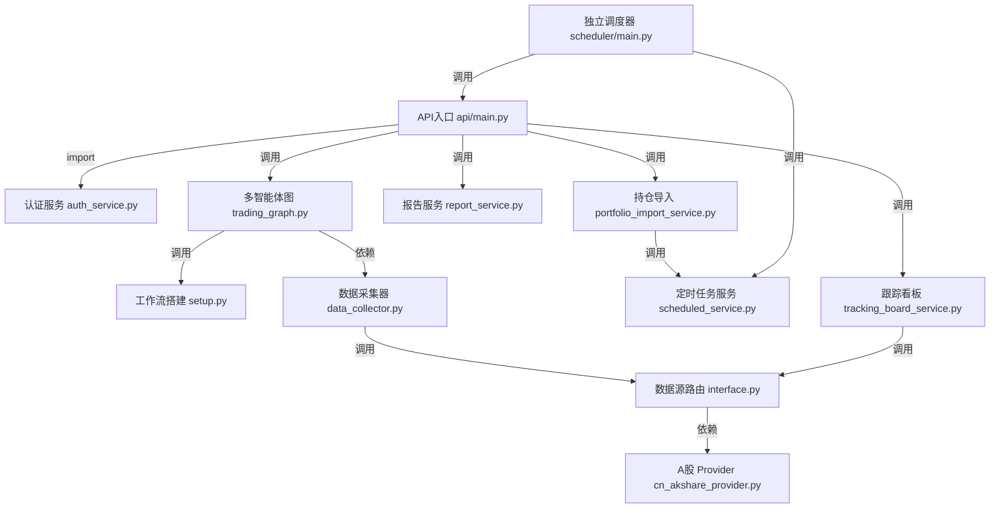

# KylinMountain/TradingAgents-AShare 源码分析

## 🔍 项目简介

`KylinMountain/TradingAgents-AShare` 是一个面向 A 股场景的多智能体投研系统：后端用 `FastAPI` 暴露分析、报告、持仓、调度、认证等接口，核心推理由 `LangGraph + LangChain` 驱动的 15 个 Agent 协作完成，行情/新闻/资金面主要依赖 `AkShare / BaoStock / yfinance`，前端则是 `React + Vite + Zustand`。它解决的不是“单次问答”，而是“把股票分析做成可持续运营的服务”：支持登录、持仓导入、定时任务、看板、报告落库。和上游 `TauricResearch/TradingAgents` 相比，这个仓库已经明显产品化，重点是 A 股数据接入、Web 端体验和任务调度链路，而不是通用 CLI 框架。

## ⚡ 核心功能

### 1. 自然语言分析任务与 SSE 流式回传

实现方式：`api/main.py:2969-3064` 先把聊天消息交给 `_ai_extract_symbol_and_date_streaming` 提取股票、日期、周期和用户上下文，再组装 `AnalyzeRequest`；真正的任务执行在 `api/main.py:1539-1765`，它初始化 job、创建 `TradingAgentsGraph`、推送 `job.created / agent.token / job.completed` 事件，并把结果写回报告表。

```python
# api/main.py:2982-2985, 3014-3023, 3059-3063
symbol, trade_date, horizons, focus_areas, specific_questions, inferred_user_context = \
    await _ai_extract_symbol_and_date_streaming(text, config, job_id)
analyze_req = AnalyzeRequest(
    symbol=symbol,
    trade_date=trade_date or cn_today_str(),
    query=text,
    horizons=horizons,
    user_intent=pre_intent,
)
return StreamingResponse(_stream_job_events(job_id), media_type="text/event-stream")
```

怎么用：

```bash
curl -N http://127.0.0.1:8000/v1/chat/completions \
  -H 'Authorization: Bearer <TOKEN>' \
  -H 'Content-Type: application/json' \
  -d '{
    "model": "tradingagents",
    "stream": true,
    "messages": [{"role": "user", "content": "分析贵州茅台短线机会，我现在半仓，成本价 1580"}]
  }'
```

输入输出：输入是 OpenAI 风格 `messages`、可选 `selected_analysts` 和配置覆盖；输出是 SSE 事件流，前端可实时消费 `agent.token`、`agent.status`、`job.completed`，最终结果里包含 `market_report / fundamentals_report / final_trade_decision` 等字段。

适用场景和限制：适合交互式单票分析与前端实时展示；但当前实现实际上会把 `request.horizons` 压成单元素，`api/main.py:1656-1660` 明确“多个 horizon 时只取第一个”，因此“短中线同时跑”的营销描述和当前源码并不一致。

### 2. 15 Agent LangGraph 协作编排

实现方式：`tradingagents/graph/setup.py:85-281` 动态装配 7 个分析师节点、Bull/Bear 研究员、Research Manager、Trader、三方风控和最终 Risk Judge；图从 `START` 并行 fan-out 到分析师，再 fan-in 到多空辩论，最后经过交易员和风控裁决。`tradingagents/graph/trading_graph.py:43-133` 则负责初始化 LLM、Memory、ToolNode、DataCollector 和 checkpointer。

```python
# tradingagents/graph/setup.py:201-245, 271-277
for analyst_type in selected_analysts:
    workflow.add_edge(START, f"{analyst_display_name(analyst_type)} Analyst")

workflow.add_edge(
    [f"{analyst_display_name(analyst_type)} Analyst Done" for analyst_type in selected_analysts],
    "Bull Researcher",
)
workflow.add_edge("Research Manager", "Trader")
workflow.add_edge("Trader", "Aggressive Analyst")
workflow.add_conditional_edges(
    "Risk Judge",
    self.conditional_logic.should_revise_after_risk_judge,
    {"Trader": "Trader", "END": END},
)
```

怎么用：

```bash
uv run python - <<'PY'
from tradingagents.default_config import DEFAULT_CONFIG
from tradingagents.graph.trading_graph import TradingAgentsGraph

graph = TradingAgentsGraph(
    config=DEFAULT_CONFIG,
    selected_analysts=["market", "social", "news", "fundamentals", "macro", "smart_money", "volume_price"],
)
state, decision = graph.propagate("600519.SH", "2026-05-29")
print(decision)
print(state["final_trade_decision"][:300])
PY
```

输入输出：输入是 `company_name`、`trade_date`、可选 `user_context / selected_analysts / request_source`；输出是完整 `final_state` 和 `process_signal()` 处理后的 BUY/SELL/HOLD 风格决策。

适用场景和限制：适合需要“分析师并行 -> 研究辩论 -> 交易 -> 风控”完整链路的场景；限制是 Agent 名单和流转顺序都写死在 `setup.py` 中，扩展新角色要改源码，而不是改配置。

### 3. 一次采集多源 A 股数据，并在本地计算技术指标与 VPA

实现方式：`tradingagents/graph/data_collector.py:264-347` 会并发抓取 `stock_data / news / global_news / fund_flow / 龙虎榜 / 涨停池 / fundamentals / 三大财务报表`，随后直接在本地用 `stockstats` 计算 `SMA/EMA/RSI/MACD/BOLL/ATR/VWMA`，再生成 `vpa_indicators`。数据调用并不是直连单一源，而是经 `tradingagents/dataflows/interface.py:125-176` 做 provider fallback；A 股主 provider `tradingagents/dataflows/providers/cn_akshare_provider.py:38-117,272-354` 还专门实现了前台优先的并发锁和 EastMoney/Sina/Tencent 多级回退。

```python
# tradingagents/graph/data_collector.py:270-287, 293-306, 321-347
tasks = {
    "stock_data": (get_stock_data, {"symbol": ticker, "start_date": start_str, "end_date": trade_date}),
    "news": (get_news, {"ticker": ticker, "start_date": ..., "end_date": trade_date}),
    "fundamentals": (get_fundamentals, {"ticker": ticker, "curr_date": trade_date}),
}
with ThreadPoolExecutor(max_workers=min(10, len(tasks))) as executor:
    future_to_key = {executor.submit(_safe, tool, payload): key for key, (tool, payload) in tasks.items()}

ss = wrap(df.copy())
indicators_res[key] = round(float(val), 2)
results["vpa_indicators"] = _compute_vpa_indicators(df.copy())
```

怎么用：

```bash
uv run python - <<'PY'
from tradingagents.graph.data_collector import DataCollector

dc = DataCollector()
pool = dc.collect("600519.SH", "2026-05-29")
print(pool["indicators"])
print(pool["vpa_indicators"][:400])
PY
```

输入输出：输入是 `ticker + trade_date`；输出是一个缓存池字典，至少包含 `stock_data / news / fundamentals / balance_sheet / cashflow / income_statement / indicators / vpa_indicators`。

适用场景和限制：适合多个 Agent 共用同一份底层数据、避免重复打 AkShare；限制是 A 股数据路径明显偏向中国市场，且 `cn_akshare_provider.py` 故意把总并发压到 5，吞吐量不是它的优化方向。

### 4. 结构化研报抽取与持久化

实现方式：`api/services/report_service.py:97-144` 先用 LLM 把长文本 `final_trade_decision + fundamentals_report` 抽成 `decision/confidence/target_price/stop_loss_price/risks/key_metrics`，然后 `api/services/report_service.py:260-305,372-460` 负责把任务从 `pending/running` 逐步更新到 `completed`，并把各类报告段落和结构化字段统一落进 `ReportDB`。

```python
# api/services/report_service.py:113-136, 402-425
client = create_llm_client(
    provider=config.get("llm_provider", "openai"),
    model=config.get("quick_think_llm", "gpt-4o-mini"),
    base_url=config.get("backend_url"),
    api_key=config.get("api_key"),
)
response = llm.invoke([HumanMessage(content=prompt)])
parsed = json_repair.loads(raw)
result = StructuredReport(**parsed)

db_report.status = "completed"
db_report.direction = resolved["direction"]
db_report.confidence = resolved["confidence"]
db_report.target_price = resolved["target_price"]
db_report.final_trade_decision = resolved["final_trade_decision"]
```

怎么用：

```bash
uv run python - <<'PY'
from api.services.report_service import extract_structured_data

res = extract_structured_data(
    final_trade_decision="最终交易建议：BUY，目标价 1680，止损价 1520，置信度 72%。",
    fundamentals_report="ROE 21%，经营现金流改善。"
)
print(res.model_dump() if res else None)
PY
```

输入输出：输入是长文本报告和当前 LLM 配置；输出是 `StructuredReport`，以及 `create_report()` 最终写入数据库的 `ReportDB` 行。

适用场景和限制：适合给前端历史列表、决策卡片和看板提供结构化字段；限制是它仍然依赖 LLM 解析，失败时才退回正则，数值字段可能为空或被模型误判。

### 5. 持仓导入、截图识别与自动补齐定时任务

实现方式：`api/services/portfolio_import_service.py:31-116` 负责标准化股票代码、去重、推算仓位占比，并在 `auto_apply_scheduled=True` 时调用 `scheduled_service.ensure_scheduled_for_symbols()` 自动为持仓创建定时分析；截图入口在 `api/main.py:3947-3969`，真正的图片解析逻辑在 `api/services/vlm_position_parser.py:29-68`，它把券商截图交给 VLM，要求返回 JSON 数组。

```python
# api/services/portfolio_import_service.py:51-76,106-113
for raw in positions:
    symbol = _normalize_code(raw.get("symbol"))
    ...
if total_mv > 0:
    for p in cleaned:
        if p["current_position_pct"] is None and p["market_value"] and p["market_value"] > 0:
            p["current_position_pct"] = round((p["market_value"] / total_mv) * 100, 4)

scheduled_sync = scheduled_service.ensure_scheduled_for_symbols(
    db=db, user_id=user_id, symbols=ordered,
)
```

```python
# api/services/vlm_position_parser.py:29-35, 45-67
raw = call_vlm(image_bytes, POSITION_PROMPT, content_type)
items = json.loads(text)
result.append({
    "symbol": symbol,
    "name": item.get("name"),
    "current_position": _to_float(item.get("current_position")),
})
```

怎么用：

```bash
curl http://127.0.0.1:8000/v1/portfolio/imports \
  -H 'Authorization: Bearer <TOKEN>' \
  -H 'Content-Type: application/json' \
  -d '{
    "source": "manual",
    "auto_apply_scheduled": true,
    "positions": [
      {"symbol": "600519.SH", "name": "贵州茅台", "current_position": 100, "average_cost": 1580, "market_value": 168000}
    ]
  }'
```

截图解析：

```bash
curl http://127.0.0.1:8000/v1/portfolio/parse-image \
  -H 'Authorization: Bearer <TOKEN>' \
  -F 'file=@/path/to/broker-position.png'
```

输入输出：输入可以是结构化持仓 JSON，也可以是 `image/*` 文件；输出是持仓快照、`scheduled_sync` 结果，或者图片识别出的 `positions` 数组。

适用场景和限制：适合把“我现在持有什么”喂给后续分析和看板；限制是 `_normalize_code()` 只认 `600519.SH / 000001.SZ / 430xxx.BJ` 这类 6 位中国股票代码，且截图识别依赖 `TA_VLM_API_KEY` 和模型返回 JSON 的稳定性。

### 6. 独立调度器执行非交易时段分析，并推送邮件/企微通知

实现方式：`api/services/scheduled_service.py:16-31,109-145` 对任务数量、周期和 `20:00~08:00` 触发时间做校验；`scheduler/main.py:127-173,178-242,277-329` 则作为独立进程运行，每分钟检查一次中国交易日的待执行任务，通过 `_concurrency_slot()` 控制并发、复用 API 的 `_run_job()`、成功后异步发送邮件和企业微信 webhook。

```python
# api/services/scheduled_service.py:16-31
def _validate_trigger_time(t: str) -> str:
    ...
    if 8 * 60 < time_val < 20 * 60:
        raise ValueError("定时时间仅允许 20:00~次日 08:00（避免影响白天使用）")
```

```python
# scheduler/main.py:225-242, 296-329
async with _concurrency_slot(job_id, symbol):
    req = await asyncio.to_thread(_build_request_sync)
    await _run_job(job_id, req, False, True, user_id, "scheduled")

if not is_cn_trading_day(today):
    continue
if 8 * 60 < time_val < 20 * 60:
    continue
_create_tracked_task(_run_scheduled_job(snap, today))
```

怎么用：

```bash
curl http://127.0.0.1:8000/v1/scheduled \
  -H 'Authorization: Bearer <TOKEN>' \
  -H 'Content-Type: application/json' \
  -d '{"symbol":"600519.SH","horizon":"short","trigger_time":"20:30"}'

uv run python -m scheduler.main
```

输入输出：输入是数据库里的定时任务定义和用户配置的通知目标；输出是后台生成的报告、任务运行状态，以及可选的 Email / WeCom 消息。

适用场景和限制：适合晚间批量复盘、持仓日报；限制是必须单独启动 `scheduler/main.py`，只起 API 不会自动跑任务，而且默认 `SCHEDULER_CONCURRENCY=3`、单用户最多 10 个定时任务。

### 7. 跟踪看板：把持仓、实时行情和最近一份报告压成可刷新的监控视图

实现方式：`api/services/tracking_board_service.py:19-80` 先读取导入持仓，再用 `route_to_vendor("get_realtime_quotes", symbols)` 拉实时行情，随后选取“上一交易日优先”的最近报告，计算 `live_market_value / floating_pnl / floating_pnl_pct` 并附带一段简短结论。

```python
# api/services/tracking_board_service.py:23-24, 32-44, 72-79
quotes = _fetch_live_quotes(symbols)
reports = _select_reports_for_symbols(db, user_id, symbols, previous_trade_date)

live_market_value = round(live_price * current_position, 2)
floating_pnl = round((live_price - average_cost) * current_position, 2)
floating_pnl_pct = round(((live_price - average_cost) / average_cost) * 100, 2)

return {
    "previous_trade_date": previous_trade_date,
    "refresh_interval_seconds": REFRESH_INTERVAL_SECONDS,
    "items": items,
}
```

怎么用：

```bash
curl http://127.0.0.1:8000/v1/dashboard/tracking-board \
  -H 'Authorization: Bearer <TOKEN>'
```

输入输出：输入是当前用户已导入的持仓；输出是按持仓展开的监控项，每项都带实时价格、当日涨跌、浮盈亏、上一交易日报告摘要等字段。

适用场景和限制：适合盘中/盘后快速检查持仓健康度；限制是没有导入持仓就没有数据，且实时行情 provider 异常时字段会降级为 `null`。

## 🗺️ 知识图谱（Mermaid）



## 🔐 安全审计

我实际执行了三类检查：

```bash
# Python 依赖（基于 uv.lock 导出的精确版本）
uv export --frozen --format requirements-txt --no-hashes > /tmp/tradingagents-ashare-req.txt
pip-audit -r /tmp/tradingagents-ashare-req.txt

# Frontend 依赖
cd frontend && npm audit --json

# 凭证/密钥模式扫描
rg -n --hidden -i '(api[_-]?key|secret|token|password|access[_-]?token)'
rg -n '(sk-[A-Za-z0-9]{20,}|ta-sk-[A-Za-z0-9_-]{20,}|AKIA[0-9A-Z]{16}|ghp_[A-Za-z0-9]{20,})'
```

### 1. 依赖漏洞扫描结果

- Python：`pip-audit` 基于 `pyproject.toml + uv.lock` 解析出的后端依赖共发现 **13 个包、16 个漏洞**。
- Frontend：`npm audit` 基于 `frontend/package-lock.json` 发现 **1 个中危漏洞**，位于传递依赖 `brace-expansion`（`GHSA-jxxr-4gwj-5jf2`，可升级修复）。
- 注意：`pip-audit` JSON 不统一给出 severity 字段，下面的“高风险关注项”是我结合本仓库实际暴露面做的影响判断。

高风险关注项：

1. `python-multipart 0.0.22` 有 2 个 multipart 解析 DoS（`CVE-2026-40347`、`CVE-2026-42561`，修复版本 `>=0.0.27`）。这和仓库实际暴露的文件上传接口直接相关，因为 `api/main.py:3947-3969` 用 `UploadFile = File(...)` 接收 `/v1/portfolio/parse-image`。

2. `starlette 0.52.1` 命中 `GHSA-86qp-5c8j-p5mr`（Host header/path 解释不一致）。当前 `api/main.py:294-300` 只挂了 `CORSMiddleware`，没有 `TrustedHostMiddleware` 或 Host allowlist；如果未来放在反向代理后面且代理配置宽松，这个框架层问题需要一起处理。

3. `curl-cffi 0.14.0` 命中 `CVE-2026-33752`（重定向型 SSRF）。它主要是通过 AkShare/YFinance 传递进来；目前仓库没有“让用户传 URL 再帮他抓”的接口，所以现实暴露面偏低，但后续如果加远程抓取功能，这个依赖会立刻变成直接风险。

4. `langgraph 1.0.10rc1` 命中 `CVE-2026-28277`（checkpoint 反序列化问题），但当前 `tradingagents/graph/trading_graph.py:54-71` 使用的是内存型 `MemorySaver()`，不是持久化 checkpoint store，因此现阶段相关性低于上面三个。

### 2. 密钥泄露扫描

- 高熵模式扫描未命中真实 `sk- / ta-sk- / AKIA / ghp_` 这类密钥串，仓库里看到的主要是文档占位符和环境变量模板，例如 `.env.example` 中的 `TA_API_KEY=`、`TA_VLM_API_KEY=`、`MAIL_PASS=` 都是空值占位。
- 但源码内存在**硬编码开发默认密钥**：`api/services/auth_service.py:36-40` 定义 `_DEFAULT_SECRET = "tradingagents-ashare-dev-secret"`，而 `api/main.py:245-250` 只是在启动时打印警告，不会阻止服务继续运行。这意味着运维忘记设置 `TA_APP_SECRET_KEY` 时，JWT 签名和用户密钥加密都退回可预测常量。

### 3. 认证与授权逻辑

正向实现：

- `api/main.py:996-1036` 的 `RequireUser` 同时支持网页登录 JWT 和 `ta-sk-` API Token。
- `api/services/token_service.py:23-63` 把 API Token 做 HMAC-SHA256 存储，而且明文只在创建时返回一次。
- `api/services/auth_service.py:56-84` 使用 `Fernet` 加密用户保存的 LLM API Key / WeCom Webhook，并支持密钥轮换时重加密。

实际问题：

1. **回测接口存在未授权访问与删除面。** `POST /v1/backtest` 在 `api/main.py:3339-3356` 要求登录，但 `GET /v1/backtest`、`GET /v1/backtest/{job_id}`、`DELETE /v1/backtest/{job_id}` 在 `api/main.py:3359-3380` 完全没有 `Depends(_require_api_user)`。同时 `api/services/backtest_service.py:19-47` 把所有回测任务放在全局进程内存里，不做用户分区。结果是匿名请求就能枚举、读取甚至删除别人的回测任务。

2. **邮箱验证码登录缺少速率限制和失败计数。** `api/main.py:3644-3665` 的 `request-code / verify-code` 只做邮箱格式检查和哈希校验；`api/services/auth_service.py:122-184` 里也没有 IP 限速、邮箱冷却、错误次数锁定或验证码尝试上限。这会带来撞库、短信/邮件轰炸类滥用风险。

3. **Web 端令牌保存在 localStorage。** `frontend/src/stores/authStore.ts:22-52` 直接把 `ta-access-token` 放进浏览器 `localStorage`。由于服务端不是 cookie session，经典 CSRF 风险反而较低；但一旦前端出现 XSS，令牌会被直接窃取，攻击面更偏向“XSS 后高价值会话劫持”。

### 4. 输入校验与数据暴露面

正向实现：

- `api/main.py:3834-3862` 对 `/v1/market/stock-search` 的 `q` 做了 `min_length=1, max_length=20` 约束。
- `api/main.py:3947-3969` 对 `/v1/portfolio/parse-image` 校验了 `content_type.startswith("image/")`，并限制文件不得超过 `10MB`。
- `api/services/scheduled_service.py:16-31,92-145` 对 `trigger_time`、`horizon`、任务数上限都做了服务端校验。
- `api/main.py:317-323` 使用 `_CONFIG_OVERRIDES_ALLOWLIST`，阻止客户端通过 `config_overrides` 直接注入 `api_key / backend_url` 等敏感项。

需要注意的数据暴露/输入处理问题：

1. `api/main.py:2475-2494` 的 `/api/version-stats` 是公开写接口，只做了**进程内** IP 级限流和字段截断。如果服务是多进程/多副本部署，这个限流天然不可共享，容易被轻量刷写。

2. `api/main.py:75-92,294-300` 允许从环境变量直接注入 `CORS_ALLOW_ORIGIN_REGEX`，同时 `allow_credentials=True`。默认值只放行 localhost 开发端口，问题不大；但一旦生产环境把 regex 配宽，跨域认证面会迅速扩大。

总体判断：安全基础设施有一些好点子（Token 哈希、用户密钥加密、配置白名单），但生产面前最该先修的是 **回测接口鉴权缺失、默认密钥回退、验证码限流缺失、上传相关依赖漏洞**。

## 🚀 快速上手

系统要求：

- Python `>=3.10`（`pyproject.toml`）
- Node.js（前端构建；仓库 Dockerfile 使用 `node:25-slim`）
- `uv`、`npm`
- 至少要准备一个可用的 LLM Provider Key；如果要用截图识别，还要配置 `TA_VLM_API_KEY`

源码安装：

```bash
cd /home/trade/ctf_workspace/gh_trending/KylinMountain-TradingAgents-AShare

uv sync

cd frontend
npm install
npm run build
cd ..

cp .env.example .env
export TA_APP_SECRET_KEY="$(openssl rand -base64 32)"

uv run python -m uvicorn api.main:app --host 0.0.0.0 --port 8000
```

如果要启用定时任务，再开第二个进程：

```bash
cd /home/trade/ctf_workspace/gh_trending/KylinMountain-TradingAgents-AShare
uv run python -m scheduler.main
```

Docker（按源码内 Dockerfile 自行构建）：

```bash
cd /home/trade/ctf_workspace/gh_trending/KylinMountain-TradingAgents-AShare
docker build -t tradingagents-ashare .
docker run --rm -p 8000:8000 \
  -e TA_APP_SECRET_KEY="$(openssl rand -base64 32)" \
  tradingagents-ashare
```

常见坑：

- 不设置 `TA_APP_SECRET_KEY` 也能跑，但会退回 `api/services/auth_service.py` 里的默认开发密钥，不适合生产。
- 不先构建 `frontend/dist`，`api/main.py:4520-4543` 就不会挂载 SPA，最终只有 API 没有完整前端页面。
- 定时分析不是 API 内的后台线程，而是独立 `scheduler/main.py` 进程；只起 FastAPI 不会执行计划任务。
- `TA_VLM_API_KEY` 只在 `/v1/portfolio/parse-image` 场景需要；SMTP 只在邮箱验证码登录和邮件报告通知场景需要。

## ⚖️ 一句话判词

值得关注，尤其适合想把“LLM 股票分析”做成 A 股可运营服务的人；但别把 README 里的“双周期”“生产可用”完全照单全收，源码里多周期目前被压成单周期，安全上也还有几处必须先补的口子。

## 📊 元信息

- 项目：`KylinMountain/TradingAgents-AShare`
- Stars：`500`（GitHub API，采集时间 2026-06-01）
- Forks：`156`（GitHub API，采集时间 2026-06-01）
- Primary Language：`Python`（仓库同时包含 TypeScript 前端）
- License：GitHub API 返回 `NOASSERTION`；`LICENSE` 文件实际声明为“上游原始部分 Apache-2.0，新组件与重大修改 PolyForm Noncommercial 1.0.0”
