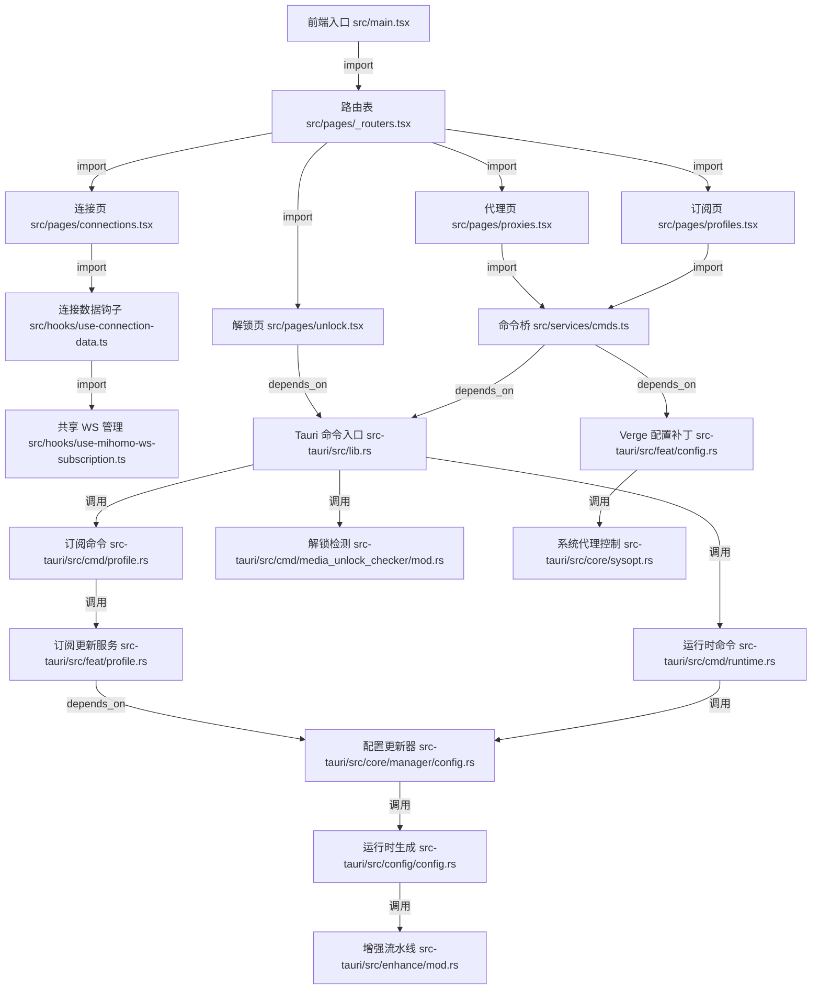

<!-- 
  📖 English summary available at: [English version](../../en/trending/2026-06-02-00-clash-verge-rev-clash-verge-rev.md)
-->


# clash-verge-rev/clash-verge-rev 源码分析

## 🔍 项目简介

`clash-verge-rev` 是一个基于 Tauri 2 的跨平台桌面代理客户端，核心目标是把 Mihomo/Clash 内核的订阅管理、运行时配置增强、系统代理/TUN、连接监控、流媒体解锁测试和备份恢复整合到一个原生 GUI 里。目标用户是需要长期管理多订阅、多平台代理策略的桌面用户。技术栈上，前端是 React 19 + TypeScript + Vite + MUI（`package.json:5-35,36-80`），后端是 Rust + Tauri 2（`src-tauri/src/lib.rs:35-72`），并通过 `tauri-plugin-mihomo`、warp、本地 sidecar/service 完成与 Mihomo 内核和系统代理的交互。和 Clash for Windows 这类 Electron 客户端相比，它更偏 Tauri/Rust，本地能力更重，系统集成更深。

## ⚡ 核心功能

### 1. 订阅导入、拖拽 YAML 与远程更新回退

- 功能名称：订阅/配置文件导入与更新
- 实现方式：前端在 `src/pages/profiles.tsx:198-225` 监听 `TauriEvent.DRAG_DROP`，只接受 `.yaml/.yml`，随后调用 `createProfile()` 写入本地；远程订阅则经 `src/services/cmds.ts:42-68` 发起 `import_profile`/`update_profile`。后端 `src-tauri/src/cmd/profile.rs:68-106,145-154` 用 `PrfItem::from_url` 拉取订阅，`src-tauri/src/feat/profile.rs:66-97` 先判断是否允许更新，`100-186` 在直连失败后依次尝试 Clash 代理、系统代理回退，`206-212` 命中当前订阅时会刷新运行时配置。

```ts
// src/pages/profiles.tsx:205-225
if (!file.endsWith('.yaml') && !file.endsWith('.yml')) continue
const data = await readTextFile(file)
await createProfile(item, data)
await mutateProfiles()
await enhanceProfiles()
```

```rust
// src-tauri/src/feat/profile.rs:122-145
match PrfItem::from_url(url, None, None, merged_opt.as_ref()).await { ... }
merged_opt.get_or_insert_with(PrfOption::default).self_proxy = Some(true);
merged_opt.get_or_insert_with(PrfOption::default).with_proxy = Some(false);
```

- 怎么用：

```ts
import { importProfile, updateProfile } from '@/services/cmds'

await importProfile('https://example.com/sub.yaml', { with_proxy: true })
await updateProfile('profile-uid')
```

- 输入输出：输入是远程订阅 URL 或本地 YAML 文本；输出是持久化后的 profile 条目和 profile 文件，若更新的是当前活动订阅，还会联动生成新的运行时配置。
- 适用场景和限制：适合机场订阅管理、拖拽导入本地规则文件；本地拖拽只接收 YAML，远程更新只对 `remote` 类型 profile 生效，并会受 `allow_auto_update` 限制。

### 2. 运行时配置增强流水线

- 功能名称：规则、代理、分组、脚本、DNS/TUN 的多阶段增强生成
- 实现方式：`src-tauri/src/enhance/mod.rs:323-365` 依次处理 `rules`、`proxies`、`proxy-groups`、`merge`、`script`，`368-443` 把 Clash 默认配置按端口开关合并进结果，`445-467` 执行内建脚本，`550-577` 把 `dns_config.yaml` 注入运行时，最终 `582-656` 返回 `config + exists_keys + chain_logs`。`src-tauri/src/config/config.rs:194-205` 再把增强后的结果写入 runtime draft，成为后续验证和热重载的输入。

```rust
// src-tauri/src/enhance/mod.rs:335-358
if let ChainType::Rules(rules) = rules_item.data {
    config = use_seq(rules, config, "rules");
}
if let ChainType::Proxies(proxies) = proxies_item.data {
    config = use_seq(proxies, config, "proxies");
}
if let ChainType::Merge(merge) = merge_item.data {
    config = use_merge(&merge, config);
}
```

```rust
// src-tauri/src/config/config.rs:194-201
let (mut config, exists_keys, logs) = enhance::enhance().await?;
Self::runtime().await.edit_draft(|d| {
    *d = IRuntime { config: Some(config), exists_keys, chain_logs: logs }
});
```

- 怎么用：

```ts
import { enhanceProfiles, getRuntimeYaml } from '@/services/cmds'

await enhanceProfiles()
const yaml = await getRuntimeYaml()
console.log(yaml)
```

- 输入输出：输入是当前 profile 及其关联的 `Rules/Proxies/Groups/Merge/Script`、全局 Clash 配置、Verge 开关和 DNS 配置文件；输出是最终 runtime YAML、存在键集合和脚本执行日志。
- 适用场景和限制：适合需要把多个订阅片段、脚本增强、DNS 覆盖统一生成一个 Mihomo 配置的场景；脚本或 merge 文件本身出错时，后续验证会失败，且 `external-controller` 会随 `enable_external_controller` 被强制改写。

### 3. 代理模式切换与链式代理运行时拼接

- 功能名称：`rule/global/direct` 模式切换与 proxy chain 导出/写回
- 实现方式：前端 `src/pages/proxies.tsx:59-80` 切换模式时调用 `patchClashMode()`，并在开启 chain mode 后于 `87-125` 读取 `proxy-chain-exit-node`，请求后端导出链式代理 YAML。后端 `src-tauri/src/cmd/runtime.rs:45-88` 沿着 `dialer-proxy` 逆向追溯代理链，生成只包含该链路的 YAML；`95-111` 则把链式配置写回 runtime，并触发统一配置应用。

```rust
// src-tauri/src/cmd/runtime.rs:55-85
if let Some(serde_yaml_ng::Value::Sequence(proxies)) = config.get("proxies") {
    let mut proxy_name = Some(Some(proxy_chain_exit_node.as_str()));
    let mut proxies_chain = Vec::new();
    while let Some(proxy) = proxies.iter().find(|proxy| { ... }) {
        proxies_chain.push(proxy.to_owned());
        proxy_name = proxy.get("dialer-proxy").map(|x| x.as_str());
    }
    config.insert("proxies".into(), proxies_chain);
}
```

- 怎么用：

```ts
import {
  getRuntimeProxyChainConfig,
  patchClashMode,
  updateProxyChainConfigInRuntime,
} from '@/services/cmds'

await patchClashMode('global')
const chainYaml = await getRuntimeProxyChainConfig('HK-Exit')
console.log(chainYaml)
await updateProxyChainConfigInRuntime(null) // 退出链式代理
```

- 输入输出：输入是模式字符串或“出口代理节点名”；输出是新的 Clash 运行模式，或一段只包含链式代理节点的 YAML，再由后端写回运行时。
- 适用场景和限制：适合调试复杂多跳代理、临时切全局/直连；chain mode 依赖配置里已经存在 `dialer-proxy` 关系，并默认从 `localStorage` 读取出口节点。

### 4. 系统代理、PAC、TUN 与内核生命周期编排

- 功能名称：系统代理/PAC/TUN 开关以及 sidecar/service 模式调度
- 实现方式：前端 `src/components/shared/proxy-control-switches.tsx:151-159,188-245` 通过 `patchVerge()` 驱动系统代理与 TUN 开关；后端 `src-tauri/src/feat/config.rs:71-199` 根据 patch 计算 `RESTART_CORE`、`SYS_PROXY`、`SYSTRAY_*` 等标志，`201-268` 统一执行重启内核、更新系统代理、刷新托盘、热键等副作用。`src-tauri/src/core/sysopt.rs:128-196` 负责实际把 PAC 或全局代理写入 OS，`src-tauri/src/core/manager/lifecycle.rs:14-23,65-71` 决定用系统服务还是 sidecar 启动 Mihomo。

```rust
// src-tauri/src/feat/config.rs:204-229
if update_flags.contains(UpdateFlags::RESTART_CORE) {
    Config::generate().await?;
    CoreManager::global().restart_core().await?;
}
if update_flags.contains(UpdateFlags::SYS_PROXY) {
    sysopt::Sysopt::global().update_sysproxy().await?;
    sysopt::Sysopt::global().refresh_guard().await;
}
```

```rust
// src-tauri/src/core/sysopt.rs:152-189
auto.url = format!("http://{proxy_host}:{pac_port}/commands/pac");
let apply_steps = proxy_apply_steps(sys.enable, auto.enable);
for step in apply_steps {
    match step {
        ProxyApplyStep::Autoproxy => auto.set_auto_proxy()?,
        ProxyApplyStep::Sysproxy => sys.set_system_proxy()?,
    }
}
```

- 怎么用：

```ts
import { patchVerge } from '@/services/cmds'

await patchVerge({ enable_system_proxy: true, proxy_auto_config: true })
await patchVerge({ enable_tun_mode: true })
```

- 输入输出：输入是 Verge 配置 patch，例如 `enable_system_proxy`、`proxy_auto_config`、`enable_tun_mode`、端口开关等；输出是 OS 级代理/PAC 状态、内核重启、托盘状态同步。
- 适用场景和限制：适合把桌面流量切进 Mihomo、使用系统 PAC 或 TUN；需要管理员权限或系统服务可用性，平台差异较大，Linux/Windows/macOS 的可用路径不同。

### 5. 配置文件编辑、语法验证、失败回滚与热应用

- 功能名称：配置文件保存后即时验证与回滚
- 实现方式：`src-tauri/src/cmd/save_profile.rs:17-83` 接收编辑器保存内容，先读取原始文件做备份，再把新内容落盘；`111-177` 调 `CoreConfigValidator::validate_config_file_outcome()` 进行校验，失败则调用 `restore_original()` 回滚原内容，成功且影响当前运行时则调用 `CoreManager::global().update_config_forced()` 热应用。真正的验证逻辑位于 `src-tauri/src/core/validate.rs:273-320,342-387`，其中 YAML 会通过 sidecar Mihomo 进程执行 `-t -d -f` 校验。

```rust
// src-tauri/src/cmd/save_profile.rs:135-148
match CoreConfigValidator::validate_config_file_outcome(file_path_str, Some(is_merge_file)).await {
    Ok(outcome) if outcome.is_valid() => { ... }
    Ok(outcome) => {
        restore_original(file_path, original_content).await?;
        return Ok(outcome);
    }
    Err(e) => {
        restore_original(file_path, original_content).await?;
        return Err(e.to_string().into());
    }
}
```

```rust
// src-tauri/src/core/validate.rs:342-348
let command = app_handle
    .shell()
    .sidecar(clash_core.as_str())?
    .args(["-t", "-d", app_dir_str, "-f", config_path]);
let output = command.output().await?;
```

- 怎么用：

```ts
import { saveProfileFile } from '@/services/cmds'

const valid = await saveProfileFile('Merge', yamlText)
console.log(valid)
```

- 输入输出：输入是 profile 标识和新的 YAML/JS 文本；输出是 `ValidationOutcome`（前端 wrapper 会折算成布尔值），并在需要时把新配置热应用到当前运行时。
- 适用场景和限制：适合内置编辑器修改 merge/script/runtime 文件时做“保存即验证”；merge 文件默认只做语法检查，不做完整内核验证，且应用退出阶段会跳过验证。

### 6. 连接与流量实时监控

- 功能名称：共享 WebSocket 的连接列表与流量采样
- 实现方式：`src/hooks/use-mihomo-ws-subscription.ts:59-131` 实现共享 Mihomo WebSocket 的引用计数、重连和“活跃 owner”分发；`src/hooks/use-connection-data.ts:22-87` 维护连接快照，增量计算 `curUpload/curDownload` 并把已断开的连接移入 `closedConnections`；`90-112` 负责订阅 Mihomo 连接流。页面侧 `src/pages/connections.tsx:86-115` 直接消费该 hook，支持表格/列表切换、排序、搜索和一键关闭连接。对于流量图表，`src/hooks/use-traffic-monitor.ts:58-157` 又额外实现了一个节流采样器。

```ts
// src/hooks/use-connection-data.ts:100-109
if (data.startsWith('Websocket error')) {
  next(data)
  void scheduleReconnect()
  return
}
next(null, (old = initConnData) =>
  mergeConnectionSnapshot(JSON.parse(data) as IConnections, old),
)
```

```ts
// src/hooks/use-mihomo-ws-subscription.ts:82-117
entry.connectWs = async () => {
  if (entry.closed || entry.connecting || entry.ws) return
  const ws = await connect()
  ws.addListener((msg: Message) => {
    if (msg.type !== 'Text') return
    pickActiveOwner(entry)?.handleMessage(msg.data)
  })
}
```

- 怎么用：

```ts
import { useConnectionData } from '@/hooks/use-connection-data'

const { response, clearClosedConnections } = useConnectionData()
console.log(response.data?.activeConnections)
clearClosedConnections()
```

- 输入输出：输入是 Mihomo WebSocket 推送的连接 JSON；输出是总上传/下载、活动连接列表、已关闭连接列表，以及每个连接的瞬时上传/下载增量。
- 适用场景和限制：适合排查哪个进程在走代理、测速或清理连接；已关闭连接历史最多保留 500 条，并依赖 Mihomo WebSocket 正常工作。

### 7. 本地与 WebDAV 备份恢复

- 功能名称：配置打包、WebDAV 上传下载与恢复后重建内存状态
- 实现方式：前端 `src/services/cmds.ts:456-509` 封装了本地/WebDAV 备份命令。后端 `src-tauri/src/core/backup.rs:234-283` 把 `profiles/`、`clash.yaml`、`verge.yaml`、`dns_config.yaml`、`profiles.yaml` 打成 zip，并在 `263-271` 主动去掉 WebDAV 凭据；`src-tauri/src/feat/backup.rs:27-67` 在恢复后把当前保存的 WebDAV 三元组重新注入 verge 配置，再同步 Clash/Profiles/Verge 内存态，`70-137` 和 `140-220` 分别处理 WebDAV 与本地路径。

```rust
// src-tauri/src/core/backup.rs:263-271
let mut verge_config: serde_json::Value = serde_yaml_ng::from_str(&verge_text)?;
if let Some(obj) = verge_config.as_object_mut() {
    obj.remove("webdav_username");
    obj.remove("webdav_password");
    obj.remove("webdav_url");
}
```

```rust
// src-tauri/src/feat/backup.rs:36-40
restored.webdav_url = webdav_url;
restored.webdav_username = webdav_username;
restored.webdav_password = webdav_password;
restored.save_file().await?;
```

- 怎么用：

```ts
import {
  createLocalBackup,
  createWebdavBackup,
  restoreLocalBackup,
  saveWebdavConfig,
} from '@/services/cmds'

await saveWebdavConfig('https://dav.example.com/backup', 'user', 'pass')
await createLocalBackup()
await createWebdavBackup()
await restoreLocalBackup('linux-backup-2026-06-02_10-00-00.zip')
```

- 输入输出：输入是当前应用目录下的配置文件，或者某个现有 zip 备份文件；输出是 zip 包、本地备份目录项、WebDAV 远端文件，或恢复后的运行配置。
- 适用场景和限制：适合迁移机器、定期快照、配置回滚；备份包故意不带 WebDAV 凭据，恢复依赖当前机器本地保存的 WebDAV 信息补回。

### 8. 流媒体与 AI 服务解锁检测

- 功能名称：并发解锁测试面板
- 实现方式：前端 `src/pages/unlock.tsx:180-250` 通过 `invoke('get_unlock_items')` 拉默认项目、用 `invoke('check_media_unlock')` 执行全量测试，并把结果缓存到 `localStorage`。后端 `src-tauri/src/cmd/media_unlock_checker/mod.rs:57-119` 构造一个共享 `reqwest::Client`，然后并发执行 ChatGPT、Claude、Gemini、Netflix、Disney+、Spotify、TikTok 等测试器。`src-tauri/src/cmd/media_unlock_checker/disney_plus.rs:8-10,60-66` 还能看到 Disney+ 检测走了固定 `Authorization` 头去探测设备 API。

```rust
// src-tauri/src/cmd/media_unlock_checker/mod.rs:71-99
spawn_unlock_check(&mut tasks, Arc::clone(&client_arc), |client| async move {
    check_chatgpt_combined(&client).await
});
spawn_unlock_check(&mut tasks, Arc::clone(&client_arc), |client| async move {
    single_result(check_netflix(&client).await)
});
spawn_unlock_check(&mut tasks, Arc::clone(&client_arc), |client| async move {
    single_result(check_disney_plus(&client).await)
});
```

- 怎么用：

```ts
import { invoke } from '@tauri-apps/api/core'

const result = await invoke('check_media_unlock')
console.log(result)
```

- 输入输出：输入是当前代理出口网络环境；输出是一个 `UnlockItem[]`，包含服务名、状态和可推断的地区信息。
- 适用场景和限制：适合换节点后快速检查流媒体/AI 服务是否放行；本质是启发式 HTTP 探测，不是官方 API，且前端默认 15 秒超时。

## 🗺️ 知识图谱（Mermaid）



## 🔐 安全审计

- 依赖扫描：
  - 我实际执行了 `pnpm audit --json`。结果是 `moderate 8 / high 0 / critical 0`，8 条全部落在 `dompurify@3.2.7`，由 `monaco-editor@0.55.1` 传入（`pnpm-lock.yaml:2162-2163,6636-6638`）。这意味着内置编辑器链路如果未来引入不可信 HTML 渲染，风险会被放大。
  - 我实际执行了 `cargo-audit audit -n --stale --json`。结果是 `vulnerabilities 0 / unmaintained 18 / unsound 2 / yanked 1`。比较值得注意的是 `glib 0.18.5`（`Cargo.lock:2897-2918`，`RUSTSEC-2024-0429`）和 `rand 0.7.3`（`Cargo.lock:5810-5822`，`RUSTSEC-2026-0097`）的 unsound 告警，以及一批 GTK3 绑定长期无人维护。
  - 审计里没有高危和严重漏洞，但前端权限面比较宽：`src-tauri/tauri.conf.json:49-60` 开启了 `assetProtocol allow ["**"]` 且 `csp: null`，`src-tauri/capabilities/desktop.json:22-27` 允许任意 `http://*/*` 与 `https://*/*` 请求，`src-tauri/capabilities/migrated.json:10-18` 则把文件系统 scope 放大到 `"**"`。这些配置本身不是漏洞，但会放大上面 `dompurify` 类问题的潜在影响面。

- 密钥泄露扫描：
  - 我用正则扫描了 `api key / token / secret / password` 模式。没有发现项目自己的云密钥、私有 token 或硬编码密码提交到仓库。
  - 命中的主要是真正的配置字段与占位逻辑：WebDAV 凭据字段在 `src-tauri/src/config/verge.rs:209-234`，保存时经 `src-tauri/src/config/encrypt.rs:18-60` 做 AES-GCM 包装；日志里还专门有 `src-tauri/src/utils/help.rs:100-140` 的 `mask_url()` 对订阅 URL 和 query token 打码。
  - 例外是 `src-tauri/src/cmd/media_unlock_checker/disney_plus.rs:8-10` 带了一个固定 `AUTH_HEADER`，它更像探测 Disney+ 设备接口所需的公共客户端头，而不是项目运营方私密凭据。

- 认证授权逻辑：
  - 这不是一个多用户 Web 服务，我在 `src/` 与 `src-tauri/src/` 里没有发现 login/session/cookie/CSRF middleware。真实暴露面主要是 Tauri 命令注册表和本地 loopback 服务。
  - Tauri 命令面很大，`src-tauri/src/lib.rs:131-216` 直接注册了启动/停止内核、修改配置、备份、解锁检测、文件读写等大量命令。如果 WebView 被注入恶意脚本，这些命令就是高价值调用面。
  - 本地 HTTP 服务只监听 `127.0.0.1`，但 `src-tauri/src/utils/server.rs:68-121` 的 `/commands/visible`、`/commands/pac`、`/commands/scheme` 没有额外认证，依赖的是 loopback 绑定而不是 token 鉴权。
  - 对 Mihomo 外部控制器的保护主要靠 Clash `secret` 字段，模板里会补成非空占位值（`src-tauri/src/config/clash.rs:36-41,107`），但这仍然是“控制面 secret”，不是整个 GUI 应用的认证体系。

- 输入校验与数据暴露面：
  - 正向控制做得比较扎实。`src/utils/uri-parser/helpers.ts:141-163` 用严格端口校验限制 `1..65535`，`199-225` 的 `parseUrlLike()` 可强制要求 auth 段；配置保存路径上，`src-tauri/src/cmd/save_profile.rs:56-83,135-177` 失败就回滚，`src-tauri/src/core/validate.rs:273-320,342-387` 用 Mihomo sidecar 做真实内核校验。
  - 但有两个明显的 TLS 降级点。其一是 WebDAV 客户端 `src-tauri/src/core/backup.rs:112-131` 打开了 `danger_accept_invalid_certs(true)`，同时又做 Basic Auth，这会让备份流量和凭据暴露在中间人风险下；其二是解锁检测客户端 `src-tauri/src/cmd/media_unlock_checker/mod.rs:58-65` 同时关闭了证书和主机名校验，虽然影响面主要限于测试功能，但不应放到高信任环境。
  - WebDAV 凭据虽然是“加密存储”，但密钥文件 `.encryption_key` 就保存在应用目录下（`src-tauri/src/utils/dirs.rs:182-200`）。因此它更像是防止明文误暴露，而不是对本机有读盘权限的对手提供强保护。
  - 备份设计里有一个正向细节：导出的 zip 会剔除 `webdav_url/webdav_username/webdav_password`（`src-tauri/src/core/backup.rs:263-271`），恢复时再由当前本机配置补回（`src-tauri/src/feat/backup.rs:29-40`），避免把远端存储凭据连同配置包一起外泄。

## 🚀 快速上手

- 系统要求：
  - Node.js 需要能运行 `pnpm@11.3.0`。
  - Rust 工具链固定在 `1.95.0`，并要求 `rustfmt`、`clippy`（`rust-toolchain.toml:1-3`）。
  - 这是 Tauri 2 桌面应用。Linux 需要 GTK/WebKitGTK 等原生依赖；Windows 需要 WebView2；macOS 需要 Xcode Command Line Tools。

- 安装与运行：

```bash
cd /home/trade/ctf_workspace/gh_trending/clash-verge-rev-clash-verge-rev
rustup toolchain install 1.95.0 --component rustfmt clippy
corepack enable
pnpm install
pnpm prebuild
pnpm dev
```

- 打包：

```bash
cd /home/trade/ctf_workspace/gh_trending/clash-verge-rev-clash-verge-rev
pnpm build
```

- 常见坑：
  - `pnpm dev` 实际跑的是 `tauri dev -f verge-dev`（`package.json:7`），`pnpm build` 跑的是 `tauri build`（`package.json:11`）；如果你只执行 `pnpm web:dev`，前端能起，但 Rust/Tauri 能力不在。
  - `pnpm prebuild` 会根据平台下载 Mihomo sidecar 与资源，版本源直接指向 GitHub Releases（`scripts/prebuild.mjs:172-180`）；离线环境或被墙网络会卡在这里。
  - TUN 和系统服务相关能力需要管理员权限，前端也显式暴露了安装/卸载服务入口（`src/components/shared/proxy-control-switches.tsx:161-179,221-240`）。
  - 当前 `pnpm audit` 会因为 `dompurify@3.2.7` 的 8 条 moderate advisory 返回非零，不是你本地环境坏了。

## ⚖️ 一句话判词

值得关注，尤其适合需要跨平台 Mihomo GUI、订阅增强、系统代理/TUN、实时监控和备份恢复的一线桌面用户；但如果你要把它放进高信任环境，建议先处理 WebDAV 与解锁检测里的 TLS 校验关闭，以及过宽的 Tauri 权限面。

## 📊 元信息

- Project：`clash-verge-rev/clash-verge-rev`
- Stars：`122,241`
- Forks：`8,913`
- Primary Language：`TypeScript`
- License：`GPL-3.0`
- 本地源码分析基于提交：`9c639bf`
- GitHub 元信息采集时间：`2026-06-02`
