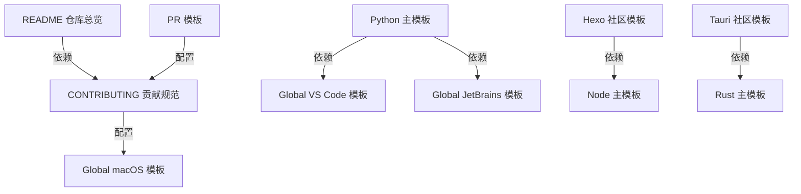

<!-- 
  📖 English summary available at: [English version](../../en/trending/2026-06-02-01-github-gitignore.md)
-->


## 🔍 项目简介

`github/gitignore` 是 GitHub 官方维护的 `.gitignore` 模板仓库，本地分析基于提交 `dcc0fc7bc2b5ba480cf117ad1be31bafceeaff46`。`README.md:3-5` 明确写到，这个仓库会被 GitHub.com 用来填充“新建仓库/文件时的 `.gitignore` 模板选择器”；也就是说，它不是 Web 服务、SDK 或 CLI，而是一个由纯文本模板、Markdown 规范和少量 GitHub Actions 配置组成的规则库。当前工作树里共有 312 个 `.gitignore` 模板，其中根目录 163 个、`Global/` 76 个、`community/` 73 个。目标用户是需要快速建立忽略规则的开发者、团队维护者和 GitHub 平台本身。技术栈基本就是 `.gitignore` 语法、Markdown 和 GitHub Actions YAML。相比 `gitignore.io` 这类在线拼装式生成器，它更强调 GitHub 官方集成、保守的人工 curated 规则和持续维护流程。

## ⚡ 核心功能

### 1. 主流语言模板提供“开箱即用”的忽略基线

实现方式：`Python.gitignore:1-27,39-53,152-160,219-220` 按“编译产物 / 打包产物 / 测试缓存 / 本地环境 / 敏感配置”分段组织规则，而不是简单罗列文件名。

关键代码：

```gitignore
__pycache__/
*.py[codz]
build/
dist/
.pytest_cache/
.env
.venv
.streamlit/secrets.toml
```

怎么用：

```bash
git clone https://github.com/github/gitignore.git
cd gitignore
cp Python.gitignore /path/to/your-python-project/.gitignore
git -C /path/to/your-python-project check-ignore -v .venv/bin/activate __pycache__/app.cpython-312.pyc
```

输入输出：输入是一个 Python 项目目录及其缓存、构建产物、虚拟环境和本地敏感文件；输出是一份纯文本 `.gitignore`，让 Git 在状态计算和提交时忽略这些路径。

适用场景和限制：适合 Django、Flask、通用脚本仓库和 Python 包工程快速起步；限制是 `.gitignore` 只影响“未来的未跟踪文件”，已经提交进历史的 `.env`、`db.sqlite3` 仍需手工 `git rm --cached`。

### 2. Node 模板通过否定规则保留样例文件，同时覆盖现代前端构建产物

实现方式：`Node.gitignore:40-45,68-75,77-85,128-143` 同时处理依赖目录、环境变量样例、Yarn v3、Next/Nuxt/Vite/SvelteKit 等工具链产物。这里最关键的不是“忽略很多目录”，而是使用否定模式保留应该纳入版本控制的样例文件。

关键代码：

```gitignore
node_modules/
.env
.env.*
!.env.example
.yarn/*
!.yarn/plugins
!.yarn/releases
.svelte-kit/
.vite/
```

怎么用：

```bash
git clone https://github.com/github/gitignore.git
cd gitignore
cp Node.gitignore /path/to/your-node-project/.gitignore
git -C /path/to/your-node-project check-ignore -v .env.local .env.example node_modules/react/index.js
```

输入输出：输入是一个 Node/前端项目里的依赖目录、构建输出、缓存和本地环境文件；输出是一份既能过滤噪音、又能保留 `.env.example` 这类共享样例的 `.gitignore`。

适用场景和限制：适合 npm、pnpm、Yarn、Next.js、Nuxt、Vite 等常见栈；限制是它只能表达路径模式，无法区分“某个 `.env.*` 是否真的不含敏感信息”，团队仍要自己约定样例文件边界。

### 3. Global 模板把编辑器和操作系统噪音做成可叠加层

实现方式：`README.md:27-35` 和 `Global/README.md:1-10` 把 `Global/` 定义为全局叠加层；`Python.gitignore:199-204` 还直接提示 VS Code 规则应从单独模板合并。具体规则则分别放在 `Global/VisualStudioCode.gitignore:1-10` 和 `Global/macOS.gitignore:1-35`。

关键代码：

```gitignore
# Global/VisualStudioCode.gitignore
.vscode/*
!.vscode/settings.json
!.vscode/tasks.json
!*.code-workspace
```

```gitignore
# Global/macOS.gitignore
.DS_Store
__MACOSX/
._*
.Spotlight-V100
.Trashes
```

怎么用：

```bash
git clone https://github.com/github/gitignore.git
cd gitignore
cat Python.gitignore Global/VisualStudioCode.gitignore Global/macOS.gitignore > /path/to/project/.gitignore
git -C /path/to/project check-ignore -v .DS_Store .vscode/settings.json
```

输入输出：输入是“项目模板 + 个人工作站噪音规则”；输出是合并后的 `.gitignore`，或一个用 `git config --global core.excludesfile` 指向的全局忽略文件。

适用场景和限制：适合多人协作时将项目规则与个人环境规则拆层维护；限制是某些团队希望共享 `.vscode/settings.json`，某些团队则不希望，把 Global 模板直接并入项目仓库前最好先确认约定。

### 4. community 目录实现“专用补丁模板”，覆盖主模板不想硬编码的场景

实现方式：`community/Python/JupyterNotebooks.gitignore:1-16` 只处理 Notebook 特有噪音，不试图替代 Python 主模板。这种拆法符合 `README.md:84-92` 对 specialized templates 的定义：把框架/工具特有规则作为附加层，而不是把所有情况塞进根模板。

关键代码：

```gitignore
.ipynb_checkpoints
*/.ipynb_checkpoints/*
profile_default/
ipython_config.py
.virtual_documents/
```

怎么用：

```bash
git clone https://github.com/github/gitignore.git
cd gitignore
cat Python.gitignore community/Python/JupyterNotebooks.gitignore > /path/to/notebook-project/.gitignore
git -C /path/to/notebook-project check-ignore -v notebook/.ipynb_checkpoints/ cell/.virtual_documents/tmp.py
```

输入输出：输入是一个带 Jupyter/IPython 辅助文件的 Python 项目；输出是“Python 基线 + Notebook 补丁”的组合忽略规则。

适用场景和限制：适合数据科学仓库、课程仓库和实验性 notebook 项目；限制是它不会自动推断你是否还需要 `Global/VisualStudioCode.gitignore`、`Global/JetBrains.gitignore` 这类编辑器层规则。

### 5. community 模板可以显式声明对根模板的依赖关系

实现方式：`community/Hexo.gitignore:1-14` 和 `community/Tauri.gitignore:1-12` 都在文件头直接写了 `Recommended:` 注释，要求用户先应用 `Node.gitignore` 或 `Rust.gitignore`，再叠加框架特定规则。这是仓库里最接近“模块依赖声明”的机制。

关键代码：

```gitignore
# community/Hexo.gitignore
# Recommended: Node.gitignore
public/
tmp/
db.json
```

```gitignore
# community/Tauri.gitignore
# Recommended: Rust.gitignore
target/
WixTools/
```

怎么用：

```bash
git clone https://github.com/github/gitignore.git
cd gitignore
cat Node.gitignore community/Hexo.gitignore > /path/to/hexo-site/.gitignore
cat Rust.gitignore community/Tauri.gitignore > /path/to/tauri-app/.gitignore
```

输入输出：输入是一个“已有基础语言栈”的框架项目；输出是“语言模板 + 框架补丁”的叠加结果。

适用场景和限制：适合 Hexo、Tauri 这类明显依附于基础生态的项目；限制是依赖关系靠注释约定，不是机器可解析的 import 机制，用户仍要手工组合文件。

### 6. Go 反向白名单模板提供极端保守的最小提交面

实现方式：`community/Golang/Go.AllowList.gitignore:1-23` 不是传统“黑名单”，而是先用 `*` 忽略一切，再用 `!` 只放行 `.go`、`go.mod`、`go.sum`、`README.md`、`LICENSE` 和目录本身。这在 `.gitignore` 语法上是个很强的策略开关。

关键代码：

```gitignore
*
!/.gitignore
!*.go
!go.sum
!go.mod
!README.md
!LICENSE
!*/
```

怎么用：

```bash
git clone https://github.com/github/gitignore.git
cd gitignore
cp community/Golang/Go.AllowList.gitignore /path/to/go-project/.gitignore
git -C /path/to/go-project check-ignore -v cmd/app/main.go docs/spec.md
```

输入输出：输入是一个只想提交源码和极少数元文件的 Go 仓库；输出是一份默认拒绝、显式放行的 `.gitignore`。

适用场景和限制：适合教学仓库、样例仓库或需要非常小提交面的项目；限制很明显，像 `Makefile`、`.github/workflows/*`、测试数据、嵌入资源都会被忽略，除非你继续手工追加 `!` 规则。

### 7. 基础设施和管理目录模板显式规避敏感文件与高噪音状态

实现方式：`Terraform.gitignore:12-17` 明确把 `*.tfvars`、`*.tfvars.json` 视为可能含密码和私钥的敏感输入；`JENKINS_HOME.gitignore:13-19,41-47` 则用“先全忽略、再只放行配置 XML”的方式限制提交面，并专门警告不要把 `secret*` 带进仓库。

关键代码：

```gitignore
# Terraform.gitignore
*.tfvars
*.tfvars.json
.terraformrc
terraform.rc
```

```gitignore
# JENKINS_HOME.gitignore
/*
!/jobs
!/.gitignore
!/*.xml
#!/secret*
```

怎么用：

```bash
git clone https://github.com/github/gitignore.git
cd gitignore
cp Terraform.gitignore /path/to/terraform-project/.gitignore
cp JENKINS_HOME.gitignore /path/to/jenkins-home/.gitignore
```

输入输出：输入是 Terraform 工程目录或 Jenkins 管理目录；输出是侧重“状态噪音隔离 + 敏感文件隔离”的 `.gitignore`。

适用场景和限制：适合 IaC 和运维配置仓库；限制是 `.gitignore` 只能阻止“误提交未来文件”，如果密钥已经进入 Git 历史，必须用历史重写工具处理。

### 8. 仓库维护流程本身也被当作“功能”实现

实现方式：`CONTRIBUTING.md:7-37` 要求每次 PR 给出首页链接、变更理由、文档依据、最小范围修改；`.github/PULL_REQUEST_TEMPLATE.md:1-27` 把这些要求变成提交流程中的勾选项；`.github/CODEOWNERS:1-7` 将全仓库路由给 `@github/gitignore-maintainers`；`.github/workflows/stale.yml:8-32` 则定时给长期无人更新的 PR 打 `stale` 标记并关闭。

关键代码：

```yaml
schedule:
  - cron: '20 16 * * *'
...
with:
  days-before-stale: 90
  days-before-close: 365
  stale-pr-label: 'stale'
```

怎么用：

```bash
git clone https://github.com/github/gitignore.git
cd gitignore
sed -n '1,40p' CONTRIBUTING.md
sed -n '1,32p' .github/PULL_REQUEST_TEMPLATE.md
sed -n '1,32p' .github/workflows/stale.yml
```

输入输出：输入是贡献者提交的模板变更和长期未处理的 PR；输出是更一致的提交流程、统一的评审归属和自动清理的 PR 队列。

适用场景和限制：适合模板库这类“内容本身就是产品”的仓库；限制是这里没有自动化语义校验或模板 lint，主要依赖人工审阅和流程约束。

## 🗺️ 知识图谱（Mermaid）



## 🔐 安全审计

### 依赖扫描

实际执行结果显示：这个仓库没有任何 `package.json`、`pyproject.toml`、`Cargo.toml`、`go.mod`、`Gemfile`、`composer.json` 等依赖清单，因此不存在可被 `npm audit`、`pip-audit`、`cargo audit` 正常审计的锁文件或项目描述。

执行证据：

```text
find ... -name 'package.json' -o -name 'pyproject.toml' -o -name 'Cargo.toml' ...
# 输出为空

pip-audit /home/trade/ctf_workspace/gh_trending/github-gitignore
# couldn't find a supported project file

pip-audit --locked /home/trade/ctf_workspace/gh_trending/github-gitignore
# no lockfiles found

npm audit --json
# ENOLOCK: requires an existing lockfile

cargo audit -n
# Couldn't load Cargo.lock
```

结论：依赖漏洞总数 `0`，高危条目 `0`，但原因不是“依赖都安全”，而是“仓库根本不携带应用依赖和锁文件”，因此扫描对象为空。

### 密钥泄露扫描

我用正则扫描了 `api key / secret / token / password / private key` 等模式，共命中 37 处；复核后均为模板规则或警告注释，未发现真实凭据字符串。

代表性样本：

- `Terraform.gitignore:12-17` 直接把 `*.tfvars` 和 `*.tfvars.json` 归类为可能含密码、私钥和 secrets 的敏感文件。
- `Packer.gitignore:7-13` 忽略 `*.pkrvars.hcl`，理由同样是可能含密码和私钥。
- `Rails.gitignore:20-30` 明确忽略 `config/master.key`、`.env`、`.env*.local`。
- `JENKINS_HOME.gitignore:7-11,41-47` 反复警告不要把 `secret.key` 和 `secret*` 带入 Git。
- `community/Obsidian/NotesAndExtendedConfiguration.gitignore:7-18,35-36` 明确提醒 `data.json` 可能含 secrets，但模板默认会把它重新纳入版本控制。

结论：真实泄露 `0` 条；但 `community/Obsidian/NotesAndExtendedConfiguration.gitignore` 的默认取舍偏向可用性而不是最小暴露面，使用者需要自行评估风险。

### 认证授权逻辑

仓库中没有 Web 服务、API 服务或 CLI 登录流，因此没有可审计的 `auth middleware`、`session` 管理、`CSRF` 防护实现。关键词扫描命中 72 处，绝大多数是模板中“要忽略的会话文件或 token 缓存”，不是认证代码。

代表性样本：

- `ZendFramework.gitignore:11-16` 忽略 `data/sessions/`，这是运行产物，不是 session 管理逻辑。
- `Symfony.gitignore:10-16` 忽略 `var/sessions/*`，同样只是会话文件路径。
- `R.gitignore:28-29` 忽略 `.httr-oauth`，这是 OAuth token 缓存文件。
- `.github/workflows/stale.yml:12-16` 是仓库里唯一显式权限声明的位置，用的是 GitHub Actions 工作流权限，不是应用登录系统。

结论：应用级认证/授权面基本不存在。

### 输入校验和数据暴露面

这个仓库没有运行时输入处理器，真正的“输入”是贡献者提交的新规则和终端用户组合模板的方式，因此风险主要来自配置失误而不是代码注入。

发现 1：`.github/workflows/stale.yml:12-16` 为 Stale 工作流授予了 `actions: write` 和 `contents: write`。但当前 `with:` 段只配置了打标/关闭 PR，并没有配置删除分支；结合注释 `contents: write # only for delete-branch option` 来看，这里的权限可以进一步最小化。这是一个低风险的权限收敛机会，不是已知漏洞。

发现 2：`community/Golang/Go.AllowList.gitignore:7-23` 使用“先忽略全部，再逐项放行”的策略，能显著收缩暴露面，但也很容易把 CI、文档、资源文件一并排除。对不了解 `.gitignore` 否定模式的用户来说，误配置风险高于普通模板。

发现 3：`Node.gitignore:68-71` 用 `!.env.example` 显式保留样例文件，这是一个合理的数据暴露控制点；与之对照，`community/Obsidian/NotesAndExtendedConfiguration.gitignore:35-36` 选择重新放行插件 `data.json`，需要额外审慎。

整体判断：这是一个“配置库安全问题大于代码执行问题”的仓库。高危漏洞未见，主要值得关注的是模板默认值是否符合目标团队的最小暴露原则。

## 🚀 快速上手

系统要求：`git` 即可；不需要 Python、Node、Rust 运行时，也没有数据库或服务端依赖。

安装和使用：

```bash
git clone https://github.com/github/gitignore.git
cd gitignore

# 1) 生成一个 Python + VS Code + macOS 的 .gitignore
cat Python.gitignore Global/VisualStudioCode.gitignore Global/macOS.gitignore > /path/to/project/.gitignore

# 2) 生成一个 Hexo 项目的 .gitignore
cat Node.gitignore community/Hexo.gitignore > /path/to/hexo-site/.gitignore

# 3) 验证某些路径是否会被忽略
git -C /path/to/project check-ignore -v .DS_Store .vscode/settings.json .env.example
```

常见坑：

- `.gitignore` 不会影响已经追踪的文件；如果你先提交了 `.env`，后加规则也不会自动消失。
- `community/*` 模板经常假定你已经叠加了某个根模板，尤其是 `community/Hexo.gitignore` 和 `community/Tauri.gitignore`。
- `community/Golang/Go.AllowList.gitignore` 是“默认全部拒绝”的强策略，没加 `!` 的文件都会消失在 Git 视野外。
- `Global/*` 更适合作为个人全局忽略，直接并进团队仓库前最好先确认是否会误伤共享编辑器配置。

## ⚖️ 一句话判词

值得关注，但关注点不是“它有多复杂”，而是“它是否足够保守且被 GitHub 平台直接消费”；如果你要维护模板库、搭建企业级 `.gitignore` 基线，或者想理解不同生态如何处理忽略规则，这是一个高价值参考仓库。

## 📊 元信息

- 项目：`github/gitignore`
- 本地分析提交：`dcc0fc7bc2b5ba480cf117ad1be31bafceeaff46`
- 模板数量：312 个 `.gitignore` 文件
- Stars：174,211
- Forks：82,453
- Language：GitHub API `language=null`，`/languages` 返回 `{}`；从内容上看主体是 `.gitignore` 模板文本
- License：`CC0-1.0`
- 元信息采集时间：2026-06-02
