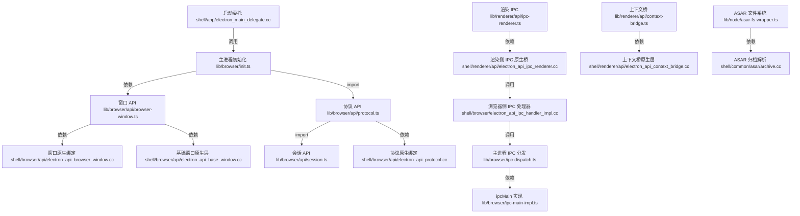

<!-- 
  📖 English summary available at: [English version](../../en/trending/2026-06-02-02-electron-electron.md)
-->


# electron/electron 源码分析报告

## 🔍 项目简介

Electron 是一个把 Chromium 渲染层、Node.js 运行时和桌面原生能力打包成统一运行时的跨平台桌面应用框架；这个仓库实现的不是“某个 Electron 应用”，而是 Electron 本体。它要解决的问题是：让团队用 JavaScript / TypeScript、HTML、CSS 写出在 macOS、Windows、Linux 上行为尽量一致的桌面程序，同时还能通过原生绑定拿到窗口、协议、系统集成、崩溃上报等能力。目标用户是桌面应用团队、框架贡献者和需要定制 Electron 二进制的发行工程团队。技术栈从源码上看是 C++ / Objective-C++（`shell/`）、TypeScript / Node.js（`lib/`、`default_app/`、`script/`）、GN + Ninja / siso（`BUILD.gn`、`docs/development/build-instructions-gn.md:91-105`）。和 Tauri / NW.js 这类竞品相比，Electron 的路线是“自带 Chromium + Node”，换来更强的一致性和 API 面，但体积、构建链和安全配置负担也更重。

## ⚡ 核心功能

### 1. 应用启动与 `package.json` / `main` 装载

- 功能名称：主进程启动后自动定位 `app` / `app.asar` / `default_app.asar`，读取 `package.json`，设置应用元信息并执行入口脚本。
- 实现方式：`shell/app/electron_main_delegate.cc:247-331` 先在原生层完成 logging、crashpad、资源包、`file://` 访问等进程级初始化；`lib/browser/init.ts:94-125` 再在 `process.resourcesPath` 下轮询搜索路径并装载 `package.json`，随后在 `lib/browser/init.ts:169-210` 根据 `type: module` 或 CommonJS 模式执行 `main`。

```ts
// lib/browser/init.ts:104-125
for (packagePath of searchPaths) {
  packagePath = path.join(process.resourcesPath, packagePath);
  packageJson = Module._load(path.join(packagePath, 'package.json'));
  break;
}

// lib/browser/init.ts:190-209
const mainStartupScript = packageJson.main || 'index.js';
Module._load(path.join(packagePath, mainStartupScript), Module, true);
```

```cpp
// shell/app/electron_main_delegate.cc:311-316
if (IsBrowserProcess()) {
  // Allow file:// URIs to read other file:// URIs by default.
  command_line->AppendSwitch(::switches::kAllowFileAccessFromFiles);
}
```

- 怎么用：

```json
{
  "name": "demo-app",
  "main": "main.js",
  "version": "1.0.0"
}
```

```bash
electron .
```

- 输入输出：输入是 `resourcesPath` 下的应用目录/ASAR 包和其中的 `package.json`；输出是设置好的 `app.name`、`app.version`、`desktopName`，以及被执行的 `main` 入口脚本。
- 适用场景和限制：适用于所有 Electron 应用启动；限制是必须能找到有效 `package.json`，否则 `lib/browser/init.ts:121-126` 会抛出 `Unable to find a valid app` 并退出。


### 2. `BrowserWindow` / `BrowserView` 窗口系统

- 功能名称：提供桌面原生窗口创建、生命周期转发、可视状态同步和 `BrowserView` 挂载能力。
- 实现方式：`lib/browser/api/browser-window.ts:8-103` 在 JS 层扩展原生 `BrowserWindow`，补上 `id` 固定化、`setBounds` 合并、焦点事件转发、`unresponsive` 防抖和 `devToolsWebContents` 属性；`lib/browser/api/browser-window.ts:205-259` 管理 `BrowserView` 的 attach/remove/top ordering；原生构造器与方法绑定来自 `shell/browser/api/electron_api_browser_window.cc:303-320` 和 `shell/browser/api/electron_api_base_window.cc:1169-1255`。

```ts
// lib/browser/api/browser-window.ts:205-217
BrowserWindow.prototype.addBrowserView = function (browserView: BrowserView) {
  if (this._browserViews.includes(browserView)) return;
  this.contentView.addChildView(browserView.webContentsView);
  browserView.ownerWindow = this;
  browserView.webContents._setOwnerWindow(this);
  this._browserViews.push(browserView);
};
```

```cpp
// shell/browser/api/electron_api_browser_window.cc:303-320
if (!Browser::Get()->is_ready()) {
  thrower.ThrowError("Cannot create BrowserWindow before app is ready");
  return nullptr;
}
return new BrowserWindow(args, options);
```

- 怎么用：

```js
const { app, BrowserWindow, BrowserView } = require('electron');

app.whenReady().then(() => {
  const win = new BrowserWindow({ width: 1200, height: 800 });
  const view = new BrowserView();
  win.addBrowserView(view);
  view.webContents.loadURL('https://example.com');
});
```

- 输入输出：输入是 `BrowserWindowConstructorOptions` 和可选 `BrowserView`；输出是原生窗口实例、内部 `webContents` 以及一组窗口事件。
- 适用场景和限制：适合多窗口桌面 UI、嵌入式视图、DevTools 管理；限制是必须在 `app` ready 后创建，且一个窗口附多个 `BrowserView` 时 `getBrowserView()` 会抛错（`lib/browser/api/browser-window.ts:238-243`）。


### 3. 主进程 / 渲染进程 / Service Worker IPC

- 功能名称：在 Electron 多进程模型里提供异步调用、同步消息、MessagePort 传输和按 frame / service worker 维度路由的 IPC。
- 实现方式：渲染侧 API 在 `lib/renderer/api/ipc-renderer.ts:8-31`，把 `send` / `sendSync` / `invoke` / `postMessage` 统一转给原生桥；渲染侧原生桥 `shell/renderer/api/electron_api_ipc_renderer.cc:82-106,164-182` 负责 V8 序列化和 Mojo 调用；浏览器侧原生 handler `shell/browser/electron_api_ipc_handler_impl.cc:59-74,137-184` 生成带 `senderFrame` / `processId` / `_replyChannel` 的事件对象；最终 `lib/browser/ipc-dispatch.ts:64-123,126-179` 选择 `ipcMain`、`webContents.ipc`、`WebFrameMain.ipc` 或 service worker IPC 作为目标，并走 `lib/browser/ipc-main-impl.ts:15-33` 的 handler 注册表。

```ts
// lib/renderer/api/ipc-renderer.ts:21-27
async invoke(channel: string, ...args: any[]) {
  const { error, result } = await ipc.invoke(internal, channel, args);
  if (error) throw new Error(`Error invoking remote method '${channel}': ${error}`);
  return result;
}
```

```ts
// lib/browser/ipc-dispatch.ts:112-122
const target = targets.find((target) => (target as any)?._invokeHandlers.has(channel));
if (target) {
  const handler = (target as any)._invokeHandlers.get(channel);
  replyWithResult(await Promise.resolve(handler(event, ...args)));
} else {
  replyWithError(new Error(`No handler registered for '${channel}'`));
}
```

- 怎么用：

```js
// main.js
const { ipcMain, BrowserWindow } = require('electron');
ipcMain.handle('sum', (_event, a, b) => a + b);

// preload.js / renderer.js
const { ipcRenderer } = require('electron');
const value = await ipcRenderer.invoke('sum', 2, 40);
```

- 输入输出：输入是可序列化参数、同步消息或 `MessagePort`；输出是 Promise 返回值、同步返回值或通过 reply channel 送回的错误对象。
- 适用场景和限制：适合主进程 RPC、窗口级 IPC、service worker 通道通信；限制是参数必须能过序列化边界，`sendSync` 在无监听器时会告警（`lib/browser/ipc-dispatch.ts:137-143`），未注册 handler 会显式报错。


### 4. `contextBridge` 与沙箱预加载

- 功能名称：在启用 `contextIsolation` 的前提下，把受控 API 从 preload 暴露给页面，同时尽量冻结对象、代理函数/Promise，降低 Node 能力直接泄漏到不可信 DOM 的风险。
- 实现方式：JS API 在 `lib/renderer/api/context-bridge.ts:3-19`，先检查 `process.contextIsolated` 再调用原生 binding；原生实现 `shell/renderer/api/electron_api_context_bridge.cc:69-90` 会递归 `DeepFreeze`，`167-176` 对桥接递归深度做 1000 层限制，`195-236` 代理函数，`240-299` 代理 Promise；沙箱 preload 执行器 `lib/sandboxed_renderer/preload.ts:55-66,98-116` 则只暴露允许的模块、执行缓存过的 preload 脚本并在失败时回报 `BROWSER_PRELOAD_ERROR`。`default_app/preload.ts:35-69` 给了一个最小示例。

```ts
// lib/renderer/api/context-bridge.ts:3-10
const checkContextIsolationEnabled = () => {
  if (!process.contextIsolated) throw new Error('contextBridge API can only be used when contextIsolation is enabled');
};

const contextBridge = {
  exposeInMainWorld: (key, api) => {
    checkContextIsolationEnabled();
    return binding.exposeAPIInWorld(0, key, api);
  }
};
```

```cpp
// shell/renderer/api/electron_api_context_bridge.cc:167-175
if (recursion_depth >= kMaxRecursion) {
  source_isolate->ThrowException(v8::Exception::TypeError(
      gin::StringToV8(source_isolate,
                      "Electron contextBridge recursion depth exceeded.")));
  return {};
}
```

- 怎么用：

```js
// preload.js
const { contextBridge, ipcRenderer } = require('electron');
contextBridge.exposeInMainWorld('api', {
  readVersion: () => ipcRenderer.invoke('get-version')
});

// main.js
new BrowserWindow({
  webPreferences: { preload, contextIsolation: true, sandbox: true, nodeIntegration: false }
});
```

- 输入输出：输入是 preload 里声明的 plain object / function / Promise；输出是挂到 `window` 上的受控 API。
- 适用场景和限制：适合安全地向页面暴露最小 API 面；限制是必须开启 `contextIsolation`，部分复杂对象会被代理/冻结而不是原样透传，过深嵌套会被拒绝。


### 5. ASAR 虚拟文件系统与完整性校验

- 功能名称：把 `.asar` 当成透明文件系统来读写常见 `fs` API，同时在支持的平台上校验包头和文件内容完整性。
- 实现方式：`lib/node/asar-fs-wrapper.ts:30-45` 缓存 `Archive` 对象，`63-80` 把普通路径拆成 `asarPath + filePath`，`179-205` / `208-249` 重写同步/异步 `fs` API，`252-263` 在启用 integrity 时计算 hash 不匹配就退出；原生解析器 `shell/common/asar/archive.cc:189-267` 读取 8 字节 header size、Pickle header 和 JSON 目录树，并在 fuse 打开时验证 header integrity；`shell/common/asar/asar_util.cc:103-148` 负责按归档偏移直接读内容并再次做 `ValidateIntegrityOrDie`。

```ts
// lib/node/asar-fs-wrapper.ts:30-39
const getOrCreateArchive = (archivePath: string) => {
  if (cachedArchives.has(archivePath)) return cachedArchives.get(archivePath)!;
  const newArchive = new asar.Archive(archivePath);
  cachedArchives.set(archivePath, newArchive);
  return newArchive;
};
```

```cpp
// shell/common/asar/archive.cc:234-255
if (electron::fuses::IsEmbeddedAsarIntegrityValidationEnabled() &&
    RelativePath().has_value()) {
  std::optional<IntegrityPayload> integrity = HeaderIntegrity();
  ValidateIntegrityOrDie(base::as_byte_span(header), *integrity);
  header_validated_ = true;
}
```

- 怎么用：

```bash
npx asar pack app app.asar
electron app.asar
```

```js
const fs = require('fs');
const buf = fs.readFileSync('app.asar/config.json');
```

- 输入输出：输入是带 `.asar` 的路径和文件操作；输出是透明读取结果、临时拷出的真实路径，或在完整性校验失败时直接终止进程。
- 适用场景和限制：适合分发应用资源、压缩目录结构、稳定地从归档读取 JS/静态文件；限制是它不是强隔离安全边界，部分 API 需要把文件临时拷出，完整性验证是否生效还取决于平台和 fuse 配置。


### 6. 自定义协议与按分区隔离的 `Session`

- 功能名称：注册/拦截自定义协议，给每个 `Session` 提供独立 cookie / cache / preload / fetch / 权限处理上下文。
- 实现方式：`lib/browser/api/protocol.ts:123-175` 把 handler 统一包装成 WHATWG `Request -> Response` 模式，并区分 built-in scheme（拦截）与 custom scheme（注册）；`shell/browser/api/electron_api_protocol.cc:114-199` 把 scheme 权限注册到 Chromium 安全策略、CSP、CORS、service worker、code cache 命令行开关里；`lib/browser/api/session.ts:25-58` 给 `Session` 注入 IPC dispatch、`fetch`、`setDisplayMediaRequestHandler`；`lib/common/api/net-client-request.ts:211-223,307-318,348-352` 对 header、session、partition、协议做输入校验。

```ts
// lib/browser/api/protocol.ts:123-145
Protocol.prototype.handle = function (scheme, handler) {
  const register = isBuiltInScheme(scheme) ? this.interceptProtocol : this.registerProtocol;
  const success = register.call(this, scheme, async (preq, cb) => {
    const req = new Request(preq.url, { method: preq.method, headers: new Headers(preq.headers) });
    const res = await handler(req);
    if (!validateResponse(res)) return cb({ error: ERR_UNEXPECTED });
  });
  if (!success) throw new Error(`Failed to register protocol: ${scheme}`);
};
```

```cpp
// shell/browser/api/electron_api_protocol.cc:135-166
if (custom_scheme.options.standard) {
  url::AddStandardScheme(custom_scheme.scheme.c_str(), url::SCHEME_WITH_HOST);
  policy->RegisterWebSafeScheme(custom_scheme.scheme);
}
if (custom_scheme.options.allowServiceWorkers) {
  AddServiceWorkerScheme(custom_scheme.scheme);
}
```

- 怎么用：

```js
const { app, protocol, session } = require('electron');

protocol.registerSchemesAsPrivileged([
  { scheme: 'app', privileges: { standard: true, secure: true, supportFetchAPI: true } }
]);

app.whenReady().then(() => {
  session.defaultSession.protocol.handle('app', () => new Response('ok'));
  const isolated = session.fromPartition('persist:customer-a');
});
```

- 输入输出：输入是 scheme 名、权限配置、`Request`、partition 名称；输出是注册过的协议处理器或隔离好的 `Session` 实例。
- 适用场景和限制：适合本地资源协议、离线应用路由、多租户缓存/登录态隔离；限制是 built-in `http` / `https` / `file` 走的是 intercept 路径，Response 结构必须合法，非法 header / 协议 / session 类型会被直接拒绝。


### 7. npm 安装时自动拉取匹配平台的 Electron 二进制

- 功能名称：把 Electron 作为 npm 包安装时，自动下载当前平台/架构对应的预编译二进制，并把 CLI 指向正确的可执行文件。
- 实现方式：`npm/install.js:20-53` 根据 `ELECTRON_INSTALL_PLATFORM` / `npm_config_platform` / `process.platform` 和架构判断下载目标，再调用 `@electron/get`；`npm/install.js:60-95` 校验 `dist/version` 与 `path.txt`，写出最终可执行路径；`npm/index.js:7-49` 在开发模式下读取 `path.txt`，缺失时自动触发安装；`npm/cli.js:5-28` 再把用户参数透传给真实 Electron 可执行文件。

```js
// npm/install.js:41-53
downloadArtifact({
  version,
  artifactName: 'electron',
  platform,
  arch
}).then(extractFile);
```

```js
// npm/index.js:33-38
const fullPath = path.join(__dirname, 'dist', executablePath);
if (!fs.existsSync(fullPath)) {
  downloadElectron();
}
return fullPath;
```

- 怎么用：

```bash
npm i electron
npx electron .
```

- 输入输出：输入是 npm 安装环境、平台/架构变量和版本号；输出是 `dist/` 下的 Electron 二进制以及 `path.txt` 记录的可执行路径。
- 适用场景和限制：适合应用开发者消费 Electron 发行版；限制是依赖网络和缓存、平台必须被 `npm/install.js:98-113` 支持，且仓库根 `package.json` 与 `npm/package.json` 是两套不同职责的 manifest。

## 🗺️ 知识图谱（Mermaid）



## 🔐 安全审计

- 依赖扫描（根工作区）：我实际执行了 `corepack yarn npm audit --all --recursive --json`。根工作区的 `package.json:6-53` 只有 dev/build/release 相关依赖，审计结果是 **56 条告警：23 条 high，33 条 moderate**。高危项主要集中在构建和发布链，而不是 Electron 运行时本体：
  - `package.json:8` 的 `@datadog/datadog-ci` 依赖链引入 `axios@1.15.1`，命中了多条高危原型污染/请求劫持问题。
  - `package.json:11` 的 `@electron/fiddle-core` 依赖链引入 `simple-git@3.33.0`，命中 RCE 告警。
  - 同一工作区里还有 `tar@6.2.1`、`serialize-javascript@6.0.2`、`@xmldom/xmldom@0.8.11` 等高危项，说明 Electron 仓库的开发工具链需要持续升级。
- 依赖扫描（发布给开发者的 npm 子包）：我把 `npm/package.json:18-24` 单独复制到临时目录后执行了 `npm install --package-lock-only --ignore-scripts` 和 `npm audit --json`，结果是 **0 条漏洞**。这意味着 `npm/` 子包（真正发布到 npm 的 `electron` wrapper）的直接依赖面目前比根工作区更干净。
- 密钥泄露扫描：对仓库执行了基于 `api key / token / secret / password` 模式的正则扫描，没有发现硬编码的真实密钥值。命中的都是“读取环境变量”或“CI 临时票据处理”代码：
  - `.env.example:1-4` 只声明了 `ELECTRON_GITHUB_TOKEN=` 占位符。
  - `script/release/github-token.ts:11-20` 从 GitHub Actions 的 OIDC 环境变量读取短期 token，`script/release/github-token.ts:28-53` 再尝试读取 `ELECTRON_GITHUB_TOKEN` / `SUDOWOODO_EXCHANGE_URL`。
  - `shell/browser/electron_browser_client.cc:638-642` 读取 `GOOGLE_API_KEY` 环境变量，而不是把 geolocation key 编译进源码。
  - `.github/actions/restore-cache-azcopy/action.yml:34-54` 会从 `sas-token` 文件读取临时 SAS token，并在步骤末尾显式 `rm -f sas-token`。
- 认证授权逻辑：这是桌面运行时，不是传统 Web 服务，所以仓库里没有 Express/FastAPI 那种 auth middleware、cookie session、CSRF token 中间件。真正存在的“认证入口”是网络认证与权限弹窗：
  - `shell/browser/login_handler.cc:97-125` 在收到 HTTP auth challenge 时会把 `login` 事件路由给 `webContents`、utility process 或 `app`；如果没人处理，就用 `std::nullopt` 取消认证，而不是静默放行。
  - `default_app/default_app.ts:69-83` 的 `isTrustedSender()` 只允许默认应用自己的 `index.html` 调用 `bootstrap` IPC。
  - `default_app/default_app.ts:110-127` 默认示例对 `window.open` 一律 `deny` 并转发到系统浏览器，同时对权限请求弹确认框。
  - 结论：框架提供认证/授权 hook，但不强制应用实现策略；真正的安全边界仍取决于应用是否正确配置 `webPreferences` 和 permission handler。
- 输入校验与暴露面：
  - `lib/browser/parse-features-string.ts:87-183` 对 `window.open()` feature string 做 allowlist，只允许少量窗口选项与 `zoomFactor/nodeIntegration/javascript/contextIsolation/webviewTag` 等白名单字段，其他字段直接丢弃。
  - `lib/common/api/net-client-request.ts:211-223` 校验 header 名和值；`307-318` 校验 `session` / `partition` 类型；`348-352` 默认只允许 `http:` / `https:`，并要求 `credentials: same-origin` 时必须显式给 `origin`。
  - `lib/renderer/security-warnings.ts:124-173` 和 `181-247` 会对“远程页面 + NodeIntegration”“关闭 webSecurity”“不安全 CSP”“allowpopups”等场景直接在开发期告警。
- 安全结论：Electron 本体在源码里已经提供了不少 guardrail，但它们很多是“警告和 hook”，不是强制策略；真正的明显短板在根工作区的开发/发布依赖链，而不是 `npm/` 发布包。

## 🚀 快速上手

- 适用系统与依赖：
  - Node.js `>= 22.12.0`，仓库 `.nvmrc` 固定的是 `22`。
  - macOS 构建要求 `macOS >= 12`、Xcode、Python `>= 3.9`、Node.js `>= 22.12.0`（`docs/development/build-instructions-macos.md:7-15`）。
  - Windows 构建要求 Windows 10+、Visual Studio toolchain、Node.js `>= 22.12.0`（`docs/development/build-instructions-windows.md:7-18`）。
  - Linux 直接跟随 Chromium build prerequisites，额外依赖见 `docs/development/build-instructions-linux.md:7-13`。
- 推荐方式：使用 `@electron/build-tools` 拉源码并构建 Electron 本体（官方推荐，见 `docs/development/build-instructions-gn.md:15-54`）。

```bash
nvm use 22
npm install -g @electron/build-tools
e init --root=~/electron --bootstrap testing
cd ~/electron/src/electron
e start
```

- 手工方式：`gclient + GN + ninja`（见 `docs/development/build-instructions-gn.md:133-244`）。

```bash
export GIT_CACHE_PATH="$HOME/.git_cache"
mkdir -p "$GIT_CACHE_PATH"

mkdir electron && cd electron
gclient config --name "src/electron" --unmanaged https://github.com/electron/electron
gclient sync --with_branch_heads --with_tags

cd src
gn gen out/Testing --args="import(\"//electron/build/args/testing.gn\")"
ninja -C out/Testing electron
./out/Testing/electron
```

- 常用测试命令：

```bash
npm run test
node script/node-spec-runner.js
```

- 常见坑：
  - 这个仓库不是“`npm install && npm start` 就能跑起来”的普通应用。`script/start.js:5-7` 只是启动已经构建好的 Electron binary。
  - 手工构建时，仓库应位于 `src/electron` 的 gclient 工作区内，而不是单独 clone 后直接 `gn gen`。
  - 根 `package.json` 是开发根清单，不是最终发布给应用开发者的 `electron` npm 包；后者在 `npm/package.json`。
  - Linux 依赖跟 Chromium 同步变化；Windows 需要 VS toolchain；macOS 经常踩 Xcode / 证书链问题，文档里都写了排障路径。

## ⚖️ 一句话判词

值得持续关注；如果你要的是“跨平台桌面运行时一致性 + Chromium/Node 全量能力 + 大型生态”，Electron 仍然是最稳的工程选项，但前提是你愿意接受更重的二进制、复杂的构建链和需要自己兜底的安全配置。

## 📊 元信息

- Project: `electron/electron`
- Stars: `121,506`（GitHub API，统计于 2026-06-02）
- Forks: `17,229`（GitHub API，统计于 2026-06-02）
- Primary Language: `C++`
- License: `MIT`
