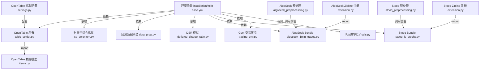

# stefan-jansen/machine-learning-for-trading 源码分析

## 🔍 项目简介

这是《Machine Learning for Algorithmic Trading, 2nd Edition》的配套代码仓库，但从源码结构看，它不是一个单体应用，而是一套“研究工作台”：绝大多数实现位于 notebook，少量关键 Python 脚本负责数据抓取、数据集落盘、Zipline bundle 注册、回测样本组装和强化学习环境封装。目标用户是量化研究员、交易策略开发者和希望系统复现实验的学习者。技术栈以 Jupyter Notebook / Python 为主，依赖 `pandas`、`numpy`、`scikit-learn`、`tensorflow`、`torch`、`scrapy`、`selenium`、`TA-Lib`、`zipline-reloaded`、`backtrader` 和 HDF5/SQLite 数据存储（见 `installation/ml4t-base.yml`、`08_ml4t_workflow/`、`22_deep_reinforcement_learning/trading_env.py`）。和 `mlfinlab`、`zipline-reloaded` 这类单一框架型项目不同，它把“数据获取 -> 特征工程 -> 模型训练 -> 回测 -> 强化学习”放在同一套教材式代码库里。

## ⚡ 核心功能

### 1. OpenTable 动态页面抓取

- 功能名称：基于 Scrapy + Splash 的餐厅列表抓取。
- 实现方式：`03_alternative_data/01_opentable/opentable/spiders/table_spider.py:10-27` 定义 `OpenTableSpider`，先用 `SplashRequest` 渲染动态页面，再用 CSS selector 抽取 `name/bookings/rating/reviews/price/cuisine/location`；`03_alternative_data/01_opentable/opentable/settings.py:37-57,82,122-125` 配置了 Splash、随机 UA、中间件、日志和 `ROBOTSTXT_OBEY = True`。

```python
# 03_alternative_data/01_opentable/opentable/spiders/table_spider.py
def start_requests(self):
    for url in self.start_urls:
        yield SplashRequest(url=url,
                            callback=self.parse,
                            endpoint='render.html',
                            args={'wait': 1})

def parse(self, response):
    for resto in response.css('div.rest-row-info'):
        item['bookings'] = resto.css('div.booking::text').re(r'\d+')
        item['rating'] = resto.css('div.all-stars::attr(style)').re_first('\d+')
        item['price'] = len(resto.css('div.rest-row-pricing > i::text').re('\$'))
```

- 怎么用：

```bash
cd /home/trade/ctf_workspace/gh_trending/stefan-jansen-machine-learning-for-trading/03_alternative_data/01_opentable
scrapy crawl opentable -o restaurants.json
```

- 输入输出：输入是 `https://www.opentable.com/new-york-restaurant-listings` 的渲染后 HTML；输出是 `OpentableItem` 记录流，字段定义在 `03_alternative_data/01_opentable/opentable/items.py:11-18`。
- 适用场景和限制：适合演示动态页面抓取和 CSS 解析；限制是默认只抓纽约列表页，源码里没有“下一页”逻辑，页面翻页版本另放在 `03_alternative_data/01_opentable/opentable_selenium.py:34-56`，而且依赖本地 `Splash` 服务 `http://localhost:8050/`。


### 2. Seeking Alpha 财报电话会抓取与结构化导出

- 功能名称：批量抓取 earnings call transcript，并拆成元数据、参会者、正文三类 CSV。
- 实现方式：`03_alternative_data/02_earnings_calls/sa_selenium.py:19-27` 负责把解析结果写入 `transcripts/parsed/<symbol>/`；`29-82` 的 `parse_html()` 用 `BeautifulSoup` 识别标题、日期、季度、管理层/分析师段和 Q&A 段；`90-115` 用 Selenium 分页抓取所有 transcript。

```python
# 03_alternative_data/02_earnings_calls/sa_selenium.py
def store_result(meta, participants, content):
    path = transcript_path / 'parsed' / meta['symbol']
    pd.DataFrame(content, columns=['speaker', 'q&a', 'content']).to_csv(path / 'content.csv', index=False)
    pd.DataFrame(participants, columns=['type', 'name']).to_csv(path / 'participants.csv', index=False)
    pd.Series(meta).to_csv(path / 'earnings.csv')

def parse_html(html):
    h1 = soup.find('h1', itemprop='headline')
    meta['company'] = h1[:h1.find('(')].strip()
    meta['symbol'] = h1[h1.find('(') + 1:h1.find(')')]
    ...
    content.append([header.text, qa, '\n'.join(p)])
```

- 怎么用：

```bash
cd /home/trade/ctf_workspace/gh_trending/stefan-jansen-machine-learning-for-trading/03_alternative_data/02_earnings_calls
python sa_selenium.py
```

- 输入输出：输入是 Seeking Alpha earnings transcript 列表页和文章页 HTML；输出是 `earnings.csv`、`participants.csv`、`content.csv`。
- 适用场景和限制：适合构建 NLP 训练语料；限制是依赖 Firefox WebDriver、页面结构和 `Earnings Call Transcript` 文案未变更，且脚本只有简单随机睡眠，没有更强的反爬/重试控制。


### 3. 线性模型预测结果与行情数据拼装成回测样本

- 功能名称：把第 7 章模型预测结果和行情数据合并成可回测 HDF5。
- 实现方式：`08_ml4t_workflow/00_data/data_prep.py:18-39` 从 `data/assets.h5` 取调整后 OHLCV，从 `07_linear_models/data.h5` 取 `lasso/predictions` 或其它预测表，然后按 `alpha` 分组，用 Spearman 相关系数自动挑最佳超参数，最后把预测列和价格列 `join` 后导出。

```python
# 08_ml4t_workflow/00_data/data_prep.py
with pd.HDFStore(DATA_DIR / 'assets.h5') as store:
    prices = (store['quandl/wiki/prices']
              .filter(like='adj')
              .rename(columns=lambda x: x.replace('adj_', ''))
              .swaplevel(axis=0))

best_alpha = predictions.groupby('alpha').apply(lambda x: spearmanr(x.actuals, x.predicted)[0]).idxmax()
predictions = predictions[predictions.alpha == best_alpha]
return predictions.join(prices, how='right')
```

- 怎么用：

```bash
cd /home/trade/ctf_workspace/gh_trending/stefan-jansen-machine-learning-for-trading/08_ml4t_workflow/00_data
python data_prep.py
```

- 输入输出：输入是 `data/assets.h5` 与 `07_linear_models/data.h5`；输出是当前目录下的 `backtest.h5`，内容为 `predicted + open/high/low/close/volume` 联表。
- 适用场景和限制：适合把模型预测桥接到 Zipline/backtrader 之类回测器；限制是 HDF5 key 名和索引结构写死，必须与书里章节产物一致。


### 4. Deflated Sharpe Ratio 解析解与数值模拟

- 功能名称：批量计算在多次试验下的“预期最大 Sharpe”解析解和数值近似。
- 实现方式：`08_ml4t_workflow/01_multiple_testing/deflated_sharpe_ratio.py:10-35` 提供解析解和蒙特卡洛近似，`41-53` 用 `product(np.linspace(-100, 100, 101), range(10, 1001, 10))` 穷举 `mu` 与 `num_trials`，最后写出 `DSR.csv`。

```python
# 08_ml4t_workflow/01_multiple_testing/deflated_sharpe_ratio.py
def get_analytical_max_sr(mu, sigma, num_trials):
    emc = 0.5772156649
    maxZ = (1 - emc) * ss.norm.ppf(1 - 1. / num_trials) + emc * ss.norm.ppf(1 - 1 / (num_trials * np.e))
    return mu + sigma * maxZ

def get_numerical_max_sr(mu, sigma, num_trials, n_iter):
    series = np.random.normal(mu, sigma, num_trials)
```

- 怎么用：

```bash
cd /home/trade/ctf_workspace/gh_trending/stefan-jansen-machine-learning-for-trading/08_ml4t_workflow/01_multiple_testing
python deflated_sharpe_ratio.py
```

- 输入输出：输入是脚本内置的 `mu/sigma/num_trials/n_iter` 网格；输出是 `DSR.csv`，列包括 `expected_max_sr`、`mean_max_sr`、`std_max_sr`、`err`。
- 适用场景和限制：适合做多重假设检验/策略筛选偏差演示；限制是参数不可通过 CLI 覆盖，默认计算量较大。


### 5. AlgoSeek 分钟级数据预处理与 Zipline 自定义 Bundle

- 功能名称：把 AlgoSeek NASDAQ100 1 分钟成交数据转成 Zipline 可 ingest 的自定义 bundle。
- 实现方式：预处理在 `08_ml4t_workflow/04_ml4t_workflow_with_zipline/01_custom_bundles/algoseek_preprocessing.py:45-108`，它从 `data/nasdaq100/data.h5` 和已有的 Quandl bundle SQLite 元数据中生成 `algoseek.h5`；`algoseek_1min_trades.py:34-88` 把 `algoseek.h5` 里的每个证券转换成 Zipline `minute_bar_writer` 所需的迭代器；`extension.py:216-254` 定义了扩展交易时段的 `AlgoSeekCalendar` 并注册 bundle。

```python
# algoseek_preprocessing.py
nasdaq_info = (get_nasdaq_symbols()
               .reset_index()
               .rename(columns=lambda x: x.lower().replace(' ', '_')))
for symbol, data in nasdaq100.groupby(level='ticker'):
    data.reset_index('ticker', drop=True).to_hdf('algoseek.h5', '{}'.format(symbol_dict[symbol]))

# algoseek_1min_trades.py
minute_bar_writer.write(minute_data_generator(), show_progress=True)
asset_db_writer.write(equities=metadata)
adjustment_writer.write(splits=pd.read_hdf(custom_data_path / 'algoseek.h5', 'splits'))

# extension.py
register('algoseek', algoseek_to_bundle(), calendar_name='AlgoSeek', minutes_per_day=960)
```

- 怎么用：

```bash
export ZIPLINE_ROOT=$HOME/.zipline
cd /home/trade/ctf_workspace/gh_trending/stefan-jansen-machine-learning-for-trading/08_ml4t_workflow/04_ml4t_workflow_with_zipline/01_custom_bundles
python - <<'PY'
from algoseek_preprocessing import get_equities, get_dividends, get_splits, get_ohlcv_by_ticker
get_equities(); get_dividends(); get_splits(); get_ohlcv_by_ticker()
PY
mkdir -p "$ZIPLINE_ROOT/custom_data"
ln -sf "$(pwd)/algoseek_1min_trades.py" "$ZIPLINE_ROOT/algoseek_1min_trades.py"
ln -sf "$(pwd)/extension.py" "$ZIPLINE_ROOT/extension.py"
ln -sf "$(pwd)/algoseek.h5" "$ZIPLINE_ROOT/custom_data/algoseek.h5"
zipline ingest -b algoseek
```

- 输入输出：输入是 `data/nasdaq100/data.h5`、`$ZIPLINE_ROOT/data/quandl/.../assets-7.sqlite`、`adjustments.sqlite`；输出是 `algoseek.h5` 和最终的 Zipline bundle。
- 适用场景和限制：适合做分钟级 ML 回测和盘前/盘后扩展时段回测；限制是必须先执行一次 `zipline ingest -b quandl`，并且代码假定 AlgoSeek 数据 schema、NASDAQ100 标的和东部时间交易时段不变。


### 6. Stooq 日本股票日线 Bundle 构建

- 功能名称：把 Stooq 日本股票日线数据切分成 Zipline 的日线 bundle。
- 实现方式：`11_decision_trees_random_forests/00_custom_bundle/stooq_preprocessing.py:21-62` 从 `data/assets.h5` 读取 `stooq/jp/tse/stocks/prices` 和 `tickers`，重排索引、补齐缺口、给每个证券写 HDF5 key；`stooq_jp_stocks.py:65-88` 生成 Zipline ingest 回调；`extension.py:11-16` 注册 `stooq` bundle。

```python
# stooq_preprocessing.py
return (df.loc[idx[:, '2014': '2019'], :]
        .unstack('ticker')
        .sort_index()
        .tz_localize('UTC')
        .ffill(limit=5)
        .dropna(axis=1))

# stooq_jp_stocks.py
daily_bar_writer.write(daily_data_generator(), show_progress=True)
asset_db_writer.write(equities=metadata)
adjustment_writer.write(splits=pd.read_hdf(custom_data_path / 'stooq.h5', 'jp/splits'))
```

- 怎么用：

```bash
export ZIPLINE_ROOT=$HOME/.zipline
cd /home/trade/ctf_workspace/gh_trending/stefan-jansen-machine-learning-for-trading/11_decision_trees_random_forests/00_custom_bundle
python stooq_preprocessing.py
mkdir -p "$ZIPLINE_ROOT/custom_data"
ln -sf "$(pwd)/stooq_jp_stocks.py" "$ZIPLINE_ROOT/stooq_jp_stocks.py"
ln -sf "$(pwd)/extension.py" "$ZIPLINE_ROOT/extension.py"
ln -sf "$(pwd)/stooq.h5" "$ZIPLINE_ROOT/custom_data/stooq.h5"
zipline ingest -b stooq
```

- 输入输出：输入是 `data/assets.h5` 中的日本股票价格和证券元数据；输出是 `stooq.h5` 与 `stooq` bundle。
- 适用场景和限制：适合复现第 11 章日本股票随机森林策略；限制是时间窗口硬编码为 `2014:2019`，只支持 TSE 股票，且要求预先设置 `ZIPLINE_ROOT`。


### 7. Gym 兼容的单资产交易环境

- 功能名称：把股票时间序列包装成可供 RL 代理训练的 `gym.Env`。
- 实现方式：`22_deep_reinforcement_learning/trading_env.py:43-125` 的 `DataSource` 从 `../data/assets.h5` 载入单一 ticker 的 OHLCV，并计算 `returns/ret_2/ret_5/.../rsi/macd/atr/stoch/ultosc`；`128-202` 的 `TradingSimulator` 维护净值、仓位、交易成本和 reward；`205-262` 的 `TradingEnvironment` 暴露标准的 `reset()/step()` 接口和 `Discrete(3)` 动作空间。

```python
# 22_deep_reinforcement_learning/trading_env.py
self.data['returns'] = self.data.close.pct_change()
self.data['rsi'] = talib.STOCHRSI(self.data.close)[1]
self.data['macd'] = talib.MACD(self.data.close)[1]
...
end_position = action - 1  # short, neutral, long
reward = start_position * market_return - self.costs[max(0, self.step-1)]
...
self.action_space = spaces.Discrete(3)
```

- 怎么用：

```python
from trading_env import TradingEnvironment

env = TradingEnvironment(trading_days=252, ticker='AAPL')
obs = env.reset()
obs, reward, done, info = env.step(2)  # 0=short, 1=hold, 2=long
```

- 输入输出：输入是单一 ticker 的历史价格、交易天数和 bps 成本参数；输出是 observation 向量、reward、done 标志和 `nav/costs` 信息。
- 适用场景和限制：适合演示 Q-learning / DQN 在交易中的环境抽象；限制是只有单资产、三离散动作、极简成本模型，没有撮合、滑点、仓位约束和组合层风险控制。


### 8. 多资产时间序列交叉验证（Purged CV）

- 功能名称：为多资产因子/收益预测提供按时间切割、带 lookahead purge 的交叉验证器。
- 实现方式：`utils.py:18-56` 定义 `MultipleTimeSeriesCV`，它假设索引里有 `date` 层，按倒序日期窗口生成 train/test index，并在训练窗口和测试窗口之间用 `lookahead` 做“净空”；多个 notebook 直接 `from utils import MultipleTimeSeriesCV`，如 `07_linear_models/08_predicting_price_movements_with_logistic_regression.ipynb:73`、`12_gradient_boosting_machines/08_making_out_of_sample_predictions.ipynb:93`。

```python
# utils.py
for i in range(self.n_splits):
    test_end_idx = i * self.test_length
    test_start_idx = test_end_idx + self.test_length
    train_end_idx = test_start_idx + self.lookahead - 1
    train_start_idx = train_end_idx + self.train_length + self.lookahead - 1
...
yield train_idx.to_numpy(), test_idx.to_numpy()
```

- 怎么用：

```python
from utils import MultipleTimeSeriesCV

cv = MultipleTimeSeriesCV(
    n_splits=3,
    train_period_length=126,
    test_period_length=21,
    lookahead=5
)
for train_idx, test_idx in cv.split(features):
    ...
```

- 输入输出：输入是带 `date` 多级索引的数据框；输出是每一折的 `train_idx/test_idx` 数组。
- 适用场景和限制：适合有前瞻期标签的横截面收益预测；限制是强依赖 MultiIndex 结构，且 `date` 层名称必须匹配。

## 🗺️ 知识图谱（Mermaid）



## 🔐 安全审计

实际执行了依赖与敏感信息扫描。依赖扫描采用两步：先从 `installation/ml4t-base.yml` 和 `installation/linux/ml4t.yml` 生成固定版本 requirements，再执行：

```bash
pip-audit -r /tmp/ml4t-audit-requirements.txt --no-deps --disable-pip --format=json
```

之所以使用 `--no-deps --disable-pip`，是因为直接重建这套 2021 年左右的环境在 Python 3.12 上会因 `arch -> old numpy` 构建失败；因此这里得到的是“基于仓库声明依赖的静态漏洞审计”，不是完整可运行环境复刻。

- 依赖漏洞总览：71 个直接依赖里，18 个包命中漏洞；`pip-audit` 返回 667 条漏洞记录，去重后为 462 个唯一漏洞 ID。问题最密集的是 `tensorflow==2.4.1`（579 条记录，383 个唯一 ID）、`torch==1.9.0`（18 条）、`scrapy==2.5.0`（14 条）、`nltk==3.6.2`（13 条）、`pillow==8.3.2`（13 条）、`requests==2.26.0`（5 条）。根因是 `installation/linux/ml4t.yml` 固定在 2021 年栈上。
- 高风险条目 1：`installation/linux/ml4t.yml` 中的 `tensorflow==2.4.1` 命中大量越界读写、空指针、DoS 类问题，`pip-audit` 给出的修复版本起点多为 `2.4.2/2.4.3` 及更高；如果本地要跑旧 notebook，至少应隔离环境，不要与生产系统共用。
- 高风险条目 2：`torch==1.9.0` 包含 `PYSEC-2022-43015`（`torch.jit.annotations.parse_type_line` 的 `eval` 代码执行）和 `PYSEC-2025-41`（`torch.load` 反序列化 RCE）等问题；对任何加载外部模型文件的实验都不安全。
- 高风险条目 3：`requests==2.26.0` 命中代理认证头泄露、`verify=False` 连接复用导致 TLS 验证残留关闭、`.netrc` 凭据泄露等问题；影响任何依赖 Session 的下载脚本。
- 高风险条目 4：`jupyterlab==3.1.11` 与 `notebook==6.4.3` 分别命中 XSRF / Authorization token 泄露、认证 cookie 写入日志、隐藏文件可被访问等问题；这和仓库“以 notebook 为主”的使用方式直接相关。
- 高风险条目 5：`lxml==4.6.3` 命中 HTML Cleaner 绕过和 XXE / 本地文件读取问题；仓库里的网页解析脚本（如 `sa_selenium.py`、`opentable_selenium.py`）虽然主要用 BeautifulSoup，但同环境里普遍安装了 `lxml` 解析器。
- 高风险条目 6：`scrapy==2.5.0` 命中认证头重定向泄露、cookie 域范围问题和 ReDoS；与 `03_alternative_data/01_opentable/opentable/` 下爬虫直接相关。

- 密钥泄露扫描：对 `.py/.yml/.yaml/.json/.env` 执行了 `rg -n "password|token|secret|api[_-]?key|private[_-]?key|SEEKING_ALPHA_" ...`。未发现硬编码 API key、token 或私钥文件。
- 凭据处理发现：`03_alternative_data/02_earnings_calls/scrape_test.py:73-108` 从环境变量读取 `SEEKING_ALPHA_USER` / `SEEKING_ALPHA_PWD`，这是正确方向；但随后把登录得到的 cookies 原样序列化到 `SA_cookies.pkl`，如果该文件进入共享目录或被误提交，会造成会话泄露。
- 认证授权逻辑：仓库没有 FastAPI/Django/Flask 之类服务端应用，所以也没有 auth middleware、session store、CSRF middleware 这类常见逻辑。唯一接近“登录流程”的代码是 `03_alternative_data/02_earnings_calls/scrape_test.py:77-130`，它用 Selenium 模拟登录 Seeking Alpha，并且使用了 `http://seekingalpha.com/account/login` 与 `http://seekingalpha.com/` Referer；即使目标站点大概率会跳 HTTPS，这种写法也不应保留在正式代码中。
- 认证代码质量问题：`03_alternative_data/02_earnings_calls/scrape_test.py:119-130` 里的 `keys` 和 `loginUrl` 在文件中没有定义，说明这段脚本更像实验残稿，不适合作为稳定的自动登录实现。
- 输入校验：`03_alternative_data/01_opentable/opentable/spiders/table_spider.py:22-27` 和 `03_alternative_data/02_earnings_calls/sa_selenium.py:29-82` 都是“完全信任上游 HTML 结构”的解析方式；一旦页面结构变化，最可能的结果是静默丢字段、输出空值，而不是显式失败。
- 数据暴露面：仓库主要暴露的是本地文件面而不是网络接口。`sa_selenium.py` 会把抓到的全文落到 `transcripts/parsed/<symbol>/`，`data_prep.py`、`stooq_preprocessing.py`、`algoseek_preprocessing.py` 会写 HDF5；这些文件没有访问控制或加密，默认适用于单机研究环境，不适合多人共享目录直接复用。
- 相对积极的点：`03_alternative_data/01_opentable/opentable/settings.py:56-57,82` 打开了 `ROBOTSTXT_OBEY = True` 并把并发压到 `1`，至少在抓取礼貌性上比“无约束并发爬虫”更稳妥。

## 🚀 快速上手

建议把它当“分章节运行的研究仓库”，不要一上来试图一次性跑通所有 notebook。源码和安装说明都默认 Python 3.8 左右的 Conda 环境。

系统与依赖要求：

- Linux/macOS/Windows + Conda/Mamba。
- Python 3.8 优先；新版本 Python 往往和 `tensorflow==2.4.1`、`zipline-reloaded`、`gym-box2d`、`TA-Lib` 不兼容。
- 如果要跑 `trading_env.py`，需要 `TA-Lib`。
- 如果要跑 OpenTable/Seeking Alpha 抓取，需要 `selenium`、浏览器驱动；Scrapy 版本还需要本地 Splash。
- 如果要跑 Zipline 相关 notebook / bundle，需要 `QUANDL_API_KEY` 和 `ZIPLINE_ROOT`。

推荐安装命令：

```bash
cd /home/trade/ctf_workspace/gh_trending/stefan-jansen-machine-learning-for-trading
conda env create -f installation/ml4t-base.yml
conda activate ml4t
export QUANDL_API_KEY='YOUR_KEY'
zipline ingest -b quandl
jupyter lab
```

Linux 上如果 `TA-Lib` 缺失，可按仓库安装文档执行：

```bash
sudo apt install build-essential wget -y
wget https://artiya4u.keybase.pub/TA-lib/ta-lib-0.4.0-src.tar.gz
tar -xvf ta-lib-0.4.0-src.tar.gz
cd ta-lib
./configure --prefix=/usr
make
sudo make install
```

几个最容易直接跑起来的入口：

```bash
# 统计模拟
python 08_ml4t_workflow/01_multiple_testing/deflated_sharpe_ratio.py

# OpenTable 爬虫
cd 03_alternative_data/01_opentable
scrapy crawl opentable -o restaurants.json

# 生成回测样本
cd /home/trade/ctf_workspace/gh_trending/stefan-jansen-machine-learning-for-trading
python 08_ml4t_workflow/00_data/data_prep.py
```

常见坑：

- `installation/linux/ml4t.yml` 很旧，和当前 Python/系统库组合时会频繁撞版本问题；优先用 `installation/ml4t-base.yml`，按章节补装。
- 很多脚本默认依赖 `data/assets.h5`、`07_linear_models/data.h5`、`data/nasdaq100/data.h5` 这类预生成文件，不先准备数据就会直接失败。
- 自定义 bundle 不是“脚本一跑就完”，还要把 `extension.py` / `*_trades.py` / `*.h5` 放到 `ZIPLINE_ROOT` 能 import 的位置。
- `table_spider.py` 依赖本地 `Splash`；`opentable_selenium.py` / `sa_selenium.py` 依赖 Firefox/Chrome 驱动。

## ⚖️ 一句话判词

值得关注，但应把它当“量化研究教材 + 原型库”而不是现成交易系统：它非常适合学习和复现实验，不适合不经改造直接拿去做生产回测或实盘。

## 📊 元信息

- 项目：`stefan-jansen/machine-learning-for-trading`
- Stars：17,747
- Forks：5,179
- Language：Jupyter Notebook（主）/ Python
- License：未声明；GitHub API 返回 `license = null`，仓库根目录也未发现 `LICENSE` 文件
- 统计时间：2026-06-02
