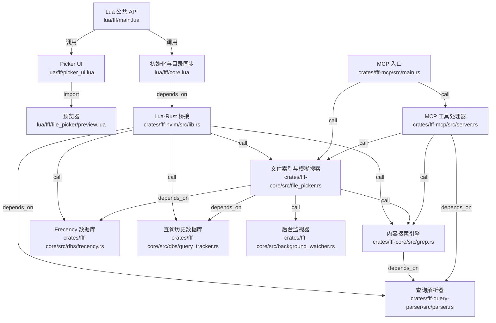

# dmtrKovalenko/fff 源码分析

## 🔍 项目简介

`dmtrKovalenko/fff` 是一个“常驻型”文件搜索工具包：核心是 Rust 写的索引与搜索引擎，外面包了 Neovim 插件、MCP 服务器、Node/Bun SDK。它解决的问题不是“单次 grep”，而是编辑器或 AI agent 在同一仓库里连续做几十次到几百次搜索时，反复 fork `rg`/`fzf` 太慢、上下文不连贯的问题。目标用户是 Neovim 用户、AI coding agent、需要嵌入式文件搜索能力的 Node/Rust 工具作者。技术栈是 Rust 工作区（`fff-core`/`fff-mcp`/`fff-nvim`/`fff-query-parser`/`fff-c`）+ Lua + TypeScript。和 `ripgrep`/`fzf`/Telescope 一类工具相比，它的差异点是“长期驻留索引 + frecency 排序 + git 感知 + 给 AI 的 MCP/SDK 封装”。

## ⚡ 核心功能

### 1. 后台索引与文件系统监视

**实现方式**

`crates/fff-core/src/file_picker.rs:734-783` 里，`FilePicker::new_with_shared_state` 会创建 picker，把实例塞进共享句柄，然后直接 `spawn()` 初始扫描任务；不是按次调用 CLI，而是把索引长期留在进程里。

```rust
pub fn new_with_shared_state(
    shared_picker: SharedFilePicker,
    shared_frecency: SharedFrecency,
    options: FilePickerOptions,
) -> Result<(), Error> {
    let picker = Self::new(options)?;
    let warmup = picker.enable_mmap_cache;
    let content_indexing = picker.enable_content_indexing;
    let watch = picker.watch;
    ScanJob::new_initial(
        shared_picker,
        shared_frecency,
        path,
        mode,
        signals,
        scanned_files_counter,
        ScanConfig {
            warmup,
            content_indexing,
            watch,
            auto_cache_budget: true,
            install_watcher: true,
            follow_symlinks,
        },
    )
    .spawn();
    Ok(())
}
```

`crates/fff-mcp/src/main.rs:259-305` 进一步说明了这个索引器如何被 MCP 服务复用：先初始化 `FilePicker`，再异步等待扫描完成，同时服务已经通过 `stdio()` 对外提供工具。

**怎么用**

```bash
cd /home/trade/ctf_workspace/gh_trending/dmtrKovalenko-fff
cargo run --release -p fff-mcp -- .
```

**输入输出**

输入是根目录、是否 warmup、是否 content indexing、是否 watch 等 `FilePickerOptions`；输出不是一次性结果，而是一个常驻的共享索引实例，后续所有 `find_files`/`grep` 都走这份状态。

**适用场景和限制**

适合编辑器、MCP、Agent 这种“同一仓库反复搜索”的长生命周期场景。默认 `follow_symlinks` 关闭，且源码前面还明确拒绝索引文件系统根目录，避免把 `/` 这种超大树直接拉进来。


### 2. 统一查询解析器：约束、定位、转义一套语法

**实现方式**

`crates/fff-query-parser/src/parser.rs:37-106` 把原始查询解析成 `FFFQuery { raw_query, constraints, fuzzy_query, location }`。它会区分单 token/多 token，把 `*.rs`、`src/`、`!test/`、`file.rs:12` 这类语法拆成结构化约束，而不是让上层 Lua/TS 各自实现一套 parser。

```rust
pub fn parse<'a>(&self, query: &'a str) -> FFFQuery<'a> {
    let raw_query = query;
    let mut constraints = ConstraintVec::new();
    let query = query.trim();
    let whitespace_count = query.chars().filter(|c| c.is_whitespace()).count();
    if whitespace_count == 0 {
        if let Some(constraint) = parse_token(query, config) {
            if !matches!(constraint, Constraint::FilePath(_))
                && !has_location_suffix
                && !treat_as_text
            {
                constraints.push(constraint);
                return FFFQuery { raw_query, constraints, fuzzy_query: FuzzyQuery::Empty, location: None };
            }
        }
        if config.enable_location() {
            let (query_without_loc, location) = parse_location(query);
            if location.is_some() {
                return FFFQuery { raw_query, constraints, fuzzy_query: FuzzyQuery::Text(query_without_loc), location };
            }
        }
    }
```

同一个文件的 `FFFQuery::grep_text()`（`crates/fff-query-parser/src/parser.rs:199-237`）还会把非约束 token 拼回 grep 文本，并正确处理 `\*.rs` 这种“字面量而不是约束”的转义。

```rust
pub fn grep_text(&self) -> String {
    match &self.fuzzy_query {
        FuzzyQuery::Empty => String::new(),
        FuzzyQuery::Text(t) => strip_leading_backslash(t).to_string(),
        FuzzyQuery::Parts(parts) => parts
            .iter()
            .map(|t| strip_leading_backslash(t))
            .collect::<Vec<_>>()
            .join(" "),
    }
}
```

**怎么用**

```lua
local r = require('fff').file_search('src/ button *.rs !test/ file_picker.rs:42', {
  mode = 'mixed',
  max_results = 20,
})
```

**输入输出**

输入是一条 query string；输出是 `FFFQuery`，包含约束数组、模糊搜索文本，以及可选的行列定位信息。

**适用场景和限制**

适合把“过滤条件 + 搜索词 + 跳转位置”塞进一条查询里。限制是语法以空白分词为基础，单 token 的 `file.rs` 会优先被当成模糊搜索文本，而不是严格的文件过滤器。


### 3. Typo-resistant 模糊文件搜索与文件/目录混合结果

**实现方式**

`crates/fff-core/src/file_picker.rs:867-945` 的 `fuzzy_search` 会按查询长度推导 `max_typos`，再把 `QueryTracker` 记住的历史命中塞进 `ScoringContext`，最后调用 `fuzzy_match_and_score_files`。这说明它不是简单字符串包含，而是“模糊匹配 + 评分排序”。

```rust
pub fn fuzzy_search<'q>(
    &self,
    query: &'q FFFQuery<'q>,
    query_tracker: Option<&QueryTracker>,
    options: FuzzySearchOptions<'q>,
) -> SearchResult<'_> {
    let effective_query = match &query.fuzzy_query {
        fff_query_parser::FuzzyQuery::Text(t) => *t,
        fff_query_parser::FuzzyQuery::Parts(parts) if !parts.is_empty() => parts[0],
        _ => query.raw_query.trim(),
    };
    let max_typos = (effective_query.len() as u16 / 4).clamp(2, 6);
    let last_same_query_entry = query_tracker
        .zip(options.project_path)
        .and_then(|(tracker, project_path)| {
            tracker.get_last_query_entry(query.raw_query, project_path, options.min_combo_count).ok().flatten()
        });
    let (items, scores, total_matched) = fuzzy_match_and_score_files(
        files,
        &context,
        self.sync_data.base_count,
        base_arena,
        overflow_arena,
    );
```

`crates/fff-core/src/file_picker.rs:1035-1115` 的 `fuzzy_search_mixed` 则把文件和目录结果按总分合并；如果 query 以 `/` 结尾，就自动切换成目录优先模式。

```rust
let dirs_only =
    query.raw_query.ends_with(std::path::MAIN_SEPARATOR) || query.raw_query.ends_with('/');
let dir_results = self.fuzzy_search_directories(query, dir_options);
if dirs_only {
    ...
    return MixedSearchResult { items, scores, total_matched, total_files: self.live_file_count(), total_dirs, location };
}
let file_results = self.fuzzy_search(query, query_tracker, file_options);
merged.sort_unstable_by_key(|b| std::cmp::Reverse(b.1.total));
```

**怎么用**

```lua
local r = require('fff').file_search('button/', {
  mode = 'mixed',
  max_results = 20,
  page = 0,
})
for _, item in ipairs(r.items) do
  print(item.type, item.relative_path)
end
```

**输入输出**

输入是查询字符串、分页、线程数、当前文件等选项；输出是 `SearchResult`/`MixedSearchResult`，包含 `items`、`scores`、`total_matched`、`location`。

**适用场景和限制**

适合“我记得大概名字，但可能拼错了”的导航场景。限制是短 query 会允许 2 到 6 个 typo，召回强但也更容易带来泛匹配；目录模式依赖末尾 `/` 这个约定。


### 4. Frecency 和记忆排序：访问越频繁、越近期，排得越高

**实现方式**

Lua 层在 `lua/fff/core.lua:18-41` 注册了 `BufEnter` 自动命令，每次进入文件都会走 Rust 的 `track_access`。这说明 frecency 不是“搜索时临时算”，而是会话内外都在积累。

```lua
if config.frecency.enabled then
  vim.api.nvim_create_autocmd({ 'BufEnter' }, {
    callback = function(args)
      local file_path = args.file
      ...
      vim.uv.fs_realpath(file_path, function(rp_err, real_path)
        if rp_err or not real_path then return end
        local ok, track_err = pcall(fuzzy.track_access, real_path)
```

Rust 侧 `crates/fff-core/src/dbs/frecency.rs:247-349` 用 LMDB 存访问时间序列，并按衰减函数算分；大于 10 次以后改用平方根增长，避免热门文件分数无限碾压。

```rust
pub fn track_access(&self, path: &Path) -> Result<()> {
    let mut accesses = self.get_accesses(path)?.unwrap_or_default();
    while let Some(&front_time) = accesses.front() {
        if front_time < cutoff_time || accesses.len() >= MAX_TIMESTAMPS_PER_FILE {
            accesses.pop_front();
        } else {
            break;
        }
    }
    accesses.push_back(now);
    ...
}

pub fn get_access_score(&self, file_path: &Path, mode: FFFMode) -> i64 {
    ...
    let normalized_frecency = if total_frecency <= 10.0 {
        total_frecency
    } else {
        10.0 + (total_frecency - 10.0).sqrt()
    };
```

同时，`crates/fff-core/src/dbs/query_tracker.rs:227-320` 会记录“某个 query 最后打开了哪个文件”，给重复查询场景做 combo boost。

```rust
pub fn track_query_completion(
    &mut self,
    query: &str,
    project_path: &Path,
    file_path: &Path,
) -> Result<(), Error> {
    let mut entry = self.query_file_db.get(&wtxn, &query_key)?
        .unwrap_or_else(|| QueryMatchEntry {
            file_path: file_path_buf.clone(),
            open_count: 0,
            last_opened: now,
        });
    if entry.file_path == file_path_buf {
        entry.open_count += 1;
    } else {
        entry.file_path = file_path_buf;
        entry.open_count = 1;
    }
```

**怎么用**

```lua
-- Neovim 正常打开文件即可自动学习
require('fff').find_files()
```

或者在 Node 里手动回写历史：

```ts
finder.trackQuery("button", "/repo/src/ui/button.tsx");
```

**输入输出**

输入是文件真实路径、query、项目路径；输出是 LMDB 中的访问历史和查询历史，间接影响后续排序分数。

**适用场景和限制**

适合长期使用同一仓库、反复打开同一批文件的场景。限制是新仓库冷启动时这部分价值不明显；LMDB map 满了会标记 unhealthy 并丢弃写入，不会让主流程崩掉。


### 5. 多模式内容搜索：plain / regex / fuzzy，且 regex 失败自动降级

**实现方式**

`crates/fff-core/src/grep.rs:1915-2035` 明确区分了三种 grep 模式：普通字面量、模糊逐行匹配、正则匹配。模糊模式前面还插了 bigram 预过滤，先缩小候选文件集合再做逐行搜索。

```rust
let case_insensitive = if options.smart_case {
    !grep_text.chars().any(|c| c.is_uppercase())
} else {
    false
};

let mut regex_fallback_error: Option<String> = None;
let regex = match options.mode {
    GrepMode::PlainText => None,
    GrepMode::Fuzzy => {
        let (mut files_to_search, mut filtered_file_count) =
            prepare_files_to_search(files, constraints_from_query, options, arena);
        ...
        return fuzzy_grep_search(
            &grep_text,
            &files_to_search,
            options,
            total_files,
            filtered_file_count,
            case_insensitive,
            budget,
            abort_signal,
            base_path,
            arena,
            overflow_arena,
        );
    }
    GrepMode::Regex => build_regex(&grep_text, options.smart_case)
        .inspect_err(|err| {
            regex_fallback_error = Some(err.to_string());
        })
        .ok(),
};
```

`crates/fff-core/src/grep.rs:1128-1150` 的 `build_regex` 说明 regex 会开 `multi_line(true)`、关 Unicode 优化，并在非法正则时返回错误，让上层改走 literal fallback。

```rust
fn build_regex(pattern: &str, smart_case: bool) -> Result<regex::bytes::Regex, String> {
    if pattern.is_empty() {
        return Err("empty pattern".to_string());
    }
    let case_insensitive = if smart_case {
        !pattern.chars().any(|c| c.is_uppercase())
    } else {
        false
    };
    regex::bytes::RegexBuilder::new(&regex_pattern)
        .case_insensitive(case_insensitive)
        .multi_line(true)
        .unicode(false)
        .build()
        .map_err(|e| e.to_string())
}
```

**怎么用**

```lua
local r = require('fff').content_search('*.rs TODO', {
  mode = 'regex',
  page_size = 20,
  smart_case = true,
})
for _, m in ipairs(r.items) do
  print(m.relative_path, m.line_number, m.line_content)
end
```

**输入输出**

输入是 query、mode、分页、上下文、大小限制；输出是 `GrepResult`，包含 `items`、`total_matched`、`total_files_searched`、`next_file_offset`、`regex_fallback_error`。

**适用场景和限制**

适合定义/引用检索、TODO 清理、批量排查调用点。限制是核心语义仍然是“单行 grep”，不是 AST 或跨行结构搜索；无效 regex 会自动退回字面量匹配，结果可能与用户预期不同但不会直接报废。


### 6. 面向 AI 的 MCP 服务器：find_files / grep / multi_grep

**实现方式**

`crates/fff-mcp/src/main.rs:259-305` 把 `fff-core` 直接接到 `rmcp::transport::stdio()` 上，说明 MCP 服务没有再包一层 HTTP API，而是本地子进程式工具。

```rust
FilePicker::new_with_shared_state(
    shared_picker.clone(),
    shared_frecency.clone(),
    fff::FilePickerOptions {
        base_path,
        enable_mmap_cache: !args.no_warmup,
        enable_content_indexing,
        watch: !args.no_watch,
        mode: FFFMode::Ai,
        cache_budget: args.max_cached_files.map(fff::ContentCacheBudget::new_for_repo),
        follow_symlinks: false,
    },
)?;
let service = server
    .serve(stdio())
    .await
    .map_err(|e| format!("Failed to start MCP server: {}", e))?;
```

`crates/fff-mcp/src/server.rs:236-360` 和 `420-610` 则做了面向 agent 的行为收敛：`grep` 结果为空时会自动缩短 query、再尝试 fuzzy fallback，`find_files` 会做 cursor 分页和“直接去读这个文件”的提示。

```rust
let parsed = QueryParser::new(AiGrepConfig).parse(query);
let result = picker.grep(&parsed, &options);
if result.matches.is_empty() && file_offset == 0 {
    let parts: Vec<&str> = query.split_whitespace().collect();
    ...
    let fuzzy_query = cleanup_fuzzy_query(query);
    let (fuzzy_options, _) = make_grep_options(output_mode, GrepMode::Fuzzy, 0, Some(0));
    let fuzzy_parsed = parser.parse(&fuzzy_query);
    let fuzzy_result = picker.grep(&fuzzy_parsed, &fuzzy_options);
```

**怎么用**

```bash
cargo run --release -p fff-mcp -- .
```

安装到支持 MCP 的客户端：

```bash
codex mcp add fff -- fff-mcp
```

**输入输出**

输入是 MCP tool 参数，如 `query`、`maxResults`、`cursor`、`patterns`；输出是文本化结果，必要时附加 `cursor: <id>` 供下一页继续拉取。

**适用场景和限制**

适合 Claude Code、Codex、Cursor、Cline 这类本地 agent。限制是它信任连接它的本地客户端，不做独立认证；另外它强调“短 query + 读文件”，不是设计来跑复杂布尔查询语言的。


### 7. Node SDK：每个实例持有独立 native picker

**实现方式**

`packages/fff-node/src/finder.ts:109-202` 里 `FileFinder.create()` 通过 `ffiCreate` 创建原生实例，之后 `fileSearch`/`directorySearch`/`mixedSearch` 都返回显式 `Result<T>`。这不是 shell-out，而是进程内 FFI。

```ts
static create(options: InitOptions): Result<FileFinder> {
  const result = ffiCreate(
    options.basePath,
    options.frecencyDbPath ?? "",
    options.historyDbPath ?? "",
    options.useUnsafeNoLock ?? false,
    !(options.disableMmapCache ?? false),
    !(options.disableContentIndexing ?? options.disableMmapCache ?? false),
    !(options.disableWatch ?? false),
    options.aiMode ?? false,
    options.logFilePath ?? "",
    options.logLevel ?? "",
    options.cacheBudgetMaxFiles ?? 0,
    options.cacheBudgetMaxBytes ?? 0,
    options.cacheBudgetMaxFileSize ?? 0,
  );
  ...
}

fileSearch(query: string, options?: SearchOptions): Result<SearchResult> {
  const guard = this.ensureAlive();
  if (!guard.ok) return guard;
  return ffiSearch(
    guard.value,
    query,
    options?.currentFile ?? "",
    options?.maxThreads ?? 0,
    options?.pageIndex ?? 0,
    options?.pageSize ?? 0,
    options?.comboBoostMultiplier ?? 0,
    options?.minComboCount ?? 0,
  );
}
```

**怎么用**

```ts
import { FileFinder } from "@ff-labs/fff-node";

const finder = FileFinder.create({ basePath: process.cwd() });
if (!finder.ok) throw new Error(finder.error);

const result = finder.value.grep("TODO", { mode: "plain" });
finder.value.destroy();
```

**输入输出**

输入是初始化参数、搜索 query、分页/模式等选项；输出是强类型的 `Result<SearchResult>` / `Result<GrepResult>` / `Result<MixedSearchResult>`。

**适用场景和限制**

适合给 Node agent、VS Code 扩展、内部工具链嵌入搜索能力。限制是依赖平台二进制或本地编译产物，而且实例用完要显式 `destroy()`。


### 8. Neovim 浮窗预览：防抖、大文件保护、定位高亮

**实现方式**

`lua/fff/picker_ui.lua:2499-2525` 打开 picker 时会设置 mode、grep mode、当前缓存，再交给 UI 状态机。真正的文件预览在 `lua/fff/file_picker/preview.lua:330-430`：用 `preview_generation` 防止异步回调串位，超过阈值的大文件直接拒绝渲染。

```lua
function M.open(opts)
  if M.state.active then return end
  M.state.renderer = opts and opts.renderer or nil
  M.state.mode = opts and opts.mode or nil
  M.state.grep_config = opts and opts.grep_config or nil
  local merged_config, base_path = initialize_picker(opts)
  if base_path then require('fff.core').change_indexing_directory(base_path) end
  ...
  return open_ui_with_state(query, nil, nil, merged_config, current_file_cache)
end
```

```lua
preview_generation = 0,
...
function M.is_big_file(file_path)
  local stat = vim.uv.fs_stat(file_path)
  if stat and stat.size > M.config.max_size then return true end
  return false
end

function M.preview_file(file_path, bufnr)
  if M.is_big_file(file_path) then
    local lines = {
      'File too large for preview',
      string.format('Size: %s (max: %s)', ...),
      '',
      'Use a text editor to view this file.',
    }
```

**怎么用**

```lua
require('fff').find_files()
require('fff').live_grep({ query = "TODO" })
```

**输入输出**

输入是当前选中项、可选定位信息、preview buffer；输出是浮窗内容、定位高亮、文件信息面板，或者“大文件不预览”的提示。

**适用场景和限制**

适合在选中文件时快速扫内容，不必真的打开缓冲区。限制是它主要是 UI 侧能力，不是通用 SDK；超大文件只给概要，不会强行 mmap 整个内容到浮窗。

## 🗺️ 知识图谱（Mermaid）



## 🔐 安全审计

### 依赖漏洞扫描

我实际执行了两次扫描：

1. `npm audit --json --workspaces`
2. `/home/trade/.cargo/bin/cargo-audit audit --json`

结果如下。

- JavaScript 侧共 **9** 个漏洞：**3 个高危，6 个中危**。
- 高危主要是：
  - `basic-ftp`，DoS 风险。锁定版本见 `package-lock.json:2587-2595`。
  - `fast-xml-builder`，XML 属性/注释注入风险。锁定版本见 `package-lock.json:2970-3000`。
  - `protobufjs`，代码注入 / 原型污染 / DoS 组合风险。锁定版本见 `package-lock.json:3755-3772`。
- 其余中危包括 `@aws-sdk/xml-builder`、`@protobufjs/utf8`、`brace-expansion`、`fast-xml-parser`、`ip-address`、`ws`；`ws` 锁定在 `package-lock.json:4189-4198`。
- 这些 JS 风险大多来自 Pi 相关 peer 依赖链，而不是 Rust 搜索内核本身。依赖链入口可见 `package-lock.json:948-1090`，其中 `@earendil-works/pi-ai` 拉入 `@google/genai`，后者再拉入 `google-auth-library`、`protobufjs`、`ws`；`@earendil-works/pi-coding-agent` 则引入了额外的大依赖面。
- Rust 侧 **0 个已确认漏洞**。但是有 2 条信息型告警：
  - `bincode 1.3.3` 已停止维护，见 `Cargo.lock:134-135`。
  - `rand 0.8.5` 命中特定条件下的 unsound 告警，见 `Cargo.lock:1868-1869`。RustSec 给出的触发条件很苛刻，偏向特定 logger/thread_rng 组合，并非这个仓库立刻可利用的远程漏洞。

### 密钥泄露扫描

- 没发现硬编码在版本库里的真实 API key / token / password。
- 扫到的主要是“环境变量占位符”和 CI secret 引用，不是泄露值：
  - `scripts/benchmark-claude.sh:64-69` 只是在提示用户导出 `AWS_ACCESS_KEY_ID` / `AWS_SECRET_ACCESS_KEY` / `AWS_SESSION_TOKEN`。
  - `install-mcp.ps1:53-56` 会在本地存在 `GITHUB_TOKEN` 时，给 GitHub API 请求加 `Authorization: Bearer ...` 头。
  - `.github/workflows/panvimdoc.yaml:54-72` 引用了 GitHub Actions secret `GUSTAV_PAT`。
- 结论：**有 secret 引用，没有 secret 泄露。**

### 认证与授权

- 没找到 HTTP auth middleware、session 管理、cookie、CSRF 这类 Web 应用逻辑。这个仓库的 MCP 面不是 Web server，而是本地 `stdio` 子进程。
- `crates/fff-mcp/src/main.rs:303-305` 直接 `serve(stdio())`，`crates/fff-mcp/src/server.rs:512-559` 直接暴露 `grep` / `multi_grep` / `find_files` 工具，没有单独认证层。
- 这对“本地 IDE/Agent 子进程”是合理的；但如果有人把 `fff-mcp` 自己封一层 TCP/HTTP 暴露出去，**必须在外面补认证、授权和限流**，否则任何能连上的客户端都能对仓库做全文搜索。

### 输入校验与数据暴露面

- 正向防护存在：
  - `packages/pi-fff/src/query.ts:10-18` 会拒绝超出工作区的绝对路径约束，避免 `path` 参数偷偷跳到仓库外。
  - `lua/fff/main.lua:173-180` 和 `lua/fff/core.lua:100-108` 会在换索引目录前检查 `cwd` / `new_path` 是否真的是目录。
  - `crates/fff-core/src/grep.rs:2011-2017` 在 regex 编译失败时退回 literal，不会让搜索入口直接崩。
  - `lua/fff/file_picker/preview.lua:345-400` 会阻止超大文件直接进入预览，降低 UI 卡死和内存暴涨概率。
- Pi 扩展还做了一层额外限制：`packages/pi-fff/src/index.ts:595-615` 会拒绝 `.*` 这种“匹配全部”的 grep 模式，防止 agent 误把 grep 当 `cat` 用。
- 但这个限制 **只存在 Pi 扩展里**。MCP 服务的 `grep` 路径（`crates/fff-mcp/src/server.rs:525-541`）会自动判定 regex/plain，却没有同等级别的 wildcard-only hard reject。风险不算致命，因为结果分页和单行 grep 限住了爆炸面，但它确实意味着不同入口的输入保护强度不一致。

## 🚀 快速上手

### 本地构建与运行 MCP

系统要求来自 `rust-toolchain.toml` 和各包清单：

- Rust：stable toolchain（`rust-toolchain.toml`）
- Node：`>=18`（`packages/fff-node/package.json`）
- Bun：`>=1.0.0`（`packages/fff-bun/package.json`）
- Neovim：需要能加载 LuaJIT 模块；测试目标默认依赖 `nvim`

直接构建：

```bash
cd /home/trade/ctf_workspace/gh_trending/dmtrKovalenko-fff
cargo build --release --features zlob
```

启动 MCP 服务器：

```bash
cargo run --release -p fff-mcp -- .
```

### 本地跑 Node 侧冒烟

```bash
cd /home/trade/ctf_workspace/gh_trending/dmtrKovalenko-fff
make prepare-node
node packages/fff-node/test/e2e.mjs
```

### 本地跑 Rust / Lua / Bun 测试

```bash
cd /home/trade/ctf_workspace/gh_trending/dmtrKovalenko-fff
make test-rust
make test-node
make test-bun
```

### 常见坑

- 这是“常驻索引器”，不是一次性 CLI；第一次扫描会比后续查询慢，但之后会很快。
- 最佳体验默认基于 git worktree；不在 git 仓库里也能跑，但 git 状态加权会失效。
- `follow_symlinks` 默认关闭，跨目录树符号链接不会自动被完整索引。
- Node/Bun 封装都依赖原生二进制；本地开发前要先 `cargo build`/`make prepare-node`。
- 如果你刻意关掉 `--no-warmup` 或 `--no-content-indexing`，启动内存会更省，但第一次 grep 和整体 grep 吞吐会下降。

## ⚖️ 一句话判词

值得关注，尤其适合“同一仓库里高频反复搜索”的 Neovim 和 AI agent 场景；如果你只是偶尔手工跑一两次 `rg`，它的复杂度和常驻索引开销未必划算。

## 📊 元信息

- 项目：`dmtrKovalenko/fff`
- Stars：7119（GitHub API，采集于 2026-06-02）
- Forks：298（GitHub API，采集于 2026-06-02）
- Language：Rust
- License：MIT
