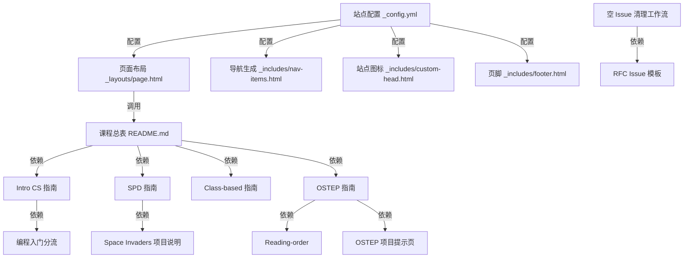

# ossu/computer-science 源码分析报告

## 🔍 项目简介

`ossu/computer-science` 不是传统意义上的 Web 应用或库，而是一个用 Markdown、Jekyll、GitHub Pages 和 GitHub Actions 维护的“计算机科学自学本科路线”源码仓库。它解决的问题不是“在线授课”，而是把分散在 MIT、Harvard、UBC、Wisconsin 等站点上的课程，重组为一条可 fork、可 PR、可发布的学习路径，目标用户是自学型学习者和课程维护者。技术栈非常轻：内容层是 Markdown，发布层是 Jekyll/Minima 主题，运维层只有一个 GitHub Actions 工作流。和 `teachyourselfcs.com` 这类偏书单/阅读清单型项目相比，OSSU 更强调按本科培养方案重排课程顺序，并补充运行说明、项目提示和社区维护流程。

## ⚡ 核心功能

这个仓库真正实现的功能，主要是“课程策展逻辑”“静态站点装配逻辑”和“仓库维护自动化”。下面每条都基于仓库内实际源码或内容源码，而不是 README 口号。

### 1. 本科式课程总表与先修关系索引

**实现方式**：`README.md:48-67` 先定义了整个培养路径的层次结构（`Intro CS`、`Core CS`、`Advanced CS`、`Final Project`），然后在 `README.md:127-154`、`README.md:169-214` 等表格里，把课程名、时长、工作量、先修条件、讨论链接和内部子页面绑定在一起。这里不是纯文本介绍，而是“可发布的课程数据表”。

```md
# README.md:127-153
Courses | Duration | Effort | Prerequisites | Discussion
:-- | :--: | :--: | :--: | :--:
[Introduction to Computer Science and Programming using Python](coursepages/intro-cs/README.md) | 14 weeks | 6-10 hours/week | [high school algebra](https://ossu.dev/precollege-math) | [chat](https://discord.gg/jvchSm9)
[Systematic Program Design](coursepages/spd/README.md) | 13 weeks | 8-10 hours/week | none | chat: [part 1](https://discord.gg/RfqAmGJ) / [part 2](https://discord.gg/kczJzpm)
[Class-based Program Design](coursepages/class-based/README.md) | 13 weeks | 5-10 hours/week | Systematic Program Design, High School Math | [chat](https://discord.com/channels/744385009028431943/891411727294562314)
```

**怎么用**：

```bash
cd /home/trade/ctf_workspace/gh_trending/ossu-computer-science
rg -n "Introduction to Computer Science|Systematic Program Design|Operating Systems: Three Easy Pieces" README.md
```

**输入输出**：输入是维护者在 Markdown 表格里录入的课程元数据和内部/外部链接；输出是首页课程总表，以及指向各课程细页的入口。

**适用场景和限制**：适合需要“一眼看懂完整培养路径”的学习者；限制是这些表格没有独立 schema、没有链接健康检查、没有自动先修校验，外链失效需要人工修。

### 2. Intro CS 门槛分流与题集节奏编排

**实现方式**：`coursepages/intro-cs/README.md:11-20` 明确把 Intro CS 标记为 `Under Review`，并在 `coursepages/intro-cs/README.md:13` 直接把吃力的学习者分流到 `coursepages/intro-programming/README.md`。同文件 `:20-31` 又把 MIT 课程原始页面里的 PSET 节奏重写成按 lecture 对应的提交窗口；`coursepages/intro-cs/README.md:36-40` 还补了 Python 3.8.x 和 Spyder 6.0.8 的兼容性说明。

```md
# coursepages/intro-cs/README.md:11-20
## ⚠️ Under Review

This course is under review. ... if you find the course difficult to follow,
you can try doing one of the [Intro to Programming courses](../intro-programming/README.md)
and then return to this course.
```

```md
# coursepages/intro-cs/README.md:22-30
- PSET 0 - Before lecture 1
- PSET 1 - Before lecture 9
- PSET 2 - Before lecture 12
- PSET 3 - Before lecture 16
- PSET 4 - Before lecture 20
- PSET 5 - Before lecture 25
```

**怎么用**：

```bash
sed -n '11,40p' /home/trade/ctf_workspace/gh_trending/ossu-computer-science/coursepages/intro-cs/README.md
sed -n '1,35p' /home/trade/ctf_workspace/gh_trending/ossu-computer-science/coursepages/intro-programming/README.md
```

**输入输出**：输入是课程可用性、学习难度反馈和运行环境兼容性经验；输出是更可执行的选课分流建议、PSET 节奏表和本地环境提示。

**适用场景和限制**：适合零基础或基础不稳的学习者；限制是它仍然只是人工分流，不会根据你的真实能力做动态推荐，而且 Python/Spyder 版本建议会随着上游课程更新而老化。

### 3. SPD 归档课程修复与期末项目补丁

**实现方式**：`coursepages/spd/README.md:21-38` 把 UBC 的归档版 SPD 课程改写成一份“可执行 runbook”，包括先做 `Week 1A` 到 `Week 6A`、再做 Space Invaders、再做 `Week 6B` 以后内容。`coursepages/spd/README.md:30-33` 还补了失效 starter file 的替代仓库 `ossu/spd-starters`。配套的 `coursepages/spd/space-invaders-instructions.md:1-15` 单独定义了 Space Invaders 最终项目的行为规范。

```md
# coursepages/spd/README.md:25-32
- Work through Week 1A to Week 6A as given in the course overview.
- After you complete, Week 6A, complete the space invaders project with [these instructions](./space-invaders-instructions.md).
- Then, work through Week 6B onwards.
- ... download the starter files from this github repository: <https://github.com/ossu/spd-starters>
```

```md
# coursepages/spd/space-invaders-instructions.md:7-13
- The tank should move right and left ...
- The tank should fire missiles straight up ...
- The invaders should appear randomly ...
- When an invader reaches the bottom of the screen, the game is over.
```

**怎么用**：

```bash
sed -n '21,38p' /home/trade/ctf_workspace/gh_trending/ossu-computer-science/coursepages/spd/README.md
sed -n '1,15p' /home/trade/ctf_workspace/gh_trending/ossu-computer-science/coursepages/spd/space-invaders-instructions.md
```

**输入输出**：输入是归档课程链接、失效 starter 的替代地址和项目规则；输出是完整学习步骤和一份可直接执行的期末项目说明。

**适用场景和限制**：适合学习归档课程时经常遇到“课还在，但材料不顺手”的场景；限制是仓库只给说明，不托管 Racket starter 代码，仍依赖外部 edX、GitHub 和 YouTube 资源可用。

### 4. Class-based 课程原始时间表重排

**实现方式**：`coursepages/class-based/README.md:11-29` 用一张三列表（Lectures/Lab/Assignment）重新整理 Northeastern 2022 春季课站上的内容顺序，解决原站点 UI 不利于按真实学习顺序浏览的问题。`coursepages/class-based/README.md:31-40` 还把“Lecture 30 顺序异常”“视频损坏需改看 YouTube 归档”“必须使用 Java 11”等边界条件写死在页面里。

```md
# coursepages/class-based/README.md:15-29
| Lectures | Lab | Assignment |
|----------|-----|------------|
| [1](...), [2](...), [3](...) | [Lab 1](...) | [Assignment 1](...) |
| [4](...), [5](...), [6](...) | [Lab 2](...) | [Assignment 2](...) |
...
| [34](...), [35](...) | - | [Assignment 10 Part 2](...) |
```

**怎么用**：

```bash
sed -n '11,40p' /home/trade/ctf_workspace/gh_trending/ossu-computer-science/coursepages/class-based/README.md
```

**输入输出**：输入是原课程站的 lecture/lab/assignment 链接及维护者手工重排规则；输出是一个更贴合自学者节奏的学习顺序表。

**适用场景和限制**：适合原课程站按学期日期组织、而非按知识顺序组织的课程；限制是这完全依赖人工维护，且当前绑定的是 `cs2510sp22` 和 Java 11 环境，未来换学期版本就要重排一次。

### 5. OSTEP 双轨路线、环境引导与项目提示

**实现方式**：`coursepages/ostep/README.md:6-10` 把 OSTEP 拆成 `Base` 和 `Extended` 两条路线；`coursepages/ostep/README.md:68-84` 再提供按 chapter 和 project 重新排序后的 roadmap；`coursepages/ostep/README.md:112-124` 直接给出克隆 `ostep-homework`、`ostep-projects` 和 `xv6-public` 的命令；细节提示则拆到 `coursepages/ostep/Reading-order.md`、`coursepages/ostep/Project-2A-processes-shell.md` 和 `coursepages/ostep/Scheduling-xv6-lottery.md`。

```md
# coursepages/ostep/README.md:112-124
git clone https://github.com/remzi-arpacidusseau/ostep-homework/
git clone https://github.com/remzi-arpacidusseau/ostep-projects/
cd ostep-projects

mkdir src
git clone https://github.com/mit-pdos/xv6-public src
```

```md
# coursepages/ostep/Reading-order.md:3-12
* Before starting the course: `initial-utilities`
* Chapter 5: `processes-shell`
* Chapter 6: `initial-xv6`
* Chapter 9: `scheduling-xv6-lottery`
...
```

```md
# coursepages/ostep/Scheduling-xv6-lottery.md:157-170
while (1) {
  count the total tickets allotted to all processes
  get the winning ticket number
  iterate over processes:
    if not runnable:
      continue
    add its tickets to counter
    if counter <= winning ticket number:
      continue
    run it
}
```

**怎么用**：

```bash
sed -n '66,132p' /home/trade/ctf_workspace/gh_trending/ossu-computer-science/coursepages/ostep/README.md
sed -n '1,20p' /home/trade/ctf_workspace/gh_trending/ossu-computer-science/coursepages/ostep/Reading-order.md
sed -n '147,170p' /home/trade/ctf_workspace/gh_trending/ossu-computer-science/coursepages/ostep/Scheduling-xv6-lottery.md
```

**输入输出**：输入是上游教材、项目仓库、xv6 源码和维护者的学习次序修正规则；输出是双轨路线、项目启动命令、以及针对关键作业的实现提示。

**适用场景和限制**：适合系统方向的深度自学；限制是仓库本身不包含 xv6/作业源码，只提供“如何拉取和如何改”的说明，且大量步骤默认 Unix/Linux 工具链。

### 6. Jekyll/Minima 静态站点装配与发布

**实现方式**：`_config.yml:1-8` 定义站点标题、远程主题和导航页，`_layouts/page.html:4-8` 是最小页面壳，只负责把正文内容塞进 `<article>`；`_includes/nav-items.html:1-7` 用 Liquid 循环把导航路径转换成链接并追加 GitHub 入口；`_includes/custom-head.html:1-3` 注入 favicon；`_includes/footer.html:1-15` 渲染页脚和社交链接；`CNAME:1` 把生产域名固定为 `cs.ossu.dev`。

```yml
# _config.yml:1-8
title: Computer Science
remote_theme: "jekyll/minima@7d91bb5"
minima:
  skin: auto
  nav_pages:
    - FAQ.md
    - HELP.md
include: ['CONTRIBUTING.md']
```

```html
<!-- _includes/nav-items.html:1-7 -->

  
  
  <a class="nav-item" href="{{ hyperpage.url | relative_url }}">{{ hyperpage.title | escape }}</a>
  

<a class="nav-item" href="https://github.com/ossu/computer-science">GitHub</a>
```

**怎么用**：

```bash
gem install jekyll jekyll-remote-theme webrick
cd /home/trade/ctf_workspace/gh_trending/ossu-computer-science
jekyll serve --host 0.0.0.0 --livereload
```

**输入输出**：输入是 Markdown 页面、Liquid include、YAML 配置和图片资源；输出是发布到 `cs.ossu.dev` 的静态 HTML 站点。

**适用场景和限制**：适合文档站点和课程清单发布；限制是仓库没有 `Gemfile`/`Gemfile.lock`，本地构建依赖全局 Ruby/Jekyll 环境，构建结果也依赖远程主题行为。

### 7. 空白 RFC Issue 自动评论并关闭

**实现方式**：`.github/ISSUE_TEMPLATE/request-for-comment-template.md:10-28` 定义 RFC issue 必填结构；`.github/workflows/delete-empty-issues.yml:12-35` 在 issue 打开时检查 `github.event.issue.body`，如果 body 为空，或者仍包含模板里那段“Give a 1 sentence description...”占位文字，就调用 `actions-cool/issues-helper` 自动留言并关闭 issue。动作使用的是 GitHub 提供的 `${{ secrets.GITHUB_TOKEN }}`，且 `permissions` 仅开启 `issues: write`。

```yml
# .github/workflows/delete-empty-issues.yml:12-18
if: github.event.issue.body == '' || contains(github.event.issue.body, 'Give a 1 sentence description of a problem with the current OSSU Curriculum. Successful critiques of the curriculum will point out ways that OSSU is failing to uphold')
steps:
  - name: Create comment
    uses: actions-cool/issues-helper@200c78641dbf33838311e5a1e0c31bbdb92d7cf0
    with:
      actions: 'create-comment'
      token: ${{ secrets.GITHUB_TOKEN }}
```

```md
# .github/ISSUE_TEMPLATE/request-for-comment-template.md:10-25
**Problem:**
Give a 1 sentence description of a problem with the current OSSU Curriculum.

**Duration:**
This should most often be 1 month from the date of posting.

**Background:**
Give an in depth description of the problem.
```

**怎么用**：

```bash
gh issue create \
  --repo ossu/computer-science \
  --title "RFC: sample curriculum change" \
  --body-file /home/trade/ctf_workspace/gh_trending/ossu-computer-science/.github/ISSUE_TEMPLATE/request-for-comment-template.md
```

**输入输出**：输入是新建 issue 的 body 文本；输出是自动评论和 issue 关闭动作，或者放行给维护者继续讨论。

**适用场景和限制**：适合高流量仓库压制“空 issue”；限制是它只做字符串启发式检查，无法真正判断 RFC 质量，模板文本未删干净时可能误杀真实讨论。

## 🗺️ 知识图谱（Mermaid）



## 🔐 安全审计

**依赖扫描**

2026-06-02 实际检查了仓库里的依赖清单文件，结果没有发现 `package.json`、`package-lock.json`、`Gemfile`、`Gemfile.lock`、`requirements.txt`、`pyproject.toml`、`Cargo.toml`、`go.mod` 等本地依赖描述文件。随后执行 `npm audit --json`，工具返回 `ENOLOCK`，原因是当前目录不存在 npm lockfile。

- 本地可扫描依赖清单数量：`0`
- 发现漏洞总数：`0`
- 高危漏洞数量：`0`
- 审计覆盖限制：因为没有 lockfile，也没有 Ruby/Python/Cargo/Go 依赖清单，无法对 Jekyll/Minima 的实际运行时依赖做标准包审计

补充一点，`_config.yml:2` 把远程主题固定为 `jekyll/minima@7d91bb5`，这比直接跟踪浮动分支更稳，但它仍然不是一份可本地审计的锁文件。

**密钥泄露扫描**

对仓库执行了 `rg -n -uu -i "(api[_-]?key|secret|token|password|...)"`。在项目源码里没有发现硬编码 API key、密码、私钥或访问令牌。唯一与 secret/token 相关的项目代码位于 `.github/workflows/delete-empty-issues.yml:18,34`：

```yml
token: ${{ secrets.GITHUB_TOKEN }}
```

这属于 GitHub Actions 运行时注入的内置令牌，不是泄露。其余命中主要来自 `.git/hooks/*.sample` 示例文件中的 `token` 字样，不属于项目业务源码。

**认证与授权逻辑**

这个仓库本质上是静态站点，没有登录、会话、Cookie、JWT、OAuth、CSRF 中间件等应用级认证代码。唯一“授权”相关逻辑在 `.github/workflows/delete-empty-issues.yml:9-10`：

```yml
permissions:
  issues: write
```

这说明工作流权限收敛到了 `issues: write`，没有申请更宽的仓库权限，做法是合理的。

**输入校验和数据暴露面**

1. `_includes/nav-items.html:2-5` 在渲染导航标题时用了 `{{ hyperpage.title | escape }}`，`_includes/footer.html:7` 用了 `{{ site.description | escape }}`。这能避免标题和描述字段里的 HTML 直接注入到页面中。

2. `_layouts/page.html:6-7` 直接输出 `{{ content }}`：

```html
<div class="post-content">
  {{ content }}
</div>
```

这在 Jekyll 站点里很常见，但也意味着仓库维护者一旦合入带恶意 HTML/脚本的 Markdown 内容，页面会被原样发布。这个风险属于“内容供应链/PR 审核边界”，不是传统输入校验问题。

3. `.github/workflows/delete-empty-issues.yml:12` 对 issue body 的检查只是基于空字符串和模板固定句子的 `contains(...)`，因此存在误判空间。它不是代码执行风险，但会造成正常 RFC 被自动关闭的运营风险。

**结论**

- 明确漏洞：未发现可直接利用的硬编码凭证、认证缺陷或高危依赖漏洞
- 主要风险：依赖审计覆盖不足、内容发布信任边界完全依赖 PR 审核、issue 自动关闭规则偏启发式

## 🚀 快速上手

**系统和依赖要求**

- Linux 或 macOS
- Ruby 3.x
- `jekyll`
- `jekyll-remote-theme`
- `webrick`
- 网络访问：首次构建需要拉远程主题

**安装和运行**

```bash
sudo apt-get update
sudo apt-get install -y ruby-full build-essential zlib1g-dev
sudo gem install jekyll jekyll-remote-theme webrick

cd /home/trade/ctf_workspace/gh_trending/ossu-computer-science
jekyll serve --host 0.0.0.0 --livereload
```

运行后默认访问：

```text
http://127.0.0.1:4000
```

**常见坑**

- 仓库没有 `Gemfile`，所以本地构建依赖不会被锁定；不同机器的 Jekyll 版本可能行为不同。
- 没装 `jekyll-remote-theme` 时，`_config.yml:2` 的 `remote_theme` 会导致构建失败。
- 课程正文几乎都依赖外部站点；站点能 build 成功，不代表所有课程链接仍然有效。
- 这个仓库不是交互式学习平台；没有账户系统、进度数据库，也不会自动检测你是否完成了课程。

## ⚖️ 一句话判词

值得关注，前提是你要找的是“可 fork、可维护、可发布的自学 CS 本科路线源码”，而不是带账户、打卡、自动评测和个性化推荐的学习平台。

## 📊 元信息

- Project: `ossu/computer-science`
- Stars: `204355`
- Forks: `25431`
- Language: `HTML`
- License: `MIT`
- Default Branch: `master`
- Site: `https://cs.ossu.dev`
- 统计口径：2026-06-02 通过 GitHub API / 仓库页面获取
