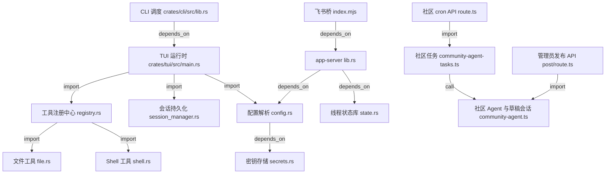

<!-- 🔗 English entry page: [English version](../../en/trending/2026-06-02-06-Hmbown-CodeWhale.md) -->

# Hmbown/CodeWhale 源码分析

## 🔍 项目简介

CodeWhale 是一个以 Rust workspace 为核心的终端编码 agent monorepo：`codewhale` 负责 CLI 调度，`codewhale-tui` 承担交互式 TUI 与工具执行，`app-server` 提供 HTTP/stdio 传输层，`web/` 是基于 Next.js + Cloudflare Workers 的社区站，`integrations/feishu-bridge/` 则把本地 runtime 暴露给飞书/ Lark 手机聊天入口。它解决的不是“让模型回答问题”，而是“让模型在本地工作区里带着工具、状态、审批策略和外部入口完成编码任务”。目标用户是需要开源、可自托管、可脚本化的 DeepSeek/MiMo 编码代理用户；和只包一层聊天 CLI 的竞品相比，这个仓库把工具面、状态库、HTTP transport、社区自动化和移动桥接都做进了同一套源码里。

## ⚡ 核心功能

### 1. CLI 调度与多入口启动

**实现方式**：`codewhale` 不是直接做所有事情，而是先加载 `ConfigStore` 和 CLI override，再按子命令把执行权分发给 TUI、认证、线程管理或 app-server。关键逻辑见 [crates/cli/src/lib.rs](/home/trade/ctf_workspace/gh_trending/Hmbown-CodeWhale/crates/cli/src/lib.rs:481)。

```rust
let mut store = ConfigStore::load(cli.config.clone())?;
let runtime_overrides = CliRuntimeOverrides { ... };

match command {
    Some(Commands::Run(args)) => {
        let resolved_runtime = resolve_runtime_for_dispatch(&mut store, &runtime_overrides);
        delegate_to_tui(&cli, &resolved_runtime, args.args)
    }
    Some(Commands::Exec(args)) => {
        let resolved_runtime = resolve_runtime_for_dispatch(&mut store, &runtime_overrides);
        delegate_to_tui(&cli, &resolved_runtime, tui_args("exec", args))
    }
```

`login`/`logout` 还会把 key 同时写入配置与 secret store，见 [crates/cli/src/lib.rs](/home/trade/ctf_workspace/gh_trending/Hmbown-CodeWhale/crates/cli/src/lib.rs:676)。

```rust
let api_key = match args.api_key {
    Some(v) => v,
    None => read_api_key_from_stdin()?,
};
write_provider_api_key_to_config(store, provider, &api_key);
let keyring_saved = write_provider_api_key_to_keyring(secrets, provider, &api_key);
```

**怎么用**：

```bash
codewhale
codewhale exec --auto "fix the failing test"
codewhale app-server --auth-token test-token
codewhale auth set --provider deepseek --api-key "$DEEPSEEK_API_KEY"
```

**输入输出**：输入是 CLI flags、prompt 和 provider/runtime override；输出是被委托的 TUI 交互、非交互文本流、认证落盘结果或 app-server 进程。

**适用场景和限制**：适合统一入口、脚本化调用和多 provider 切换。限制是它本质上是 dispatcher，Cargo/手工安装时要同时提供 `codewhale` 和 `codewhale-tui` 这对二进制，否则入口存在但 runtime 不完整。

### 2. Agent 工具面注册与子代理扩展

**实现方式**：工具面不是硬编码在某个 prompt 里，而是由 `ToolRegistryBuilder` 拼装。`with_agent_tools()` 先注册文件、搜索、git、diagnostics、skill、task、OCR、finance 等，再按 `allow_shell` 决定是否补 shell 工具；`with_full_agent_surface()` 继续叠加 todo、plan、review、RLM 和 subagent。见 [crates/tui/src/tools/registry.rs](/home/trade/ctf_workspace/gh_trending/Hmbown-CodeWhale/crates/tui/src/tools/registry.rs:906)。

```rust
pub fn with_agent_tools(self, allow_shell: bool) -> Self {
    let builder = self
        .with_file_tools()
        .with_note_tool()
        .with_search_tools()
        .with_user_input_tool()
        .with_parallel_tool()
        .with_git_tools()
        .with_git_history_tools()
        .with_diagnostics_tool()
        .with_project_tools()
        .with_skill_tools();

    if allow_shell {
        builder.with_shell_tools().with_runtime_task_shell_tools()
    } else {
        builder
    }
}
```

```rust
self.with_agent_tools(allow_shell)
    .with_todo_tool(todo_list)
    .with_plan_tool(plan_state)
    .with_review_tool(client.clone(), model.clone())
    .with_rlm_tool(client, model)
    .with_recall_archive_tool()
    .with_subagent_tools(manager, runtime)
```

**怎么用**：

```bash
codewhale exec --auto "inspect this repo and propose a patch"
codewhale --yolo
```

**输入输出**：输入是会话上下文、开关位（如 `allow_shell`）和共享状态（todo/plan/subagent manager）；输出是一个模型可见的 tool catalog，以及相应的工具执行 surface。

**适用场景和限制**：适合把“模型能做什么”编排成可组合能力层。限制是 shell 工具默认受审批/策略控制，某些 meta-tool（如 `multi_tool_use.parallel`）保留为引擎兼容层，不直接当成普通工具暴露。

### 3. 工作区文件读取：分页、PDF 提取和 OCR

**实现方式**：`ReadFileTool` 会先通过 `context.resolve_path()` 约束路径，再根据文件类型走文本、PDF 或图片 OCR 分支；对大文件采用按行分页和 16KB 截断，返回 `next_start_line` 让上层继续拉取。见 [crates/tui/src/tools/file.rs](/home/trade/ctf_workspace/gh_trending/Hmbown-CodeWhale/crates/tui/src/tools/file.rs:25)。

```rust
let path_str = required_str(&input, "path")?;
let file_path = context.resolve_path(path_str)?;
let pages = optional_str(&input, "pages");

if is_pdf(&file_path)? {
    return read_pdf(&file_path, pages);
}
if is_image_for_ocr(&file_path) {
    return read_image_via_ocr(&file_path, path_str);
}
```

```rust
let start_line = match input.get("start_line").and_then(Value::as_u64) {
    Some(0) => {
        return Err(ToolError::invalid_input(
            "start_line must be 1-based and greater than 0".to_string(),
        ));
    }
    Some(v) => v as usize,
    None => 1,
};
```

```rust
if truncated_by_lines {
    output.push_str(&format!(
        "\n[TRUNCATED] Showing lines {shown_first}-{shown_last} of {total_lines}. \
To continue, call read_file with path=\"{path_str}\" start_line={next_start} max_lines={max_lines}\n"
    ));
}
```

**怎么用**：

```json
{"path":"crates/cli/src/lib.rs","start_line":481,"max_lines":80}
```

```bash
codewhale exec --auto "read crates/cli/src/lib.rs and summarize the command dispatch"
```

**输入输出**：输入是 `path`、可选 `start_line/max_lines/pages`；输出是纯文本内容、带行号分页块、PDF 提取文本或 `<image_ocr>` 包裹的 OCR 结果。

**适用场景和限制**：适合源码审查、增量阅读、PDF/截图吸收。限制是非 UTF-8 二进制文件不支持；文本窗口默认 200 行、最大 500 行，并且会做 16KB 可见输出限制。

### 4. Shell 执行：审批、安全分析、后台任务和沙箱

**实现方式**：`ExecShellTool` 把 shell 执行做成结构化工具：先解析 `command/timeout/background/interactive/cwd/tty`，再跑 `execpolicy`、危险命令分析、`cwd` 路径约束、shell_env hook，最后视配置决定走本地 shell manager 还是外部 sandbox backend。见 [crates/tui/src/tools/shell.rs](/home/trade/ctf_workspace/gh_trending/Hmbown-CodeWhale/crates/tui/src/tools/shell.rs:1781)。

```rust
fn capabilities(&self) -> Vec<ToolCapability> {
    vec![
        ToolCapability::ExecutesCode,
        ToolCapability::Sandboxable,
        ToolCapability::RequiresApproval,
    ]
}

fn approval_requirement(&self) -> ApprovalRequirement {
    ApprovalRequirement::Required
}
```

```rust
if let ExecPolicyDecision::Deny(reason) = decision {
    return Ok(ToolResult {
        content: format!("BLOCKED: {reason}"),
        success: false,
        metadata: Some(json!({
            "execpolicy": {
                "decision": "deny",
                "reason": reason,
            }
        })),
    });
}
```

```rust
let working_dir = match input.get("cwd").and_then(serde_json::Value::as_str) {
    Some(dir) => {
        let resolved = context.resolve_path(dir)?;
        Some(resolved.to_string_lossy().to_string())
    }
    None => None,
};
```

**怎么用**：

```json
{"command":"cargo test -p codewhale-cli","timeout_ms":600000,"cwd":"."}
```

```bash
codewhale exec --auto "run cargo test -p codewhale-cli and explain the first failure"
```

**输入输出**：输入是命令字符串及执行参数；输出是 `stdout/stderr/exit_code/duration_ms` 等 metadata，后台模式会返回 `task_id` 供后续 wait/poll。

**适用场景和限制**：适合编译、测试、格式化、git 操作等工作区命令。限制是危险命令在非 `yolo` 模式下会被 block；`interactive` 不能和 `background/tty/combined_output/stdin` 混用；外部 sandbox backend 不支持交互和后台模式。

### 5. 会话与线程持久化：原子 JSON + SQLite 分支消息树

**实现方式**：CodeWhale 的“会话”和“线程”分两层存储。`SessionManager` 用原子写保存可恢复的 JSON 会话、checkpoint 和离线队列；`StateStore` 则在 SQLite 中建立 `threads/messages/checkpoints/jobs/thread_dynamic_tools`，并通过 `parent_entry_id/current_leaf_id` 支持分支消息树。见 [crates/tui/src/session_manager.rs](/home/trade/ctf_workspace/gh_trending/Hmbown-CodeWhale/crates/tui/src/session_manager.rs:255) 与 [crates/state/src/lib.rs](/home/trade/ctf_workspace/gh_trending/Hmbown-CodeWhale/crates/state/src/lib.rs:268)。

```rust
pub fn save_session(&self, session: &SavedSession) -> std::io::Result<PathBuf> {
    let path = self.validated_session_path(&session.metadata.id)?;
    let content = serde_json::to_string_pretty(&session)?;
    write_atomic(&path, content.as_bytes())?;
    self.cleanup_old_sessions()?;
    Ok(path)
}
```

```sql
CREATE TABLE IF NOT EXISTS threads (...);
CREATE TABLE IF NOT EXISTS messages (...);
ALTER TABLE messages ADD COLUMN parent_entry_id INTEGER NULL;
ALTER TABLE threads ADD COLUMN current_leaf_id INTEGER NULL;
```

**怎么用**：

```bash
codewhale sessions
codewhale resume <SESSION_ID>
codewhale fork <SESSION_ID>
codewhale exec --continue "follow up on the previous result"
```

**输入输出**：输入是 session id、thread metadata、message/item payload；输出是 `*.json` 会话文件、checkpoint 文件、`state.db` 中的线程/消息/作业记录。

**适用场景和限制**：适合长任务恢复、会话分叉、离线队列恢复和 app-server 共享状态。限制是存在双层存储心智成本：用户可见会话 JSON 和 runtime state.db 不是同一份文件。

### 6. app-server：HTTP + stdio JSON-RPC 传输层

**实现方式**：`app-server` 用 Axum 暴露 `/thread`、`/app`、`/prompt`、`/tool`、`/jobs`、`/mcp/startup`，同时也支持 `run_stdio()` 读取 JSON-RPC 2.0 行协议。HTTP 侧除了 `/healthz` 外都经过 Bearer middleware；若用户选择 `--insecure-no-auth`，源码明确拒绝在非 loopback 上无认证监听。见 [crates/app-server/src/lib.rs](/home/trade/ctf_workspace/gh_trending/Hmbown-CodeWhale/crates/app-server/src/lib.rs:133)。

```rust
let protected_routes = Router::new()
    .route("/thread", post(thread_handler))
    .route("/app", post(app_handler))
    .route("/prompt", post(prompt_handler))
    .route("/tool", post(tool_handler))
    .route("/jobs", get(jobs_handler))
    .route("/mcp/startup", post(mcp_startup_handler))
    .route_layer(middleware::from_fn_with_state(
        state.clone(),
        require_app_server_token,
    ));
```

```rust
if options.insecure_no_auth {
    if !options.listen.ip().is_loopback() {
        bail!("refusing unauthenticated app-server bind on non-loopback address");
    }
    return Ok(None);
}
```

```rust
let authorized = req
    .headers()
    .get(header::AUTHORIZATION)
    .and_then(|value| value.to_str().ok())
    .and_then(|raw| raw.strip_prefix("Bearer "))
    .is_some_and(|token| token == expected);
```

**怎么用**：

```bash
codewhale app-server --host 127.0.0.1 --port 8787 --auth-token test-token
curl -H "Authorization: Bearer test-token" http://127.0.0.1:8787/healthz
```

**输入输出**：输入是 HTTP JSON 请求或 stdio JSON-RPC 消息；输出是 `ThreadResponse`、`PromptResponse`、工具调用结果、作业状态和 JSON-RPC result/error。

**适用场景和限制**：适合本地 IDE/手机桥/外部进程接入 CodeWhale runtime。限制是它更像本地 transport，不是多租户 SaaS API；默认 CORS 白名单也只覆盖本地常见开发源。

### 7. 社区自动化闭环：GitHub 拉取、DeepSeek 生成草稿、KV 存储、人工发布

**实现方式**：`/api/cron` 先校验 `x-cron-secret`，再分派 `curate/triage/pr-review/stale/dupes/digest/facts-drift/linkcheck/semantic-drift` 任务。`runCurate()` 会抓 GitHub stats/feed，交给 `curate()`/`agentChat()` 生成 Dispatch；`runTriage()`/`runPrReview()` 会抓 issue/PR，调用 DeepSeek `/v1/chat/completions` 生成中英双语 draft，并保存到 KV。最终 `admin/post` 在校验 session cookie、Origin 和 body 长度后，才真正调用 GitHub 评论 API。见 [web/app/api/cron/route.ts](/home/trade/ctf_workspace/gh_trending/Hmbown-CodeWhale/web/app/api/cron/route.ts:30)、[web/lib/community-agent-tasks.ts](/home/trade/ctf_workspace/gh_trending/Hmbown-CodeWhale/web/lib/community-agent-tasks.ts:44)、[web/lib/community-agent.ts](/home/trade/ctf_workspace/gh_trending/Hmbown-CodeWhale/web/lib/community-agent.ts:49) 和 [web/app/api/admin/post/route.ts](/home/trade/ctf_workspace/gh_trending/Hmbown-CodeWhale/web/app/api/admin/post/route.ts:31)。

```ts
const auth = req.headers.get("x-cron-secret") ?? "";
if (!(await safeEqual(auth, env.CRON_SECRET))) {
  return NextResponse.json({ error: "unauthorized" }, { status: 401 });
}
```

```ts
const [stats, feed] = await Promise.all([
  fetchRepoStats(env.GITHUB_TOKEN),
  fetchFeed(env.GITHUB_TOKEN, 30),
]);
const dispatch = await curate(env.DEEPSEEK_API_KEY, stats, feed, dsEnv(env));
await putDispatchWithKv(env.CURATED_KV, dispatch);
```

```ts
const { content, usage } = await agentChat(
  [{ role: "system", content: TRIAGE_PROMPT }, { role: "user", content: JSON.stringify(payload) }],
  env.DEEPSEEK_API_KEY!,
  true,
  dsEnv(env)
);
const parsed = JSON.parse(content) as { bodyEn: string; bodyZh: string };
await saveDraft(env.CURATED_KV, draft);
```

```ts
const ghRes = await fetch(commentUrl, {
  method: "POST",
  headers: {
    Accept: "application/vnd.github+json",
    Authorization: `Bearer ${env.MAINTAINER_GITHUB_PAT}`,
    "Content-Type": "application/json",
  },
  body: JSON.stringify({ body: commentBody }),
});
```

**怎么用**：

```bash
curl -H "x-cron-secret: $CRON_SECRET" \
  "http://localhost:3000/api/cron?task=triage"
```

```bash
curl -X POST "https://codewhale.net/api/admin/post" \
  -H "Origin: https://codewhale.net" \
  -H "Cookie: mt_sid=<session>" \
  -H "Content-Type: application/json" \
  -d '{"action":"post","draftKey":"draft:triage:123","lang":"en"}'
```

**输入输出**：输入是 GitHub issue/PR/feed 数据、DeepSeek key、管理员 token/session；输出是 KV 中的 dispatch/draft/usage 记录，以及最终的 GitHub issue comment。

**适用场景和限制**：适合开源项目维护自动化，但仍保留“先草拟、后人工发布”的护栏。限制是 `digest` 类型不会自动发评论，发布还依赖 `MAINTAINER_GITHUB_PAT`。

### 8. 飞书手机桥：聊天命令映射到 runtime 线程/turn

**实现方式**：飞书桥先从环境变量加载 `FEISHU_APP_ID/SECRET`、本地 runtime URL、bearer token、allowlist、group prefix 等，再通过 WebSocket 收消息。入口会过滤非文本、群聊前缀、allowlist 与重复消息，然后把 `/new`、`/resume`、`/interrupt`、`/allow`、普通 prompt 等命令翻译为 runtime `/v1/threads`、`/turns`、`/events`、`/approvals` 请求；返回流通过 SSE 增量回放到飞书。安全校验则在 `validateBridgeConfig()` 中限制 runtime 必须指向 localhost、工作区/线程映射路径必须是绝对路径、group control 不能和 unlisted chat 同开。见 [integrations/feishu-bridge/src/index.mjs](/home/trade/ctf_workspace/gh_trending/Hmbown-CodeWhale/integrations/feishu-bridge/src/index.mjs:87) 与 [integrations/feishu-bridge/src/lib.mjs](/home/trade/ctf_workspace/gh_trending/Hmbown-CodeWhale/integrations/feishu-bridge/src/lib.mjs:80)。

```js
const config = {
  appId: requiredEnv("FEISHU_APP_ID"),
  appSecret: requiredEnv("FEISHU_APP_SECRET"),
  runtimeUrl: (process.env.DEEPSEEK_RUNTIME_URL || "http://127.0.0.1:7878").replace(/\/+$/, ""),
  runtimeToken: requiredEnv("DEEPSEEK_RUNTIME_TOKEN"),
  allowlist: parseList(process.env.DEEPSEEK_CHAT_ALLOWLIST),
  allowGroups: parseBool(process.env.FEISHU_ALLOW_GROUPS, false),
  requirePrefixInGroup: parseBool(process.env.FEISHU_REQUIRE_PREFIX_IN_GROUP, true),
};
```

```js
if (!isAllowed(identity, config.allowlist, config.allowUnlisted)) {
  await sendText(identity.chatId, pairingRefusalText(identity));
  return;
}
```

```js
const turnResponse = await runtimeJson(
  `/v1/threads/${encodeURIComponent(state.threadId)}/turns`,
  { method: "POST", body: { prompt, model: effectiveModel, allow_shell: config.allowShell } }
);
await streamTurnEvents(chatId, state.threadId, turnId, sinceSeq);
```

```js
if (!localHosts.has(parsed.hostname)) {
  add(errors, "remote_runtime_url", "DEEPSEEK_RUNTIME_URL must point at localhost on Lighthouse");
}
if (allowGroups && allowUnlisted) {
  add(errors, "open_group_control", "Group control cannot be enabled while unlisted chats are allowed");
}
```

**怎么用**：

```bash
cd integrations/feishu-bridge
npm install
cp .env.example .env
npm run validate:config
npm start
```

飞书里可直接发：

```text
/status
/new
/allow <approval_id>
帮我检查当前仓库里失败的测试
```

**输入输出**：输入是飞书文本消息和桥接环境变量；输出是 runtime thread/turn 创建、SSE 事件增量、审批提示以及飞书回复消息。

**适用场景和限制**：适合手机上远程驱动本地/云主机上的 CodeWhale runtime。限制是当前只支持文本消息，默认只允许私聊，群聊需要 allowlist + prefix 配置。

## 🗺️ 知识图谱（Mermaid）



## 🔐 安全审计

- **依赖扫描结果**：`cargo audit --json` 对 `Cargo.lock` 的扫描结果是 `0` 个漏洞、`0` 个高危/严重，但有 `3` 个 informational 级维护性警告：`derivative 2.2.0`、`fxhash 0.2.1`、`paste 1.0.15`。这不是现成 RCE/DoS，但说明 Rust 供应链里有后续替换工作。

- **npm 扫描结果**：仓库根目录 `npm audit --package-lock-only --json` 为 `0` 个漏洞；[integrations/feishu-bridge/package.json](/home/trade/ctf_workspace/gh_trending/Hmbown-CodeWhale/integrations/feishu-bridge/package.json:8) 对应子项目也是 `0` 个漏洞；`web/` 子项目则有 `4` 个中危、`0` 高危/严重。直接触发点是 [web/package.json](/home/trade/ctf_workspace/gh_trending/Hmbown-CodeWhale/web/package.json:24) 中的 `wrangler ^4.86.0`，审计链路是 `wrangler -> miniflare -> ws`，外加 `brace-expansion` 的数字区间 DoS。因为这些包都在 `devDependencies`，这里“主要影响本地预览/部署链，而非浏览器运行时代码”是基于 manifest 位置作出的推断。

- **高危条目**：本次 `cargo audit` 和三处 `npm audit` 都没有报出 high / critical 条目；最接近需要立即处理的是 `web` 子项目的 `wrangler` 依赖链升级。

- **密钥泄露扫描**：宽松模式搜索主要命中环境变量名、占位符和示例文件；更严格的高熵模式只命中了测试夹具，例如 [crates/tui/src/config.rs](/home/trade/ctf_workspace/gh_trending/Hmbown-CodeWhale/crates/tui/src/config.rs:5690)、[crates/tui/src/tui/app.rs](/home/trade/ctf_workspace/gh_trending/Hmbown-CodeWhale/crates/tui/src/tui/app.rs:5456)、[crates/tui/src/tui/onboarding/mod.rs](/home/trade/ctf_workspace/gh_trending/Hmbown-CodeWhale/crates/tui/src/tui/onboarding/mod.rs:288) 和 `ui/tests.rs`。生产代码未发现硬编码真实 token / private key。相反，飞书桥还会显式拒绝 placeholder 值，见 [integrations/feishu-bridge/src/lib.mjs](/home/trade/ctf_workspace/gh_trending/Hmbown-CodeWhale/integrations/feishu-bridge/src/lib.mjs:229) 与 [integrations/feishu-bridge/src/lib.mjs](/home/trade/ctf_workspace/gh_trending/Hmbown-CodeWhale/integrations/feishu-bridge/src/lib.mjs:312)。

- **认证与授权**：`app-server` 除 `/healthz` 外全部经 Bearer middleware 保护，并且 [crates/app-server/src/lib.rs](/home/trade/ctf_workspace/gh_trending/Hmbown-CodeWhale/crates/app-server/src/lib.rs:368) 禁止在非 loopback 地址上以 `--insecure-no-auth` 启动；社区后台登录使用 `safeEqual()` + KV session，并把 `mt_sid` 设置为 `httpOnly + secure + sameSite=strict` cookie，见 [web/lib/community-agent.ts](/home/trade/ctf_workspace/gh_trending/Hmbown-CodeWhale/web/lib/community-agent.ts:270) 和 [web/app/api/admin/login/route.ts](/home/trade/ctf_workspace/gh_trending/Hmbown-CodeWhale/web/app/api/admin/login/route.ts:29)；管理员发布接口还额外做了 Origin 白名单与 session 校验，见 [web/app/api/admin/post/route.ts](/home/trade/ctf_workspace/gh_trending/Hmbown-CodeWhale/web/app/api/admin/post/route.ts:34)；手动 cron 入口要求 `x-cron-secret`，见 [web/app/api/cron/route.ts](/home/trade/ctf_workspace/gh_trending/Hmbown-CodeWhale/web/app/api/cron/route.ts:41)；飞书桥默认拒绝未配对会话和未授权群聊，见 [integrations/feishu-bridge/src/index.mjs](/home/trade/ctf_workspace/gh_trending/Hmbown-CodeWhale/integrations/feishu-bridge/src/index.mjs:189)。

- **输入校验与暴露面**：文件工具和 shell 工具都通过 `resolve_path()` 把路径压回工作区边界，分别见 [crates/tui/src/tools/file.rs](/home/trade/ctf_workspace/gh_trending/Hmbown-CodeWhale/crates/tui/src/tools/file.rs:82) 与 [crates/tui/src/tools/shell.rs](/home/trade/ctf_workspace/gh_trending/Hmbown-CodeWhale/crates/tui/src/tools/shell.rs:1936)；`read_file` 校验 `start_line/max_lines`，`exec_shell` 校验交互参数互斥并进行危险命令分析；`admin/post` 校验 action、`draftKey` 长度、语言枚举和 64KB payload 上限，见 [web/app/api/admin/post/route.ts](/home/trade/ctf_workspace/gh_trending/Hmbown-CodeWhale/web/app/api/admin/post/route.ts:47)；`app-server` stdio transport 会拒绝非法 JSON 和非 `jsonrpc: 2.0` 请求，见 [crates/app-server/src/lib.rs](/home/trade/ctf_workspace/gh_trending/Hmbown-CodeWhale/crates/app-server/src/lib.rs:174)；站点中间件统一补了 `X-Frame-Options`、`HSTS`、`nosniff` 等安全头，见 [web/middleware.ts](/home/trade/ctf_workspace/gh_trending/Hmbown-CodeWhale/web/middleware.ts:6)。

- **残余风险**：后台接口没有单独的 CSRF token 机制，当前主要依赖 `SameSite=strict` cookie 和 `Origin` 白名单；这已经足够挡掉大多数跨站提交，但如果后续引入跨域管理入口，最好补显式 CSRF token。另一个现实问题是 `web` 的 `wrangler` 审计告警，应在继续扩大维护者使用面前升级。

## 🚀 快速上手

**系统与依赖要求**：Rust 源码构建最低 `rustc 1.88`，见 [Cargo.toml](/home/trade/ctf_workspace/gh_trending/Hmbown-CodeWhale/Cargo.toml:22)；npm 安装器和飞书桥都要求 Node.js `>=18`，见 [npm/codewhale/scripts/install.js](/home/trade/ctf_workspace/gh_trending/Hmbown-CodeWhale/npm/codewhale/scripts/install.js:1) 和 [integrations/feishu-bridge/package.json](/home/trade/ctf_workspace/gh_trending/Hmbown-CodeWhale/integrations/feishu-bridge/package.json:21)。Linux 源码构建需要 `pkg-config` 和 `libdbus-1-dev`，见 [Dockerfile](/home/trade/ctf_workspace/gh_trending/Hmbown-CodeWhale/Dockerfile:33)。

1. **本地构建 CLI/TUI**

```bash
git clone https://github.com/Hmbown/CodeWhale.git
cd CodeWhale
cargo install --path crates/cli --locked
cargo install --path crates/tui --locked
codewhale --version
codewhale
```

2. **运行非交互 agent / 本地 app-server**

```bash
codewhale exec --auto "summarize this repository"
codewhale app-server --host 127.0.0.1 --port 8787 --auth-token test-token
curl -H "Authorization: Bearer test-token" http://127.0.0.1:8787/healthz
```

3. **启动社区站本地开发环境**

```bash
cd web
npm install
cp .env.example .env.local
npm run dev
```

手动触发社区任务：

```bash
curl -H "x-cron-secret: $CRON_SECRET" \
  "http://localhost:3000/api/cron?task=curate"
```

4. **启动飞书桥**

```bash
cd integrations/feishu-bridge
npm install
cp .env.example .env
npm run validate:config
npm start
```

**常见坑**：

- `codewhale` 和 `codewhale-tui` 是成对二进制；只装一个通常不够用。
- npm 路径和飞书桥都要求 Node 18+；老版本 Node 会被安装脚本直接拒绝。
- 飞书桥配置会拒绝非 localhost 的 `DEEPSEEK_RUNTIME_URL`，也会检查 runtime/bridge token 不一致，见 [integrations/feishu-bridge/src/lib.mjs](/home/trade/ctf_workspace/gh_trending/Hmbown-CodeWhale/integrations/feishu-bridge/src/lib.mjs:250)。
- `web/` 当前 `npm audit` 有 4 个中危，主要落在 `wrangler` 开发链，协作开发前最好先升级。

## ⚖️ 一句话判词

值得关注，尤其适合需要开源 DeepSeek/MiMo 编码 agent、要接入本地工具和外部入口的人；它不是轻量聊天壳，而是一套已经把工具执行、状态持久化、HTTP transport、社区自动化和飞书桥都做出来的工程化 runtime。

## 📊 元信息

- Project：`Hmbown/CodeWhale`
- 源码快照：本地仓库 `31f34c5`
- Stars：`36,449`
- Forks：`3,138`
- Language：`Rust`（GitHub API 主语言；本地仓库同时包含 TypeScript/JavaScript 社区站与桥接代码）
- License：`MIT`
- 统计时间：`2026-06-02`
- 统计来源：`https://api.github.com/repos/Hmbown/CodeWhale`
