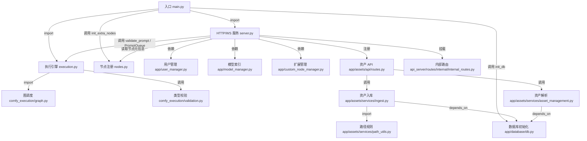

# Comfy-Org/ComfyUI 源码分析

## 🔍 项目简介

ComfyUI 是一个把 AI 生成流程抽象成“节点图”的本地/服务端执行引擎：`main.py` 负责启动流程，`server.py` 暴露 HTTP/WebSocket 接口，`execution.py` 执行和缓存工作流，`nodes.py` 与 `comfy_extras/*` 提供图像、视频、音频、3D 等节点能力。它解决的是“把模型加载、提示词、采样、后处理、文件资产、前端交互组合成可重复工作流”的问题，目标用户是需要精细控制推理流水线的创作者、工作流作者和集成开发者。技术栈主要是 Python 3.10+、PyTorch、aiohttp、Pydantic v2、SQLAlchemy/Alembic、Pillow、PyAV（见 `pyproject.toml`、`requirements.txt`、`server.py`、`app/database/db.py`）。和 A1111/InvokeAI 相比，它更偏“工作流执行引擎 + API 后端”，而不是单次出图界面。

## ⚡ 核心功能

### 1. 工作流排队执行与 WebSocket 状态回传

- 功能名称：工作流入队、执行状态广播、历史结果查询
- 实现方式：`server.py:257-312` 注册 `/ws`，为每个客户端维护 `sid` 和特性协商；`server.py:927-968` 注册 `/prompt`，验证工作流后把任务压入 `PromptQueue`；`execution.py:1240-1284` 的 `PromptQueue` 维护待执行队列、运行中任务和历史记录。

```python
# server.py:257-275
@routes.get('/ws')
async def websocket_handler(request):
    ws = web.WebSocketResponse()
    await ws.prepare(request)
    sid = request.rel_url.query.get('clientId', '')
    ...
    await self.send("status", {"status": self.get_queue_info(), "sid": sid}, sid)

# server.py:953-968
valid = await execution.validate_prompt(prompt_id, prompt, partial_execution_targets)
...
for sensitive_val in execution.SENSITIVE_EXTRA_DATA_KEYS:
    if sensitive_val in extra_data:
        sensitive[sensitive_val] = extra_data.pop(sensitive_val)
self.prompt_queue.put((number, prompt_id, prompt, extra_data, outputs_to_execute, sensitive))
```

- 怎么用：仓库自带了可直接跑的 API 示例。先启动 ComfyUI，再执行：

```bash
python script_examples/websockets_api_example.py
```

- 输入输出：输入是 API 工作流 JSON、可选 `client_id` / `prompt_id` / `extra_data`；输出是 `/prompt` 返回的 `prompt_id` 和 `number`，以及 WebSocket 上的 `status`、`executing`、`progress`、`executed` 事件，最终结果可从 `/history/{prompt_id}` 取回。
- 适用场景和限制：适合集成到外部前端、批量渲染器或队列系统。限制是客户端要自己维护 `client_id` 关联会话；如果只调用 `/prompt` 不连 `/ws`，就拿不到实时进度，只能轮询历史。


### 2. 增量执行、局部重跑与节点级校验

- 功能名称：只重跑变化节点，而不是每次整图重算
- 实现方式：`execution.py:67-95` 的 `IsChangedCache` 优先调用节点的 `fingerprint_inputs` 或 `IS_CHANGED` 判断是否失效；`execution.py:1106-1143` 在 `validate_prompt()` 中只把输出节点加入执行集合，并支持 `partial_execution_targets`；`execution.py:1232-1318` 的队列结构把每次执行结果保留到历史。

```python
# execution.py:72-91
if issubclass(class_def, _ComfyNodeInternal) and first_real_override(class_def, "fingerprint_inputs") is not None:
    has_is_changed = True
    is_changed_name = "fingerprint_inputs"
elif hasattr(class_def, "IS_CHANGED"):
    has_is_changed = True
    is_changed_name = "IS_CHANGED"
...
is_changed = await _async_map_node_over_list(self.prompt_id, node_id, class_def, input_data_all, is_changed_name, v3_data=v3_data)

# execution.py:1141-1143
if hasattr(class_, 'OUTPUT_NODE') and class_.OUTPUT_NODE is True:
    if partial_execution_list is None or x in partial_execution_list:
        outputs.add(x)
```

- 怎么用：把 UI 导出的 API workflow 保存成 `workflow.json` 后，可以只执行某个输出节点：

```bash
jq '{prompt: ., partial_execution_targets:["9"]}' workflow.json | \
curl -X POST http://127.0.0.1:8188/prompt \
  -H 'Content-Type: application/json' \
  --data-binary @-
```

- 输入输出：输入是完整图和可选的 `partial_execution_targets`；输出是被选中的输出节点集合、`node_errors` 和历史结果。节点如果实现了 `fingerprint_inputs` / `IS_CHANGED`，缓存层会跳过未变化的上游。
- 适用场景和限制：适合调 prompt、改少量节点参数、做长图的局部复算。限制是增量效果依赖节点实现；没有实现变更指纹的节点，缓存粒度会更粗，可能比预期重跑更多。


### 3. 内置模型装载、提示词编码与 LoRA 注入

- 功能名称：基础扩散图流水线节点
- 实现方式：`nodes.py:58-74` 的 `CLIPTextEncode` 把文本转成 conditioning；`nodes.py:587-608` 的 `CheckpointLoaderSimple` 从 `models/checkpoints` 装载模型；`nodes.py:670-707` 的 `LoraLoader` 把 LoRA 叠加到模型和 CLIP 上。

```python
# nodes.py:58-74
class CLIPTextEncode(ComfyNodeABC):
    RETURN_TYPES = (IO.CONDITIONING,)
    FUNCTION = "encode"
    def encode(self, clip, text):
        tokens = clip.tokenize(text)
        return (clip.encode_from_tokens_scheduled(tokens), )

# nodes.py:587-608
class CheckpointLoaderSimple:
    RETURN_TYPES = ("MODEL", "CLIP", "VAE")
    def load_checkpoint(self, ckpt_name):
        ckpt_path = folder_paths.get_full_path_or_raise("checkpoints", ckpt_name)
        out = comfy.sd.load_checkpoint_guess_config(ckpt_path, output_vae=True, output_clip=True, embedding_directory=folder_paths.get_folder_paths("embeddings"))
        return out[:3]
```

- 怎么用：仓库自带的最小 API 示例就是这条链路：

```bash
python script_examples/basic_api_example.py
```

- 输入输出：输入包括 checkpoint 名称、文本 prompt、LoRA 名称和强度等；输出是 `MODEL`、`CLIP`、`VAE`、`CONDITIONING` 等中间对象，供 `KSampler`、`VAEDecode`、`SaveImage` 等节点继续消费。
- 适用场景和限制：这是 ComfyUI 最核心的“可编排推理图”能力，适合文本生成图像、模型切换、风格注入。限制是模型文件必须放在 `folder_paths` 管理的目录中；checkpoint 缺少文本编码器时，`CLIPTextEncode` 会直接抛异常。


### 4. 插件化节点系统与多模态扩展装载

- 功能名称：自定义节点、前端静态资源、工作流模板、多语言文案、内置 extra nodes
- 实现方式：`main.py:138-175` 会执行每个 custom node 的 `prestartup_script.py`；`nodes.py:2192-2248` 通过 `NODE_CLASS_MAPPINGS` 或 `comfy_entrypoint()` 动态装载节点并注册 Web 目录；`nodes.py:2390-2433` / `2489-2499` 把 `nodes_video.py`、`nodes_audio_encoder.py`、`nodes_load_3d.py` 等内置扩展批量装入；`app/custom_node_manager.py:32-132` 汇总 `locales/` 和 `example_workflows/`。

```python
# main.py:168-175
script_path = os.path.join(module_path, "prestartup_script.py")
if os.path.exists(script_path):
    ...
    success = execute_script(script_path)

# nodes.py:2214-2245
LOADED_MODULE_DIRS[module_name] = os.path.abspath(module_dir)
...
if hasattr(module, "NODE_CLASS_MAPPINGS") and getattr(module, "NODE_CLASS_MAPPINGS") is not None:
    for name, node_cls in module.NODE_CLASS_MAPPINGS.items():
        if name not in ignore:
            NODE_CLASS_MAPPINGS[name] = node_cls
```

- 怎么用：启动后可以直接查询已经装载的扩展节点和模板：

```bash
curl http://127.0.0.1:8188/object_info/LoadVideo
curl http://127.0.0.1:8188/workflow_templates
curl http://127.0.0.1:8188/i18n
```

- 输入输出：输入是 `custom_nodes/` 下的 Python 模块、可选 `WEB_DIRECTORY`、`locales/`、`example_workflows/`；输出是可被前端发现的节点定义、静态资源目录、模板列表和翻译 JSON。内置 `comfy_extras` 机制同样走这条装载链路，所以视频/音频/3D 节点并不是“外部插件”，而是源码里真实存在的扩展模块。
- 适用场景和限制：适合团队扩展专有节点、封装企业工作流、给前端追加自定义面板。限制是这里没有沙箱：`prestartup_script.py` 和模块 import 都是直接执行 Python 代码；导入失败时节点会被跳过并记录 warning。


### 5. 资产系统：哈希去重上传、数据库入库与安全下载

- 功能名称：把输入/输出/模型文件抽象成带 hash、tag、metadata 的资产
- 实现方式：`app/assets/api/routes.py:379-477` 的 `/api/assets` 先用 Pydantic 校验上传规格，再决定走“已知 hash 复用”还是“新文件入库”；`app/assets/services/ingest.py:352-445` 对临时文件计算 BLAKE3，去重后按 tag 规则落盘；`app/assets/services/path_utils.py:29-61` 把 tag 映射到 `models` / `input` / `output` 目录并阻止路径逃逸。

```python
# app/assets/api/routes.py:389-447
spec = schemas_in.UploadAssetSpec.model_validate({...})
...
if spec.hash and parsed.provided_hash_exists is True:
    result = create_from_hash(...)
else:
    result = upload_from_temp_path(
        temp_path=parsed.tmp_path,
        name=spec.name,
        tags=spec.tags,
        ...
    )

# app/assets/services/ingest.py:363-412
digest, _ = hashing.compute_blake3_hash(temp_path)
asset_hash = "blake3:" + digest
...
base_dir, subdirs = resolve_destination_from_tags(tags)
dest_abs = os.path.abspath(os.path.join(dest_dir, hashed_basename))
validate_path_within_base(dest_abs, base_dir)
```

- 怎么用：这个功能默认关闭，需要显式开启。

```bash
python main.py --enable-assets
curl -F file=@input/example.png -F tags=input -F name=example.png \
  http://127.0.0.1:8188/api/assets
```

- 输入输出：输入是 `multipart/form-data` 文件上传，或只给一个已存在的 `blake3:<hex>`；输出是资产 JSON，包含 `id`、`asset_hash`、`mime_type`、`tags`、`preview_url`、`user_metadata` 等字段。
- 适用场景和限制：适合把 ComfyUI 当作可追踪的素材仓库或批处理后端。限制是 `--enable-assets` 依赖 SQLite/Alembic 初始化；新上传文件必须给 tag；同一数据库默认有进程锁，多实例共享同一个 `comfyui.db` 会报错。


### 6. 模型目录索引与预览提取

- 功能名称：扫描模型文件、返回元数据、提取预览图
- 实现方式：`app/model_manager.py:28-74` 注册实验性 `/experiment/models*` 接口；`app/model_manager.py:110-156` 递归扫描模型目录并缓存 `name / pathIndex / modified / size`；`app/model_manager.py:158-174` 尝试从同名图片或 safetensors metadata 的 `ssmd_cover_images` 取预览。

```python
# app/model_manager.py:42-48
@routes.get("/experiment/models/{folder}")
async def get_all_models(request):
    folder = request.match_info.get("folder", None)
    ...
    files = self.get_model_file_list(folder)
    return web.json_response(files)

# app/model_manager.py:127-142
filenames = filter_files_extensions(filenames, folder_paths.supported_pt_extensions)
...
file_info = {
    "name": relative_path,
    "pathIndex": pathIndex,
    "modified": os.path.getmtime(full_path),
    "created": os.path.getctime(full_path),
    "size": os.path.getsize(full_path)
}
```

- 怎么用：

```bash
curl http://127.0.0.1:8188/experiment/models/checkpoints
curl http://127.0.0.1:8188/experiment/models/preview/checkpoints/0/some_model.safetensors > preview.webp
```

- 输入输出：输入是模型类别名和文件路径；输出是模型清单 JSON，或一张 `image/webp` 预览图。预览既可以来自同名图片，也可以来自 safetensors 头里的封面元数据。
- 适用场景和限制：适合做模型浏览器、管理后台和前端选择器。限制是接口本身标成 “experiment”；只扫描已登记的模型扩展名；缓存失效依赖目录 mtime，不是内容级索引。

## 🗺️ 知识图谱（Mermaid）



## 🔐 安全审计

- 依赖漏洞扫描：执行 `python -m pip_audit -r requirements.txt`，结果为 `No known vulnerabilities found`，漏洞数 0，高危 0。
- 依赖漏洞扫描：执行 `python -m pip_audit -r manager_requirements.txt`，结果同样为 0 个已知漏洞，高危 0。
- 密钥泄露扫描：对仓库执行正则扫描（`AKIA` / `ghp_` / `sk-` / 私钥头等模式），未发现真实密钥。
- 密钥泄露扫描：唯一命中是 `script_examples/basic_api_example.py:103` 的注释占位符 `comfyui-87d...******`，这是文档示例，不是有效凭据。
- 认证授权逻辑：默认看不到 session、cookie、JWT 或 auth middleware。`app/user_manager.py:58-69` 的“多用户”本质上只是读取 `comfy-user` 请求头并映射到本地 `users.json`，`app/app_settings.py:11-19` 只是拿不到用户时返回 `401`。这意味着它更像“用户命名空间隔离”，不是强认证。
- 认证授权逻辑：`app/assets/api/routes.py:214-215`、`386` 会把 `USER_MANAGER.get_request_user_id(request)` 当成 owner_id 传给资产查询/上传；如果服务通过 `--listen 0.0.0.0` 暴露到局域网或公网，而前面又没有反向代理鉴权，`comfy-user` 头可以被伪造。
- 内部接口暴露：`api_server/routes/internal/internal_routes.py:22-52` 暴露了 `/internal/logs`、`/internal/logs/raw`、`/internal/folder_paths`、`/internal/files/{directory_type}`，代码里没有额外授权检查。这会泄露日志内容、模型目录位置和最近文件名。
- CSRF/跨站防护：`server.py:147-176` 的 `create_origin_only_middleware()` 会在 loopback 场景下拒绝 `Sec-Fetch-Site: cross-site` 和不匹配的 `Host/Origin`。这是有效的本地防护，但它不是通用的认证机制；一旦改成外网监听或前置代理改写头部，这层保护不够。
- CORS 风险：`server.py:104-117` 的 `create_cors_middleware()` 允许通过 CLI 把 `Access-Control-Allow-Origin` 设成任意值，甚至 `*`。如果同时外网暴露服务，会放大前述 header-based multi-user 风险。
- 输入校验：`app/assets/api/upload.py:41-111` 强制上传必须是 `multipart/form-data`，并在 hash 已存在时只“吞掉”文件流而不落盘；`app/assets/api/schemas_in.py:52-122` 用 Pydantic 限制分页、tag、metadata、body 结构。
- 输入校验：`server.py:524-538` 和 `456-481` 对 `/view`、`/upload/mask` 做了路径穿越防护；`app/assets/services/path_utils.py:29-61` 禁止 tag 中出现 `.`、`..`、路径分隔符，并用 `validate_path_within_base()` 强制目标路径留在根目录内。
- 数据暴露面：`server.py:601-612` 和 `app/assets/api/routes.py:295-333` 会把 `text/html` / `text/css` / `text/javascript` 等危险 MIME 强制改成 `application/octet-stream`，并在资产下载接口加上 `X-Content-Type-Options: nosniff`，这部分做得比较扎实。
- 数据暴露面：`server.py:647-697` 的 `/system_stats` 会返回 Python 版本、GPU、RAM，以及 `argv: sys.argv`。如果运维把敏感参数直接放在命令行里，这个接口会把它们暴露出去。

## 🚀 快速上手

- 系统要求：Windows / Linux / macOS；Python >= 3.10（`pyproject.toml`）；需要与你的硬件匹配的 PyTorch，README 明确要求先装合适的 `torch`。
- 依赖要求：基础依赖见 `requirements.txt`；资产系统依赖 SQLite/Alembic；视频相关依赖来自 `av`；如果要用管理器，还要额外安装 `manager_requirements.txt`。

```bash
cd /home/trade/ctf_workspace/gh_trending/Comfy-Org-ComfyUI
python -m venv .venv
source .venv/bin/activate
pip install -r requirements.txt
python main.py --listen 127.0.0.1 --port 8188
```

```bash
# 启用资产系统与管理器（可选）
pip install -r manager_requirements.txt
python main.py --enable-assets --enable-manager
```

```bash
# CPU-only 模式（没有可用 GPU 时）
python main.py --cpu
```

- 常见坑：`README.md:302-317` 要求先把 checkpoint 放进 `models/checkpoints`，否则 `CheckpointLoaderSimple` 不会有可选模型。
- 常见坑：`app/database/db.py:75-91` 会给 SQLite 文件加锁；多开实例共享同一个 `user/comfyui.db` 时，`--enable-assets` 很容易因为数据库锁失败。
- 常见坑：`comfy/cli_args.py:38-43` 默认只监听 `127.0.0.1:8188`。如果你改成 `--listen 0.0.0.0`，不要同时配宽松 `--enable-cors-header`，也不要把它当成“天然多用户服务”直接暴露。
- 常见坑：`main.py:475-488` 启动时会加载 `comfy_extras` 和 custom nodes；任何一个节点模块缺依赖，都会在日志里看到导入失败，但服务依然可能继续启动。

## ⚖️ 一句话判词

值得重点关注，尤其适合需要“本地/私有模型 + 可视化工作流 + HTTP/WS 集成 + 可追踪资产”的场景；如果你只是想要一个轻量单次出图界面，它的学习和运维成本会明显高于传统 UI。

## 📊 元信息

- Stars：115k（GitHub 仓库页面，访问时间 2026-06-02）
- Forks：13.5k（GitHub 仓库页面，访问时间 2026-06-02）
- Language：Python
- License：GPL-3.0
