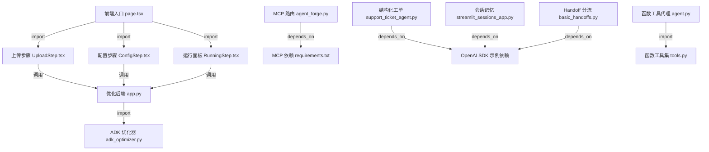

# Shubhamsaboo/awesome-llm-apps 源码分析报告

## 🔍 项目简介

这是一个“可直接运行的 LLM/Agent 模板仓库”，不是单体应用。源码按 `starter_ai_agents`、`advanced_ai_agents`、`rag_tutorials`、`mcp_ai_agents`、`voice_ai_agents`、`awesome_agent_skills`、`ai_agent_framework_crash_course` 等 8 个一级目录组织，仓库内实测有 472 个 Python 文件、117 个 TS/JS 文件和 21 个 `SKILL.md`。它解决的问题不是“再造一个框架”，而是给开发者现成的 AI Agent、RAG、MCP、Voice、Skill 优化样板；目标用户是需要克隆后快速改造成业务原型或教学 demo 的开发者。技术栈以 Python、Streamlit、FastAPI、Next.js、OpenAI Agents SDK、Google ADK、Anthropic MCP 为主。与 LangChain cookbook 或纯 awesome-list 相比，它的区别在于大部分条目都带可执行源码，而不是只给链接或概念说明。

## ⚡ 核心功能

### 1. 技能包上传、过滤与会话初始化

- 功能名称：将一个 Agent Skill 压缩包或文件夹导入系统，过滤非法文件后创建服务端会话。
- 实现方式：核心在 `awesome_agent_skills/self-improving-agent-skills/backend/app.py:23-30,113-170,173-208`。后端先定义总大小、单文件大小、文件数和扩展名白名单，再用 `_is_safe_path()` 阻止路径穿越，用 `_is_allowed_file()` 过滤二进制或非文本文件，最后调用 `create_session_from_files()` 生成 `session_id` 并把 `SKILL.md`、元数据和文件列表放进内存会话。

```python
# awesome_agent_skills/self-improving-agent-skills/backend/app.py
MAX_UPLOAD_SIZE = 10 * 1024 * 1024
MAX_FILE_COUNT = 50
ALLOWED_EXTENSIONS = {
    ".md", ".txt", ".json", ".yaml", ".yml", ".py", ".js", ".ts",
}

if not _is_safe_path(name):
    logger.warning(f"Skipping unsafe zip entry: {name}")
    continue
if not _is_allowed_file(name):
    logger.info(f"Skipping non-text file: {name}")
    continue

return create_session_from_files(skill_files, file_list)
```

- 怎么用：

```bash
cd /home/trade/ctf_workspace/gh_trending/Shubhamsaboo-awesome-llm-apps
python awesome_agent_skills/self-improving-agent-skills/backend/app.py

curl -X POST http://localhost:8891/api/upload \
  -F 'file=@/path/to/skill.zip'
```

- 输入输出：输入是 `.zip` 或多文件上传，要求包含 `SKILL.md`；输出是 `{"session_id": "...", "file_list": [...], "metadata": {...}}`。
- 适用场景和限制：适合把一套 Skill 说明、参考文件、脚本一起导入做后续分析；限制是只接受文本型扩展名、总大小 10MB、最多 50 个文件，且会话只保存在进程内存里。


### 2. 用 Gemini/ADK 自动生成测试场景与评测标准

- 功能名称：从导入的 `SKILL.md` 和参考资料里自动抽取测试场景与 yes/no 评测题。
- 实现方式：`awesome_agent_skills/self-improving-agent-skills/backend/adk_optimizer.py:133-159` 把 `SKILL.md` 与 `references/` 拼成 prompt，要求 executor agent 返回固定 JSON；`backend/app.py:211-223` 把结果落回 session；前端 `frontend/src/components/UploadStep.tsx:127-146` 直接调用 `/api/analyze` 并推进到配置步骤。

```python
# awesome_agent_skills/self-improving-agent-skills/backend/adk_optimizer.py
prompt = (
    f"Analyze this agent skill and generate test scenarios "
    f"with evaluation criteria.\n\n"
    f"# SKILL.md\n{skill_md}\n{ref_text}\n\n"
    f"Generate:\n"
    f"1. 3-4 diverse test scenarios\n"
    f"2. 4-6 binary yes/no evaluation criteria\n\n"
)
return await self._ask_json(self.executor, prompt)
```

```python
# awesome_agent_skills/self-improving-agent-skills/backend/app.py
analysis = await optimizer.analyze_skill(session["skill_files"])
session["scenarios"] = analysis["scenarios"]
session["evals"] = analysis["evals"]
session["status"] = "analyzed"
```

- 怎么用：

```bash
curl -X POST http://localhost:8891/api/analyze \
  -H 'Content-Type: application/json' \
  -d '{"session_id":"<session-id>","gemini_api_key":"<GOOGLE_API_KEY>"}'
```

- 输入输出：输入是 `session_id` 和 Gemini key；输出是 `scenarios[]` 与 `evals[]` 两组 JSON。
- 适用场景和限制：适合为新 Skill 快速生成最小可用测试集；限制是评测题完全由模型生成，前端仍要在 `frontend/src/components/ConfigStep.tsx:99-155` 手工勾选、改写、删除后再进入优化。


### 3. 三代理 Skill 优化闭环

- 功能名称：用三个 ADK agent 做“执行-诊断-改写”的自动优化循环，并把每轮得分反馈到前端。
- 实现方式：`adk_optimizer.py:42-84` 初始化 `executor`、`analyst`、`mutator` 三个 agent；`adk_optimizer.py:161-266,270-374` 执行 baseline 打分、失败诊断、单点 mutation、重新打分，只有新分数更高时才保留；`backend/app.py:278-396` 用后台任务包装这一循环，并把 baseline、experiment_result、complete 事件追加到 `session["experiments"]`。

```python
# awesome_agent_skills/self-improving-agent-skills/backend/adk_optimizer.py
self.executor = Agent(...)
self.analyst = Agent(..., output_schema=FailureAnalysis)
self.mutator = Agent(..., output_schema=SkillMutation)

baseline = await self._score_skill(current_md, scenarios, evals)
analysis = await self._analyze_failures(current_md, scenarios, evals, baseline["details"])
mutation = await self._mutate_skill(current_md, analysis)
result = await self._score_skill(new_md, scenarios, evals)
kept = new_pct > baseline_pct
```

```python
# awesome_agent_skills/self-improving-agent-skills/backend/app.py
elif event["type"] == "experiment_result":
    session["experiments"].append({
        "experiment_id": event["data"].get("round", len(session["experiments"])),
        "pass_rate": event["data"].get("score", 0),
        "status": "keep" if event["data"].get("kept") else "discard",
    })
```

- 怎么用：

```bash
curl -X POST http://localhost:8891/api/start/<session-id> \
  -H 'Content-Type: application/json' \
  -d '{"gemini_api_key":"<GOOGLE_API_KEY>","max_rounds":5}'

curl http://localhost:8891/api/status/<session-id>
```

- 输入输出：输入是已筛选好的 `scenarios`、`evals`、Gemini key 和 `max_rounds`；输出是 `baseline_score`、`final_score`、`mutation_log`、`score_history` 和改写后的 `SKILL.md`。
- 适用场景和限制：适合做 prompt/skill 文本级迭代优化；限制是每轮只允许 “ONE targeted change”，而且 `/api/stop/{session_id}` 只是改状态并关闭队列，`stop_requested` 在 `app.py:290,405` 被设置但 `adk_optimizer.py` 内没有读取，后台优化不会真正取消。


### 4. 结构化客服工单生成

- 功能名称：把自然语言投诉转成结构化客服工单对象。
- 实现方式：`ai_agent_framework_crash_course/openai_sdk_crash_course/2_structured_output_agent/support_ticket_agent.py:18-53` 用 `Enum + Pydantic` 定义 `Priority`、`Category` 和 `SupportTicket`；`support_ticket_agent.py:56-93` 用 `Agent(..., output_type=SupportTicket)` 强制输出符合 schema 的对象；`support_ticket_agent.py:128-145` 再把 `Runner.run_sync()` 的 `final_output` 渲染成工单字段。

```python
# ai_agent_framework_crash_course/openai_sdk_crash_course/2_structured_output_agent/support_ticket_agent.py
class SupportTicket(BaseModel):
    title: str
    description: str
    priority: Priority
    category: Category
    customer_name: Optional[str] = None

support_ticket_agent = Agent(
    name="Support Ticket Creator",
    instructions="... Always return a valid JSON object matching the SupportTicket schema.",
    output_type=SupportTicket
)
```

- 怎么用：

```bash
cd /home/trade/ctf_workspace/gh_trending/Shubhamsaboo-awesome-llm-apps
python ai_agent_framework_crash_course/openai_sdk_crash_course/2_structured_output_agent/support_ticket_agent.py
```

- 输入输出：输入是投诉文本；输出是 `SupportTicket` 对象，含标题、类别、优先级、客户名、复现步骤、预计修复时间和紧急关键词。
- 适用场景和限制：适合工单预分类、客服总结、结构化抽取；限制是 `requirements.txt` 里写的是 `openai-agents>=1.0.0`，`pip-audit` 在 2026-06-02 无法解析这个版本，意味着该目录依赖当前不可直接安装。


### 5. 工具调用型计算代理

- 功能名称：把自然语言数学问题路由到一组 `@function_tool`。
- 实现方式：`ai_agent_framework_crash_course/openai_sdk_crash_course/3_tool_using_agent/calculator_agent.py:15-99` 定义加减乘除、复利、圆面积、三角形面积、温度换算等工具；`calculator_agent.py:101-132` 把这些工具挂到 `Agent(..., tools=[...])`；`calculator_agent.py:154-156,181-183` 用 `Runner.run_sync()` 驱动问答。更轻量的分层写法在 `3_1_function_tools/agent.py` 和 `3_1_function_tools/tools.py`，前者 import 后者的工具列表。

```python
# ai_agent_framework_crash_course/openai_sdk_crash_course/3_tool_using_agent/calculator_agent.py
@function_tool
def calculate_compound_interest(principal: float, rate: float, time: int, compounds_per_year: int = 1) -> str:
    amount = principal * (1 + rate/compounds_per_year) ** (compounds_per_year * time)
    interest = amount - principal
    return f"Principal: ${principal:,.2f}, Final Amount: ${amount:,.2f}, Interest Earned: ${interest:,.2f}"

calculator_agent = Agent(
    name="Calculator Agent",
    tools=[add_numbers, subtract_numbers, multiply_numbers, divide_numbers, calculate_compound_interest, ...]
)
```

- 怎么用：

```bash
python ai_agent_framework_crash_course/openai_sdk_crash_course/3_tool_using_agent/calculator_agent.py
```

- 输入输出：输入是自然语言数学请求，例如 “What’s the compound interest on $5000 at 3.5% for 8 years?”；输出是代理根据工具结果拼出的最终回答。
- 适用场景和限制：适合演示 function calling、工具路由和确定性计算；限制是输出是自然语言，不是结构化 JSON，且 `3_1_function_tools/tools.py` 里的天气工具只是 mock 文本。


### 6. 基于 SQLiteSession 的会话记忆、多会话与记忆编辑

- 功能名称：在 Streamlit 里演示对话记忆、跨会话隔离、历史读取和手工注入记忆条目。
- 实现方式：`ai_agent_framework_crash_course/openai_sdk_crash_course/7_sessions/streamlit_sessions_app.py:47-79` 包装 `SessionManager`，内部使用 `SQLiteSession(session_id, db_file)`；`streamlit_sessions_app.py:128-191` 演示内存会话和持久会话；`streamlit_sessions_app.py:214-259` 提供 `get_items()`、`add_items()`、`pop_item()` 对记忆进行检查和修改。

```python
# ai_agent_framework_crash_course/openai_sdk_crash_course/7_sessions/streamlit_sessions_app.py
def get_session(self, session_id: str, db_file: str = "demo_sessions.db"):
    if session_id not in self.sessions:
        self.sessions[session_id] = SQLiteSession(session_id, db_file)
    return self.sessions[session_id]

result = asyncio.run(Runner.run(agent, user_input, session=session))
items = asyncio.run(st.session_state.session_manager.get_session_items(session_id))
```

- 怎么用：

```bash
streamlit run ai_agent_framework_crash_course/openai_sdk_crash_course/7_sessions/streamlit_sessions_app.py
```

- 输入输出：输入是聊天消息、可选 session 上下文和人工注入的消息对；输出是模型回复以及数据库中的对话历史。
- 适用场景和限制：适合做 memory demo、客服上下文维持、会话调试；限制是该目录同样依赖 `openai-agents>=1.0.0`，当前 requirements 不可直接通过 pip 安装。


### 7. 基于 handoff 的客服分流

- 功能名称：让一个总控客服把账单问题和技术问题转给不同 specialist。
- 实现方式：`ai_agent_framework_crash_course/openai_sdk_crash_course/8_handoffs_delegation/basic_handoffs.py:6-30` 定义 billing 和 technical 两个 specialist；`basic_handoffs.py:33-50` 在 `root_agent` 上配置 `handoffs=[billing_agent, technical_agent]`，自动生成 handoff tool；`basic_handoffs.py:60-72` 用两条测试输入验证分流结果。

```python
# ai_agent_framework_crash_course/openai_sdk_crash_course/8_handoffs_delegation/basic_handoffs.py
root_agent = Agent(
    name="Customer Service Triage Agent",
    instructions="... If the issue is clearly billing-related, transfer to Billing Agent.",
    handoffs=[billing_agent, technical_agent]
)
```

- 怎么用：

```bash
python ai_agent_framework_crash_course/openai_sdk_crash_course/8_handoffs_delegation/basic_handoffs.py
```

- 输入输出：输入是用户客服请求；输出是 triage agent 或下游 specialist 返回的最终答复。
- 适用场景和限制：适合做最小多代理委派示例；限制是只有两个固定 specialist，没有持久会话，也没有更细粒度的意图识别。


### 8. Multi-MCP 工具路由与专长代理分派

- 功能名称：把用户问题按关键词路由到安全审计、代码审查、研究、BIM 四类专长代理，并为每个代理挂不同的 MCP server。
- 实现方式：`mcp_ai_agents/multi_mcp_agent_router/agent_forge.py:38-118` 定义 `AGENTS` 字典和每个代理的 `mcp_servers`；`agent_forge.py:121-138` 用关键词分类器 `classify_query()` 做自动路由；`agent_forge.py:150-183` 拉起 `stdio_client` 和 `ClientSession` 收集 MCP tool；`agent_forge.py:210-256` 实现 tool-use loop，在 Claude 触发 `tool_use` 时调用 `session.call_tool()` 再回注给模型。

```python
# mcp_ai_agents/multi_mcp_agent_router/agent_forge.py
if any(kw in query_lower for kw in security_keywords):
    return "security_auditor"

result = await session.list_tools()
for tool in result.tools:
    all_tools.append(mcp_tool_to_anthropic(tool))
    session_map[tool.name] = session

while response.stop_reason == "tool_use":
    result = await session.call_tool(tool_use.name, tool_use.input)
```

- 怎么用：

```bash
python -m pip install -r mcp_ai_agents/multi_mcp_agent_router/requirements.txt
streamlit run mcp_ai_agents/multi_mcp_agent_router/agent_forge.py
```

- 输入输出：输入是用户 prompt 和 Anthropic API key；输出是被路由后的代理回复，附带真实 MCP server 工具结果。
- 适用场景和限制：适合演示“一个大模型 + 多工具域”的最小调度器；限制是 `classify_query()` 只是关键词匹配，且运行依赖 `npx` 下载的 MCP server 包与外部 API。

## 🗺️ 知识图谱（Mermaid）



## 🔐 安全审计

- 依赖扫描范围：实际执行了 `pip-audit` 扫描 `awesome_agent_skills/self-improving-agent-skills/backend/requirements.txt`、`mcp_ai_agents/multi_mcp_agent_router/requirements.txt`，并尝试扫描 `ai_agent_framework_crash_course/openai_sdk_crash_course/{2_structured_output_agent,7_sessions,8_handoffs_delegation}/requirements.txt`；同时对 5 个现成 `package-lock.json` 执行了 `npm audit --package-lock-only --json`。
- Python 结果：
  - `awesome_agent_skills/self-improving-agent-skills/backend/requirements.txt`：1 项漏洞，命中 `starlette` `PYSEC-2026-161` / `GHSA-86qp-5c8j-p5mr`。漏洞说明涉及基于 `Host` 头的 URL 重建与真实路由不一致，可能引出 auth bypass；源码上该后端正是 `FastAPI` 服务入口，见 `awesome_agent_skills/self-improving-agent-skills/backend/app.py:32-40`。
  - `mcp_ai_agents/multi_mcp_agent_router/requirements.txt`：0 项漏洞。
  - `ai_agent_framework_crash_course/openai_sdk_crash_course/2_structured_output_agent/requirements.txt`、`7_sessions/requirements.txt`、`8_handoffs_delegation/requirements.txt`：`pip-audit` 无法完成解析，因为三者都声明了 `openai-agents>=1.0.0`，而当前 PyPI 解析结果中没有这个版本。这不是 CVE，但它说明这些目录的依赖当前不可直接重现。
- NPM 结果：5 个 lockfile 合计 75 项漏洞，其中高危 34、中危 31、低危 10。
  - `advanced_ai_agents/multi_agent_apps/ai_negotiation_battle_simulator/frontend/package-lock.json`：42 项（高 12 / 中 22 / 低 8），高危项包括 `@hono/node-server` 授权绕过、`express-rate-limit` 限流绕过、`fast-uri` 路径穿越、`dompurify` 多个 XSS 相关条目。
  - `advanced_llm_apps/thinkpath_chatbot_app/package-lock.json`：25 项（高 18 / 中 6 / 低 1），高危项包括 `electron` 命令行注入、`lodash` code injection、`tar` 路径穿越。
  - `advanced_llm_apps/multimodal_video_moment_finder/frontend/package-lock.json`：5 项（高 3 / 中 2），高危项包括 `next`、`flatted`、`picomatch`。
  - `awesome_agent_skills/self-improving-agent-skills/frontend/package-lock.json`：3 项（高 1 / 中 1 / 低 1），高危核心来自 `next`；对应源码版本在 `frontend/package.json:9-15`，锁定为 `next: ^15.1.4`。
  - `rag_tutorials/multimodal_agentic_rag/frontend/package-lock.json`：0 项。
- 密钥泄露扫描：对 `.py/.ts/.tsx/.js/.jsx` 做 regex 扫描后，没有发现真实可用的 API key、token、私钥。唯一命中是 `ai_agent_framework_crash_course/google_adk_crash_course/4_tool_using_agent/4_2_function_tools/utility_agent/agent.py:67` 里的示例字符串 `"mypassword"`，属于文档式 prompt，不是硬编码凭据。
- 认证与授权：
  - `awesome_agent_skills/self-improving-agent-skills/backend/app.py:34-40` 开启了 `allow_origins=["*"]`、`allow_credentials=True`、`allow_methods=["*"]`、`allow_headers=["*"]`。这说明该后端没有做严谨的跨域收口。
  - `awesome_agent_skills/self-improving-agent-skills/backend/app.py:211-245,278-433,487-498` 的 `/api/analyze`、`/api/start/{session_id}`、`/api/download/{session_id}`、`/api/status/{session_id}` 都没有认证；访问控制基本只靠 `session_id`。如果 session_id 泄露，别人就能读取状态或下载改写后的 skill zip。
  - `mcp_ai_agents/multi_mcp_agent_router/agent_forge.py:283-353` 通过 Streamlit 密码框收集 Anthropic key，但没有额外的用户认证层；这是典型本地 demo 形态，不适合裸暴露成公共服务。
- 输入校验与暴露面：
  - 正向措施：`awesome_agent_skills/self-improving-agent-skills/backend/app.py:113-121,124-170,173-208` 做了扩展名白名单、路径穿越拦截、总大小与单文件大小限制。
  - 正向措施：`awesome_agent_skills/self-improving-agent-skills/backend/app.py:462-484` 在加载示例技能时用 `re.fullmatch()` 和 `realpath + startswith()` 防目录逃逸。
  - 风险点：`awesome_agent_skills/self-improving-agent-skills/backend/app.py:290,399-409` 会把 `stop_requested` 设为 `True`，但 `awesome_agent_skills/self-improving-agent-skills/backend/adk_optimizer.py:161-266` 没有读取这个标志，意味着“停止优化”不会真停，只会让前端看起来停了，后台仍可能继续消耗模型额度。
  - 风险点：`mcp_ai_agents/multi_mcp_agent_router/agent_forge.py:150-183,210-256` 会把 MCP server 暴露出来的工具全部装配给模型调用；信任边界实际上扩展到了 `npx` 拉起的外部 MCP server 包和它们返回的工具结果。

## 🚀 快速上手

系统和依赖要求：

- Python 3.11+。
- Node.js 20+ / npm 10+，因为 Next.js 前端和 MCP demo 依赖 `npm` / `npx`。
- 按目录准备 API key：Google Gemini、Anthropic、OpenAI 等。

推荐先跑仓库里完成度最高的一套全栈应用 `self-improving-agent-skills`：

```bash
cd /home/trade/ctf_workspace/gh_trending/Shubhamsaboo-awesome-llm-apps/awesome_agent_skills/self-improving-agent-skills/backend
python -m venv .venv
source .venv/bin/activate
python -m pip install -r requirements.txt
python app.py
```

```bash
cd /home/trade/ctf_workspace/gh_trending/Shubhamsaboo-awesome-llm-apps/awesome_agent_skills/self-improving-agent-skills/frontend
npm install
NEXT_PUBLIC_API_URL=http://localhost:8891 npm run dev
```

如果要跑 MCP 路由 demo：

```bash
cd /home/trade/ctf_workspace/gh_trending/Shubhamsaboo-awesome-llm-apps
python -m pip install -r mcp_ai_agents/multi_mcp_agent_router/requirements.txt
streamlit run mcp_ai_agents/multi_mcp_agent_router/agent_forge.py
```

常见坑：

- `ai_agent_framework_crash_course/openai_sdk_crash_course/2_structured_output_agent/requirements.txt`、`7_sessions/requirements.txt`、`8_handoffs_delegation/requirements.txt` 里的 `openai-agents>=1.0.0` 当前无法被 `pip-audit` 解析，安装时大概率也会失败。
- `self-improving-agent-skills` 前端默认请求 `http://localhost:8891`，见 `frontend/src/components/UploadStep.tsx:16` 与 `RunningStep.tsx:47`；后端端口改掉后要同步 `NEXT_PUBLIC_API_URL`。
- `mcp_ai_agents/multi_mcp_agent_router/agent_forge.py:55-57,76-77,94-95` 通过 `npx` 启 MCP server，没有 Node 环境就起不来。

## ⚖️ 一句话判词

值得关注，尤其适合“想直接拿现成 Agent/RAG/MCP 模板改造业务原型”的开发者；但它更像一个高产模板库而不是经过统一打磨的产品仓库，亮点是覆盖面与可执行代码，短板是部分子目录依赖失效、前后端安全收口偏松。

## 📊 元信息

- 项目：`Shubhamsaboo/awesome-llm-apps`
- Stars：113k（GitHub 页面，访问时间 2026-06-02）
- Forks：16.7k（GitHub 页面，访问时间 2026-06-02）
- Language：Python 67.7%，JavaScript 21.4%，TypeScript 8.2%，CSS 1.6%，HTML 1.0%
- License：Apache-2.0（见根目录 `LICENSE` 与 GitHub 页面）
