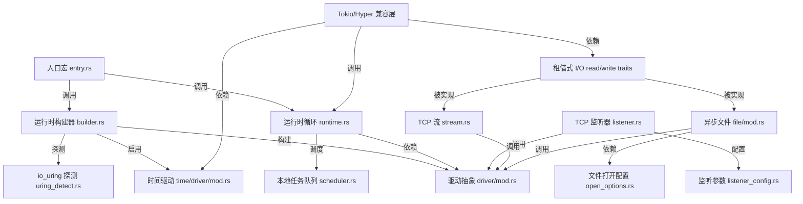

<!-- 🔗 English entry page: [English version](../../en/trending/2026-06-02-09-bytedance-monoio.md) -->

# bytedance/monoio 源码分析

## 🔍 项目简介

`bytedance/monoio` 是一个 Rust thread-per-core 异步运行时，目标是直接利用 `io_uring/epoll/kqueue` 做高吞吐网络与文件 I/O，而不是像 `tokio-uring` 那样叠在另一个 runtime 之上。它面向的是写代理、网关、RPC、存储接入层这类基础设施的 Rust 开发者；核心技术栈是 Rust 2021、`io-uring`、`mio`、`socket2`、自研任务调度器、proc-macro 入口宏，以及 `monoio-compat` 对 Tokio/Hyper 的兼容层。和 Tokio 相比，它更强调非 `Send`/非 `Sync` 任务在本地线程上的低开销调度，而不是通用 work-stealing。

## ⚡ 核心功能

### 1. 自适应运行时构建与驱动选择

- 功能名称：自动在 `io_uring` 和 legacy 驱动之间切换，并可叠加时间驱动。
- 实现方式：核心逻辑在 `monoio/src/builder.rs:179-259` 与 `monoio/src/utils/uring_detect.rs:15-75`。`FusionDriver` 构建时先探测内核能力，再决定走 `IoUringDriver` 还是 `LegacyDriver`；探测逻辑不仅看平台，还会检查 `Accept/Connect/Read/Write/Timeout` 等 opcode 是否都可用。

```rust
// monoio/src/builder.rs:182-203
if crate::utils::detect_uring() {
    let builder = RuntimeBuilder::<IoUringDriver> { /* ... */ };
    info!("io_uring driver built");
    Ok(builder.build()?.into())
} else {
    let builder = RuntimeBuilder::<LegacyDriver> { /* ... */ };
    info!("legacy driver built");
    Ok(builder.build()?.into())
}
```

```rust
// monoio/src/utils/uring_detect.rs:16-21,58-61
let val = std::env::var("MONOIO_FORCE_LEGACY_DRIVER");
match val {
    Ok(v) if matches!(v.to_ascii_lowercase().as_str(), "1" | "true" | "yes") => return false,
    _ => {}
}
let uring = err_to_false!(io_uring::IoUring::new(2));
err_to_false!(uring.submitter().register_probe(&mut probe));
USED_OP.iter().all(|op| probe.is_supported(*op))
```

- 怎么用：

```bash
cd /home/trade/ctf_workspace/gh_trending/bytedance-monoio
cargo run -p monoio-examples --example builder
```

- 输入输出：输入是 `RuntimeBuilder` 配置项（如 `entries`、timer、blocking 策略）和一个异步 future；输出是 `Runtime`/`FusionRuntime`，最终通过 `block_on` 返回 future 的结果。
- 适用场景和限制：适合需要同一套代码在新内核上吃到 `io_uring`、旧环境回退 `epoll/kqueue` 的服务端程序。限制是 `io_uring` 依赖 Linux 5.6+ 且要求相关 opcode 齐全；显式设置 `MONOIO_FORCE_LEGACY_DRIVER=1` 会强制退回 legacy。


### 2. `#[monoio::main]` / `#[monoio::test_all]` 入口宏

- 功能名称：把异步入口函数编译成实际的 runtime 启动代码，并支持 `threads`、`entries`、`timer_enabled`、`driver` 等参数。
- 实现方式：`monoio-macros/src/entry.rs:256-340` 会在编译期拼出 `RuntimeBuilder` 调用链；单线程模式直接 `.build().block_on(body)`，多线程模式则把同一个异步 body 分发到多个 OS 线程分别启动 runtime。

```rust
// monoio-macros/src/entry.rs:268-337
if let Some(entries) = config.entries {
    rt = quote! { #rt.with_entries(#entries) }
}
if Some(true) == config.timer_enabled {
    rt = quote! { #rt.enable_timer() }
}
if matches!(config.threads, None | Some(1)) {
    #rt.build().expect("Failed building the Runtime").block_on(body);
} else {
    let threads: Vec<_> = (1 .. #threads_expr)
        .map(|_| {
            ::std::thread::spawn(|| {
                #rt.build().expect("Failed building the Runtime").block_on(async #body);
            })
        })
        .collect();
    #rt.build().expect("Failed building the Runtime").block_on(body);
}
```

- 怎么用：

```rust
#[monoio::main(threads = 2, timer_enabled = true, driver = "fusion")]
async fn main() {
    let mut interval = monoio::time::interval(std::time::Duration::from_secs(1));
    interval.tick().await;
}
```

- 输入输出：输入是带属性参数的 `async fn`；输出是编译器看到的同步入口函数，负责创建 1 个或多个 runtime 并驱动异步 body。
- 适用场景和限制：适合快速启动服务、测试双驱动路径（`test_all`）和 thread-per-core 部署。限制是多线程模式下函数不能有返回值，且 timer 相关 API 必须显式开启 `timer_enabled`。


### 3. 本地任务调度与 `spawn`

- 功能名称：在单个 runtime 线程里调度本地任务，允许任务不是 `Send`。
- 实现方式：`monoio/src/runtime.rs:130-196` 是主事件循环；`monoio/src/runtime.rs:368-381` 实现 `spawn`；`monoio/src/scheduler.rs:5-67` 用 `VecDeque<Task<LocalScheduler>>` 保存本地任务队列。`block_on` 先跑任务队列，再轮询主 future，不活跃时再交给驱动 `park()`。

```rust
// monoio/src/runtime.rs:368-381
pub fn spawn<T>(future: T) -> JoinHandle<T::Output>
where
    T: Future + 'static,
    T::Output: 'static,
{
    let (task, join) = new_task(
        crate::utils::thread_id::get_current_thread_id(),
        future,
        LocalScheduler,
    );
    CURRENT.with(|ctx| {
        ctx.tasks.push(task);
    });
    join
}
```

```rust
// monoio/src/runtime.rs:153-188
loop {
    let mut max_round = self.context.tasks.len() * 2;
    while let Some(t) = self.context.tasks.pop() {
        t.run();
        if max_round == 0 { break; } else { max_round -= 1; }
    }
    if self.context.tasks.is_empty() { break; }
    let _ = self.driver.submit();
}
let _ = self.driver.park();
```

- 怎么用：

```bash
cd /home/trade/ctf_workspace/gh_trending/bytedance-monoio
cargo run -p monoio-examples --example echo
```

- 输入输出：输入是 `'static` future；输出是 `JoinHandle<T::Output>`。运行时内部吃的是 `TaskQueue`，吐出来的是被轮询后的任务结果。
- 适用场景和限制：适合连接处理、轻量后台任务、线程局部状态很重的服务。限制是 runtime 关闭时未完成任务会被丢弃；源码还显式禁止“runtime 套 runtime”（`runtime.rs:136-139`）。


### 4. 租借式异步 I/O：buffer 所有权回传

- 功能名称：以“把 buffer 所有权交给内核/运行时，再连结果一起还回来”的方式做读写，而不是传统 `&mut [u8]`。
- 实现方式：`monoio/src/io/async_read_rent.rs:16-49` 与 `monoio/src/io/async_write_rent.rs:23-87` 定义了 `AsyncReadRent/AsyncWriteRent`；`monoio/src/io/util/buf_reader.rs:79-176` 又在这个模型上实现了带内部缓冲的 `BufReader`。

```rust
// monoio/src/io/async_read_rent.rs:16-39
pub trait AsyncReadRent {
    fn read<T: IoBufMut>(&mut self, buf: T) -> impl Future<Output = BufResult<usize, T>>;
    fn readv<T: IoVecBufMut>(&mut self, buf: T) -> impl Future<Output = BufResult<usize, T>>;
}
```

```rust
// monoio/src/io/async_write_rent.rs:23-42
pub trait AsyncWriteRent {
    fn write<T: IoBuf>(&mut self, buf: T) -> impl Future<Output = BufResult<usize, T>>;
    fn writev<T: IoVecBuf>(&mut self, buf_vec: T) -> impl Future<Output = BufResult<usize, T>>;
    fn flush(&mut self) -> impl Future<Output = std::io::Result<()>>;
}
```

```rust
// monoio/src/io/util/buf_reader.rs:80-103
if self.pos == self.cap && buf.bytes_total() >= owned_buf.len() {
    self.discard_buffer();
    return self.inner.read(buf).await;
}
let rem = match self.fill_buf().await { /* ... */ };
let amt = std::cmp::min(rem.len(), buf.bytes_total());
unsafe {
    buf.write_ptr().copy_from_nonoverlapping(rem.as_ptr(), amt);
    buf.set_init(amt);
}
```

- 怎么用：

```rust
use monoio::io::{AsyncReadRent, AsyncWriteRentExt};

let mut buf = Vec::<u8>::with_capacity(8 * 1024);
let (res, buf2) = stream.read(buf).await;
let n = res?;
let (res, buf3) = stream.write_all(buf2).await;
res?;
```

- 输入输出：输入是拥有所有权的 `Vec<u8>`、切片包装器、`IoBuf`/`IoBufMut` 实现；输出统一是 `(io::Result<usize>, 原 buffer)` 或扩展方法的 `(io::Result<()>, 原 buffer)`。
- 适用场景和限制：适合 completion-based I/O、零拷贝/少拷贝路径以及需要把 buffer 生命周期交给内核的场景。限制是调用者必须自己回收和复用返回的 buffer，这和 Tokio 的借用式 API 心智模型不同。


### 5. TCP：可配置监听、TFO、可取消 accept、零拷贝发送

- 功能名称：提供服务端监听、客户端连接、Fast Open、取消语义和 `write_zc`。
- 实现方式：`monoio/src/net/tcp/listener.rs:48-100` 用 `socket2` 设置 `reuse_port/reuse_addr/SO_SNDBUF/SO_RCVBUF/TCP_FASTOPEN`；`monoio/src/net/tcp/stream.rs:114-177` 负责建连和 legacy 分支的写就绪确认；`monoio/src/net/tcp/stream.rs:263-280` 暴露 `write_zc`；`monoio/src/net/tcp/tfo/linux.rs:12-53` 则直接打 `setsockopt(TCP_FASTOPEN/TCP_FASTOPEN_CONNECT)`。

```rust
// monoio/src/net/tcp/listener.rs:67-87
if opts.reuse_port {
    sys_listener.set_reuse_port(true)?;
}
if opts.reuse_addr {
    sys_listener.set_reuse_address(true)?;
}
if opts.tcp_fast_open {
    super::tfo::set_tcp_fastopen(&sys_listener, opts.backlog)?;
}
sys_listener.bind(&addr)?;
sys_listener.listen(opts.backlog)?;
```

```rust
// monoio/src/net/tcp/stream.rs:277-280
pub async fn write_zc<T: IoBuf>(&self, buf: T) -> BufResult<usize, T> {
    let op = Op::send_zc(self.fd.clone(), buf).unwrap();
    op.result().await
}
```

```rust
// examples/timer_select.rs:44-57
let canceller = Canceller::new();
let timeout_fut = monoio::time::sleep(Duration::from_millis(100));
let listener = TcpListener::bind("127.0.0.1:0").unwrap();
let mut io_fut = pin!(listener.cancelable_accept(canceller.handle()));
```

- 怎么用：

```bash
cd /home/trade/ctf_workspace/gh_trending/bytedance-monoio
cargo run -p monoio-examples --example echo-tfo
```

```bash
cd /home/trade/ctf_workspace/gh_trending/bytedance-monoio
cargo test -p monoio --test send_zc -- --nocapture
```

- 输入输出：监听器输入是地址和 `ListenerOpts`，输出 `TcpListener`；`accept()` 输出 `(TcpStream, SocketAddr)`；`connect_addr_with_config()` 输入 `SocketAddr + TcpConnectOpts`，输出 `TcpStream`；`write_zc()` 输入拥有所有权的 buffer，输出 `BufResult<usize, T>`。
- 适用场景和限制：适合高并发 TCP 服务、代理、L4/L7 接入层。限制是 `TcpStream::connect` 在 `stream.rs:91-100` 明说 DNS 解析可能阻塞当前线程，且当前只取第一个解析结果；`write_zc` 仅在 Linux + `iouring` 下有意义，且源码注释已说明它是 best-effort，不保证每次都真的零拷贝。


### 6. 异步文件系统：位置读写、原子创建、阻塞回退

- 功能名称：异步打开文件、按 offset 读写、目录操作、原子 `create_new`、在无 `io_uring` 时回退到 blocking 线程。
- 实现方式：`monoio/src/fs/file/mod.rs` 的 `File` 不维护内部 cursor，所有关键 API 都是 positional I/O；`monoio/src/fs/open_options.rs:360-408` 会校验不合法的打开组合并用 `O_EXCL` 实现原子新建；`monoio/src/fs/mod.rs:70-81` 在非 `iouring` 场景通过 `spawn_blocking` 做 `asyncify`；`monoio/src/driver/op/open.rs:25-34` 组装真实的 `open/openat` 参数。

```rust
// monoio/src/fs/file/mod.rs:24-27,208-210
/// The file does not maintain an internal cursor.
/// The caller is required to specify an offset when issuing an operation.
pub async fn read_at<T: IoBufMut>(&self, buf: T, pos: u64) -> crate::BufResult<usize, T> {
    file_impl::read_at(self.fd.clone(), buf, pos).await
}
```

```rust
// monoio/src/fs/open_options.rs:402-408
Ok(match (self.create, self.truncate, self.create_new) {
    (false, false, false) => 0,
    (true, false, false) => libc::O_CREAT,
    (false, true, false) => libc::O_TRUNC,
    (true, true, false) => libc::O_CREAT | libc::O_TRUNC,
    (_, _, true) => libc::O_CREAT | libc::O_EXCL,
})
```

```rust
// monoio/src/fs/mod.rs:76-81
match spawn_blocking(f).await {
    Ok(res) => res,
    Err(_) => Err(io::Error::other("background task failed")),
}
```

- 怎么用：

```rust
use monoio::fs::File;
use monoio::io::AsyncWriteRentAt;

let file = File::create("hello.txt").await?;
let (res, buf) = file.write_at(b"hello monoio", 0).await;
res?;
file.sync_all().await?;
file.close().await?;
```

- 输入输出：输入是 `Path/OpenOptions`、offset 和拥有所有权的 buffer；输出是 `File` 或 `BufResult`。顶层 `monoio::fs::read/write/rename/remove_*` 进一步把这些能力包装成更高层的文件 API。
- 适用场景和限制：适合日志、状态快照、小型存储引擎、按偏移读写的服务。限制是 API 与标准库 cursor 模型不同；未启用/不可用 `io_uring` 时，文件 I/O 是否真正异步取决于 `sync` 特性和 blocking 策略。


### 7. Tokio/Hyper 兼容层

- 功能名称：把 Monoio 的 completion-based I/O 转成 Tokio/Hyper 能消费的 poll-based trait。
- 实现方式：`monoio-compat/src/safe_wrapper.rs:57-215` 的 `StreamWrapper<T>` 内部持有读写 buffer 和已 armed 的 future，把 `AsyncReadRent/AsyncWriteRent` 轮询结果映射到 Tokio `AsyncRead/AsyncWrite`；`monoio-compat/src/hyper.rs:12-48` 提供 `MonoioExecutor` 和 `MonoioTimer`，让 Hyper 直接跑在 Monoio 上。

```rust
// monoio-compat/src/safe_wrapper.rs:80-84
let buf = unsafe { this.read_buf.take().unwrap_unchecked() };
let stream = unsafe { &mut *this.stream.get() };
this.read_fut.arm_future(AsyncReadRent::read(stream, buf));
```

```rust
// monoio-compat/src/hyper.rs:13-22,27-33
pub struct MonoioExecutor;
impl<F> Executor<F> for MonoioExecutor
where
    F: std::future::Future + 'static,
{
    fn execute(&self, fut: F) {
        monoio::spawn(fut);
    }
}
impl Timer for MonoioTimer {
    fn sleep(&self, duration: Duration) -> Pin<Box<dyn Sleep>> {
        Box::pin(MonoioSleep { inner: monoio::time::sleep(duration) })
    }
}
```

- 怎么用：

```bash
cd /home/trade/ctf_workspace/gh_trending/bytedance-monoio
cargo run -p monoio-examples --example hyper-server
```

- 输入输出：输入是 Monoio 的 `TcpStream`/poll-io 对象、future 和 timer；输出是实现了 Tokio/Hyper trait 的兼容对象，例如 `StreamWrapper<T>`、`MonoioIo<T>`、`MonoioExecutor`。
- 适用场景和限制：适合想保留 Monoio runtime，同时复用 Hyper/Tokio I/O 生态的项目。限制是兼容层会引入额外状态机和 buffer 管理，不是零成本抽象；要启用 `poll-io` 和 `monoio-compat` 的对应 feature。

## 🗺️ 知识图谱（Mermaid）



## 🔐 安全审计

- 依赖漏洞扫描：仓库没有提交 `Cargo.lock`，我在临时副本里执行 `cargo generate-lockfile` 后再跑 `cargo audit --json`。结果是 `135` 个依赖、`0` 个漏洞、`0` 个高危项。审计输出关键字段为 `vulnerabilities.count = 0`。
- 编译验证：执行 `cargo test --workspace --no-run` 成功，说明 workspace 依赖能完整解析和编译。当前可见的问题主要是 warning，不是编译失败。
- 密钥泄露扫描：用正则扫描 `api_key/token/secret/password` 赋值模式，未发现硬编码凭据。可见命中主要有两处：
  - `README.md:17` 与 `README-zh.md:16` 的 Codecov badge URL 包含 `token=3MSAMJ6X3E`，这是 badge 参数，不是运行时密钥。
  - `.github/workflows/coverage.yml:37` 用的是 `${{ secrets.CODECOV_TOKEN }}`，说明 CI 上传 token 通过 GitHub Secret 注入，没有硬编码在仓库里。
- 认证授权逻辑：主库没有 HTTP auth middleware、session 管理、CSRF 防护这一类应用层代码；它本质上是 runtime 与 I/O 库，不是 web framework。可以从两处看出来：
  - `monoio/src/lib.rs:29-34` 导出的就是 `fs/io/net/task/time/utils` 等基础设施模块。
  - `examples/hyper_server.rs:44-50` 的 HTTP 示例只按 `method + path` 分支返回内容，没有任何认证、会话或 CSRF 逻辑。
  - 结论：如果在 Monoio 上实现对外 HTTP 服务，认证授权必须在应用层自行补齐。
- 输入校验与数据暴露面：
  - 正向校验：`monoio/src/fs/open_options.rs:360-408` 会拒绝“无访问模式”“只 truncate 不 write”等非法组合，`create_new(true)` 最终映射到 `O_CREAT | O_EXCL`，能避免先检查再创建的 TOCTOU 竞态。
  - 正向校验：`monoio/src/net/tcp/listener.rs:50-53` 与 `monoio/src/net/tcp/stream.rs:97-100` 在地址解析为空时直接报错；`listener.rs:151-153` 遇到未知 socket family 返回 `InvalidInput`。
  - 句柄安全：`monoio/src/driver/op/open.rs:28-31` 在 Unix 打开文件时总是带上 `O_CLOEXEC`，减少子进程 FD 泄露风险。
  - 可用性风险：`monoio/src/net/tcp/stream.rs:91-100` 源码明确写着 `connect()` 的域名解析“may block the current thread”，并且当前只尝试第一个解析结果（`// TODO: loop for all addrs`）。如果把域名解析放在热路径，会拖慢 runtime 线程。
  - 数据暴露风险：`examples/h2_server.rs:31-37` 会把完整 `request` 和 body chunk 打印到 stdout；这是示例代码，但如果直接照搬到生产服务，日志里可能出现敏感请求数据。
  - 取消语义风险：`examples/timer_select.rs:30-39` 特别提示，在 `io_uring` 下“drop 一个 I/O future 不等于立刻取消内核里的 syscall”；做超时控制时必须用 `cancelable_*` 路径，否则容易出现“逻辑超时但底层 I/O 还在跑”的行为偏差。

## 🚀 快速上手

系统和依赖要求：

- Rust：仓库 README 要求 `rustc 1.75+`；我在当前环境用 `rustc 1.96.0` 验证过能编译。
- Linux：想吃到 `io_uring` 路径，至少要有支持相关 opcode 的 Linux 内核；否则会走 legacy driver。
- 可选功能：Hyper 示例依赖 `poll-io` 和 `monoio-compat`，这些在 `examples/Cargo.toml` 里已经配好了。

直接可复制的命令：

```bash
cd /home/trade/ctf_workspace/gh_trending/bytedance-monoio

# 1) 先验证整个 workspace 能编译
cargo test --workspace --no-run

# 2) 运行最小 runtime 启动示例
cargo run -p monoio-examples --example builder

# 3) 跑一个 TCP echo server
cargo run -p monoio-examples --example echo
```

另开一个终端：

```bash
nc 127.0.0.1 50002
```

如果你想直接看生态兼容能力：

```bash
cd /home/trade/ctf_workspace/gh_trending/bytedance-monoio
cargo run -p monoio-examples --example hyper-server
```

常见坑：

- `monoio::time::*` 不是默认可用；没开 timer 就调用会在 `monoio/src/time/driver/handle.rs:47-51` panic。入口宏要写 `#[monoio::main(timer_enabled = true)]`，手动 builder 要调用 `.enable_timer()`。
- `TcpStream::connect("domain:port")` 里域名解析可能阻塞 runtime 线程；高性能场景尽量提前解析成 `SocketAddr`，走 `connect_addr`。
- 文件 API 是 positional I/O，不维护内部 cursor；像 `File::read_at/write_at` 都要求你自己传 offset。
- `cargo test --workspace --no-run` 目前会看到 `monoio-compat` 上由 `#[monoio::test_all]` 引出的 `unexpected_cfgs` warning，但不影响编译通过。

## ⚖️ 一句话判词

值得关注，尤其适合追求低调度开销、thread-per-core 模型和 completion-based I/O 的 Rust 基础设施项目；如果你的首要目标是通用生态完整度而不是极致 I/O 路径控制，Tokio 仍然更省心。

## 📊 元信息

- 项目：`bytedance/monoio`
- Stars：约 `5k`（GitHub 仓库页，采集于 `2026-06-02`）
- Forks：`288`
- Language：`Rust 100.0%`
- License：`MIT OR Apache-2.0`，仓库同时附带 `LICENSE-THIRD-PARTY`
