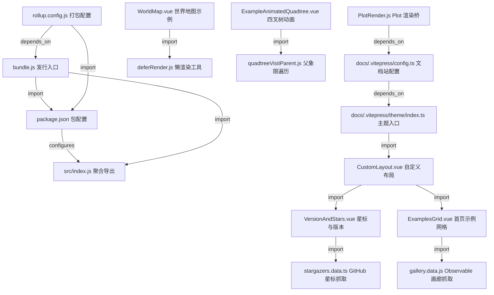

# d3/d3 源码分析报告

## 🔍 项目简介

`d3/d3` 这个仓库不是把全部可视化算法都写在一个地方的大单体，而是 D3 官方的“聚合发行版 + 文档站点”。`package.json` 把 30 个 `d3-*` 子包作为运行时依赖收进来（`package.json:37-68`），`src/index.js` 再统一转发这些 API（`src/index.js:1-30`），同时仓库还维护一套基于 VitePress 的官方文档和交互示例（`docs/.vitepress/config.ts`、`docs/components/*`）。目标用户是需要低层数据可视化原语的前端工程师、数据新闻团队和图形开发者。技术栈以 ESM JavaScript、Rollup、VitePress、Vue、Observable Plot 为主。和 ECharts、Chart.js 这类高层图表库相比，D3 更偏“底层可组合工具箱”；而这个仓库本身更偏“聚合器和文档门户”。

## ⚡ 核心功能

### 1. 统一聚合 30 个 D3 子模块 API

实现方式：

`src/index.js` 直接把所有子包重新导出，`bundle.js` 则额外把版本号挂出来，`test/d3-test.js` 会遍历 `package.json` 里的依赖，逐个断言这些导出确实暴露在顶层 `d3` 命名空间里。

```js
// src/index.js
export * from "d3-array";
export * from "d3-axis";
export * from "d3-brush";
// ...
export * from "d3-transition";
export * from "d3-zoom";
```

```js
// bundle.js
export {version} from "./package.json";
export * from "./src/index.js";
```

```js
// test/d3-test.js
for (const moduleName in packageData.dependencies) {
  it(`d3 exports everything from ${moduleName}`, async () => {
    const module = await import(moduleName);
    for (const propertyName in module) {
      if (propertyName !== "version") assert(propertyName in d3);
    }
  });
}
```

怎么用：

```js
import {scaleLinear, line, forceSimulation} from "d3";
```

或者在仓库内直接验证：

```bash
npm test
```

输入输出：

- 输入：应用代码中的 `import {…} from "d3"` 请求。
- 输出：来自各个 `d3-*` 子包的统一顶层 API。

适用场景和限制：

- 适合想用一个包拿到整套 D3 API 的场景。
- 限制是：这个仓库本身不实现大多数图形算法，真正的算法代码在各个 `d3-*` 子仓库里；如果你关心 tree-shaking 或某个算法细节，应该直接看对应子包。


### 2. 构建 UMD / ESM / 压缩版三种发行物

实现方式：

`rollup.config.js` 以 `bundle.js` 为入口，统一生成 `dist/d3.js`、`dist/d3.mjs`、`dist/d3.min.js` 三个产物；还会从 `LICENSE` 提取版权文字生成 banner，并在压缩时保留 `InternMap`、`InternSet` 两个名字不被 mangling。

```js
// rollup.config.js
const config = {
  input: "bundle.js",
  output: {
    file: `dist/${meta.name}.js`,
    name: "d3",
    format: "umd",
    extend: true,
    banner: `// ${meta.homepage} v${meta.version} Copyright ${copyright}`
  }
};

export default [
  config,
  {...config, output: {...config.output, file: `dist/${meta.name}.mjs`, format: "esm"}},
  {...config, output: {...config.output, file: `dist/${meta.name}.min.js`}, plugins: [...config.plugins, terser({...})]}
];
```

怎么用：

```bash
npm run prepublishOnly
```

输入输出：

- 输入：`bundle.js`、`package.json`、`LICENSE`、所有 `d3-*` 依赖。
- 输出：浏览器可直接用的 UMD 包、ESM 包、压缩包。

适用场景和限制：

- 适合 npm 发布、CDN 分发、浏览器 `<script>` 使用。
- 我在 Node `v24.15.0` + npm `11.12.1` 环境实际执行 `npm run prepublishOnly` 时失败，报错 `SyntaxError: Unexpected identifier 'assert'`，触发点是 `rollup.config.js:5` 仍使用 `assert {type: "json"}` 语法；说明当前脚本对较新的 Node 版本不完全兼容。


### 3. 把本地构建结果绑定到 VitePress 文档站

实现方式：

`docs/.vitepress/config.ts` 里显式把 `d3` alias 到 `./dist/d3.mjs`，并注入 `__APP_VERSION__`；`docs/.vitepress/theme/index.ts` 再把 `d3` 暴露到浏览器全局，方便在文档页控制台里直接试 API。

```ts
// docs/.vitepress/config.ts
vite: {
  resolve: {
    alias: [
      {find: "d3", replacement: path.resolve("./dist/d3.mjs")}
    ]
  },
  define: {
    __APP_VERSION__: JSON.stringify(process.env.npm_package_version),
  },
},
```

```ts
// docs/.vitepress/theme/index.ts
enhanceApp({app, router}) {
  globalThis.d3 = d3; // for console testing!
  Object.defineProperty(app.config.globalProperties, "$dark", {get: () => useData().isDark.value});
}
```

怎么用：

```bash
npm install --ignore-scripts
npm run prepublishOnly
npm run docs:dev
```

输入输出：

- 输入：`docs/**/*.md` 文档内容、本地 `dist/d3.mjs` 构建结果、VitePress 配置。
- 输出：可交互的官方文档站。

适用场景和限制：

- 适合做 API 文档、示例站、可运行教学页面。
- 限制是当前 checkout 默认没有 `dist/` 目录，而 alias 又强依赖 `dist/d3.mjs`（`docs/.vitepress/config.ts:24-33`）；也就是说 `docs:dev` 不是开箱即用，先得成功打包一次。


### 4. 构建时抓取 GitHub 星标和 Observable 示例画廊

实现方式：

`docs/.vitepress/theme/stargazers.data.ts` 在构建阶段请求 GitHub API，读取 `stargazers_count`；`docs/.vitepress/theme/gallery.data.js` 则动态导入 Observable notebook，把 `previews` 重新绑定到本地数组，收集首页示例。显示层分别是 `VersionAndStars.vue` 和 `ExamplesGrid.vue`。

```ts
// docs/.vitepress/theme/stargazers.data.ts
({stargazers_count} = await github(`/repos/${REPO}`));

const headers = {
  ...(authorization && {authorization}),
  accept
};
const response = await fetch(url, {headers});
```

```js
// docs/.vitepress/theme/gallery.data.js
const runtime = new Runtime();
const module = runtime.module((await import("https://api.observablehq.com/@d3/gallery.js?v=4")).default);
module.redefine("previews", () => (chunk) => data.push(...chunk));
await Promise.all(values);
return data;
```

```vue
<!-- docs/.vitepress/theme/ExamplesGrid.vue -->
const slice = d3.shuffler(d3.randomLcg(d3.utcDay()))(data.slice()).slice(0, n);
sample.value = slice.slice(0, yn.value * xn.value);
```

怎么用：

```bash
GITHUB_TOKEN=your_token npm run docs:dev
```

输入输出：

- 输入：GitHub REST API 响应、Observable 远程模块输出、浏览器窗口尺寸与指针位置。
- 输出：首页导航上的版本/Star 数字，以及首页示例缩略图网格。

适用场景和限制：

- 适合给文档站自动展示仓库热度和外部示例库。
- 限制是对外部网络强依赖；`stargazers.data.ts` 在非 CI 场景失败时会回退成 `NaN`（`docs/.vitepress/theme/stargazers.data.ts:6-12`），不会阻断本地开发，但会导致数据缺失。


### 5. 用自定义渲染桥把 Observable Plot 安全塞进 Vue / SSR / 懒加载流程

实现方式：

`docs/components/PlotRender.js` 实现了一套极简 `Document / Element / TextNode`，在没有真实 DOM 时用它生成可序列化的虚拟结构；浏览器端则可以直接挂载真实 Plot DOM。若 `defer` 为真，会使用 `IntersectionObserver` 和 `requestIdleCallback` 延迟渲染。代码里还明确把 `addEventListener/removeEventListener/dispatchEvent` 置为空实现，说明 SSR 路径只保证结构输出，不保证交互。

```js
// docs/components/PlotRender.js
class Document {
  createElementNS(namespace, tagName) {
    return new Element(this, tagName);
  }
}

class Element {
  addEventListener() {
    // ignored; interaction needs real DOM
  }
}
```

```js
// docs/components/PlotRender.js
if (this.defer) {
  this._observer = new IntersectionObserver(([entry]) => {
    if (entry.isIntersecting) observed();
  }, {rootMargin: "100px"});
  if (typeof requestIdleCallback === "function") {
    this._idling = requestIdleCallback(observed);
  }
}
```

怎么用：

```vue
<script setup>
import PlotRender from "./components/PlotRender.js";
</script>

<PlotRender
  defer
  :options="{x: {label: 'value'}, marks: []}"
/>
```

输入输出：

- 输入：`options`、`mark`、`method`、`defer` 四类 props。
- 输出：Vue 可挂载的 Plot DOM / VNode。

适用场景和限制：

- 适合把 Observable Plot 这种直接产出 DOM 的库接入文档系统。
- 限制是：SSR 路径下交互监听被显式忽略；如果你依赖真实事件系统，只能在客户端渲染路径使用。


### 6. 文档里直接嵌入交互式力导向示例

实现方式：

`docs/components/ExampleLinkForce.vue` 构造了一个 `20 x 20` 的格点图，使用 `forceSimulation + forceLink + drag` 做可拖拽 lattice；`docs/components/ExampleCollideForce.vue` 则用一个鼠标控制的虚拟节点推动其余圆形粒子，核心是 `forceCollide` 和 `forceManyBody`。

```js
// docs/components/ExampleLinkForce.vue
simulation = d3.forceSimulation(nodes)
  .force("charge", d3.forceManyBody().strength(-40))
  .force("link", d3.forceLink(links).strength(1).distance(10).iterations(10))
  .force("x", d3.forceX())
  .force("y", d3.forceY())
  .on("tick", ticked);
```

```js
// docs/components/ExampleCollideForce.vue
simulation = d3.forceSimulation(nodes)
  .velocityDecay(0.1)
  .force("collide", d3.forceCollide().radius((d) => d.r + 1).iterations(4))
  .force("charge", d3.forceManyBody().strength((d, i) => i ? 0 : -width * 2 / 3))
  .on("tick", ticked);
```

怎么用：

```vue
<ExampleLinkForce />
<ExampleCollideForce />
```

这两个组件分别在 `docs/d3-force/link.md`、`docs/d3-force/collide.md` 中被直接引用。

输入输出：

- 输入：组件内部生成的节点/边数据，加上用户指针/拖拽事件。
- 输出：持续更新的 SVG `line` / `circle` 元素。

适用场景和限制：

- 适合教学和 API 文档里的“可动示例”。
- 限制是参数全部写死在组件内部，不是可复用的公开 API。


### 7. 逐点插入四叉树并显示父象限分裂过程

实现方式：

`docs/components/ExampleAnimatedQuadtree.vue` 不是一次性把树建好，而是对点集逐个 `tree.add(i)`，每加一个点就链式创建 `transition`，再借助 `quadtreeVisitParent.js` 遍历父象限边界，把新增的分割线画出来。

```js
// docs/components/ExampleAnimatedQuadtree.vue
const tree = d3.quadtree([], (i) => points[i][0], (i) => points[i][1]);
for (let i = 0; i < points.length; ++i) {
  tree.add(i);
  let t = svg.transition();
  quadtree_visitParent.call(tree, (x0, y0, x1, y1) => {
    t = t.transition();
    g.append("line").transition(t).attr("x1", x(x0));
  });
  await t.end();
}
```

```js
// docs/components/quadtreeVisitParent.js
if (parent) callback(parent.x0, parent.y0, parent.x1, parent.y1);
if ((child = node[3])) quads.push({parent: q, node: child, x0: xm, y0: ym, x1, y1});
```

怎么用：

```vue
<ExampleAnimatedQuadtree :points="[[0.1, 0.2], [0.7, 0.9], [0.4, 0.6]]" />
```

输入输出：

- 输入：`points` 数组，元素形如 `[x, y]`。
- 输出：按插入顺序播放的四叉树分裂 SVG 动画。

适用场景和限制：

- 适合讲解 `d3-quadtree` 的空间划分过程。
- 限制是代码直接使用了 `tree._x0/_x1/_y0/_y1` 等内部字段（`docs/components/ExampleAnimatedQuadtree.vue:13-17`），对底层实现细节有耦合，升级底层库时更脆弱。


### 8. 懒加载远程 TopoJSON 并渲染世界/美国地图

实现方式：

`docs/components/WorldMap.vue` 在 `mounted` 时按分辨率请求 `world-atlas`，再把 `feature` 交给 `geoPath`；如果启用 `rotate` 且分辨率为 `110m`，会监听 `pointermove` 动态更新投影旋转。`docs/components/UsMap.vue` 会拉取 `us-atlas`，并用 `topojson.mesh/feature` 派生 nation、state、county 三层几何。两者都通过 `deferRender.js` 延迟到可视区域内再绘制。

```js
// docs/components/WorldMap.vue
if (this.land) this.feature = landPromises[this.resolution] ??= d3
  .json(`https://cdn.jsdelivr.net/npm/world-atlas@2.0.2/land-${this.resolution}.json`)
  .then((world) => topojson.feature(world, world.objects.land));

this.disconnect = deferRender(this.$el, async () => render(this.$el, this));
```

```js
// docs/components/UsMap.vue
objectsPromise ??= d3
  .json(`https://cdn.jsdelivr.net/npm/us-atlas@3.0.1/counties-10m.json`)
  .then((us) => ({
    nation: topojson.feature(us, us.objects.nation),
    statemesh: topojson.mesh(us, us.objects.states, (a, b) => a !== b),
    countymesh: topojson.mesh(us, us.objects.counties, (a, b) => a !== b && (a.id / 1000 | 0) === (b.id / 1000 | 0)),
  }));
```

```js
// docs/components/deferRender.js
observer = new IntersectionObserver(([entry]) => {
  if (entry.isIntersecting) {
    disconnect();
    render();
  }
}, {rootMargin: "100px"});
```

怎么用：

```vue
<WorldMap :projection='d3.geoEqualEarth().fitExtent([[1, 1], [687, 339]], {type: "Sphere"})' />
<UsMap :projection='d3.geoAlbersUsa().scale(560).translate([344, 200])' />
```

输入输出：

- 输入：`projection`、`resolution`、`rotate` 等 props，外加远程 TopoJSON 数据。
- 输出：SVG `path` 路径集合。

适用场景和限制：

- 适合文档中展示地理投影、边界 mesh 和路径生成。
- 限制是对 jsDelivr 强依赖；`WorldMap` 的拖动旋转只有 `resolution === "110m"` 才会启用（`docs/components/WorldMap.vue:15-18`）。

## 🗺️ 知识图谱（Mermaid）



## 🔐 安全审计

### 1. 依赖扫描结果

我实际执行了以下命令：

```bash
npm install --ignore-scripts
npm audit --json
npm audit --omit=dev --json
```

结果：

- 全量依赖：`18` 个漏洞，`1 low / 9 moderate / 8 high / 0 critical`
- 仅生产依赖：`0` 个漏洞

这和仓库形态是一致的：运行时依赖主要是 `d3-*` 子包（`package.json:37-68`），问题集中在文档/测试/构建链（`package.json:69-79`）。

高危条目（按 `npm audit --json` 实际输出整理）：

- `rollup`，直接开发依赖，声明在 `package.json:69-79`，实际用于 `rollup.config.js:14-64`
  - 高危点包括 DOM clobbering 导致 XSS、以及 Rollup 4 的任意文件写；当前锁定区间仍被 audit 命中。
- `mocha`，直接开发依赖，声明在 `package.json:75-77`
  - 通过 `serialize-javascript`、`minimatch`、`diff`、`js-yaml` 引入多条风险，其中 `serialize-javascript` 命中了高危 RCE / DoS。
- `@rollup/plugin-terser`，直接开发依赖，声明在 `package.json:72-75`
  - 通过 `serialize-javascript` 命中高危问题。
- 高危传递依赖还包括 `cross-spawn`、`braces`、`flatted`、`minimatch`、`picomatch`
  - 这些都位于构建/测试链，而不是 `d3` 运行时导出面。

结论：

- 这个仓库的“线上运行时代码”风险面不高。
- 主要风险在本地构建机、CI、文档开发服务器这条链上。

### 2. 密钥泄露扫描

我实际执行了正则扫描：

```bash
rg -n -i --glob '!node_modules/**' '(api[_-]?key|secret|token|password|authorization...)' .
```

发现：

- 没有扫描到硬编码 API key / token / password。
- 唯一命中是 `CHANGES.md:988` 中对历史 API `request.password` 的文档性描述，不是泄露。
- 真正和 secret 相关的源码点只有 `docs/.vitepress/theme/stargazers.data.ts:16-25`，它会读取环境变量 `GITHUB_TOKEN`，并在请求 GitHub API 时放到 `authorization` 请求头里：

```ts
authorization = process.env.GITHUB_TOKEN && `token ${process.env.GITHUB_TOKEN}`
const headers = {...(authorization && {authorization}), accept};
```

结论：

- 没有发现仓库内硬编码密钥。
- 有一个标准的“从环境变量读取 token”的做法，位置清晰、风险可控。

### 3. 认证授权逻辑

检查范围：`src/`、`docs/.vitepress/`、`docs/components/`、`test/`。

发现：

- 没有登录、登出、session、cookie、JWT、OAuth、CSRF middleware 之类的代码。
- 没有后端入口、没有用户身份态持久化、没有权限判断分支。
- 唯一和“authorization”相关的可执行代码仍然是 `docs/.vitepress/theme/stargazers.data.ts:16-25` 的 GitHub API 请求头。

结论：

- 这是静态库 + 静态文档站仓库，不是带用户账户体系的 Web 应用。
- 因而这里不存在传统意义上的认证/授权/CSRF 实现，也谈不上这些逻辑被写坏。

### 4. 输入校验和数据暴露面

发现 1：文档链接完整性有专门测试，但这是“构建期校验”，不是运行期输入过滤。

`test/docs-test.js:4-73` 会递归扫描 `docs/` 下的 Markdown，提取标题锚点和内部链接，断言不存在坏链：

```js
for await (const file of readMarkdownFiles(root)) {
  const text = await readMarkdownSource(root + file);
  anchors.set(file, getAnchors(text));
}
```

这说明仓库对文档质量有自动检查，但它不处理用户输入攻击。

发现 2：运行时代码的主要输入面是远程数据和浏览器事件。

- `docs/.vitepress/theme/gallery.data.js:4-17` 会从 Observable 动态导入远程 JS 模块。
- `docs/components/WorldMap.vue:55-59` 和 `docs/components/UsMap.vue:27-35` 会从 jsDelivr 拉取 TopoJSON。
- `docs/components/ExampleLinkForce.vue:23-27`、`docs/components/ExampleCollideForce.vue:16-20` 主要吃鼠标/指针事件。

这些输入都没有复杂的字符串拼接执行逻辑；我在源码里没有发现 `eval(`、`new Function(`、`v-html`、运行时代码里的 `innerHTML` 写入。

发现 3：文档站故意暴露了一个全局 `d3` 变量。

`docs/.vitepress/theme/index.ts:10-12`：

```ts
globalThis.d3 = d3; // for console testing!
```

这不是漏洞，但它确实扩大了页面全局命名空间；如果以后文档页再混入第三方脚本，需要注意全局污染和调试接口暴露。

## 🚀 快速上手

### 环境要求

- 源码声明：`Node >= 12`（`package.json:89-90`）
- 我实际分析环境：`Node v24.15.0`、`npm 11.12.1`
- 推断建议：如果你要真正构建文档和发布产物，优先尝试较新的 LTS，但要避开和 `import ... assert {type: "json"}` 语法不兼容的组合

### 最小可执行路径

安装依赖并跑测试：

```bash
cd /home/trade/ctf_workspace/gh_trending/d3-d3
npm install --ignore-scripts
npm test
```

如果你只想验证“聚合导出”和测试，这一步已经够了。

### 理想的文档开发路径

```bash
cd /home/trade/ctf_workspace/gh_trending/d3-d3
npm install --ignore-scripts
npm run prepublishOnly
npm run docs:dev
```

### 常见坑

- `npm run prepublishOnly` 在我当前的 Node `v24.15.0` 环境里失败：

```text
[!] SyntaxError: Unexpected identifier 'assert'
```

对应源码点是 `rollup.config.js:5` 的：

```js
import meta from "./package.json" assert {type: "json"};
```

- 当前 checkout 没有 `dist/` 目录，但文档配置把 `d3` alias 到 `./dist/d3.mjs`（`docs/.vitepress/config.ts:24-33`）；所以不先成功打包，文档开发服务很难正常跑起来。
- `npm run docs:build` 会先执行 `./prebuild.sh`（`package.json:86`），而这个脚本包含 `686` 条 `cp -v`，依赖 `./build/d3.github.com/*` 历史静态文件。当前仓库里该目录缺失，我实际执行时出现了大量：

```text
cp: cannot stat './build/d3.github.com/...': No such file or directory
```

也就是说，这份仓库当前更适合“读源码、跑测试”，不适合在现状下直接完整重建官网。

## ⚖️ 一句话判词

值得关注，但要看准角度：如果你想研究 D3 官方如何做 API 聚合、发行构建和文档示例，这个仓库很有价值；如果你想研究比例尺、地理投影、力导向等核心算法实现，真正的代码不在这里，而在各个 `d3-*` 子包里。

## 📊 元信息

- Project: `d3/d3`
- Stars: `113k`（GitHub 仓库页，2026-06-02 抓取）
- Forks: `22.7k`（GitHub 仓库页，2026-06-02 抓取）
- Language: `Shell 92.1% / JavaScript 7.9%`（GitHub 仓库页，2026-06-02 抓取）
- License: `ISC`（`package.json:18`、`LICENSE`，GitHub 仓库页也标注为 ISC）
